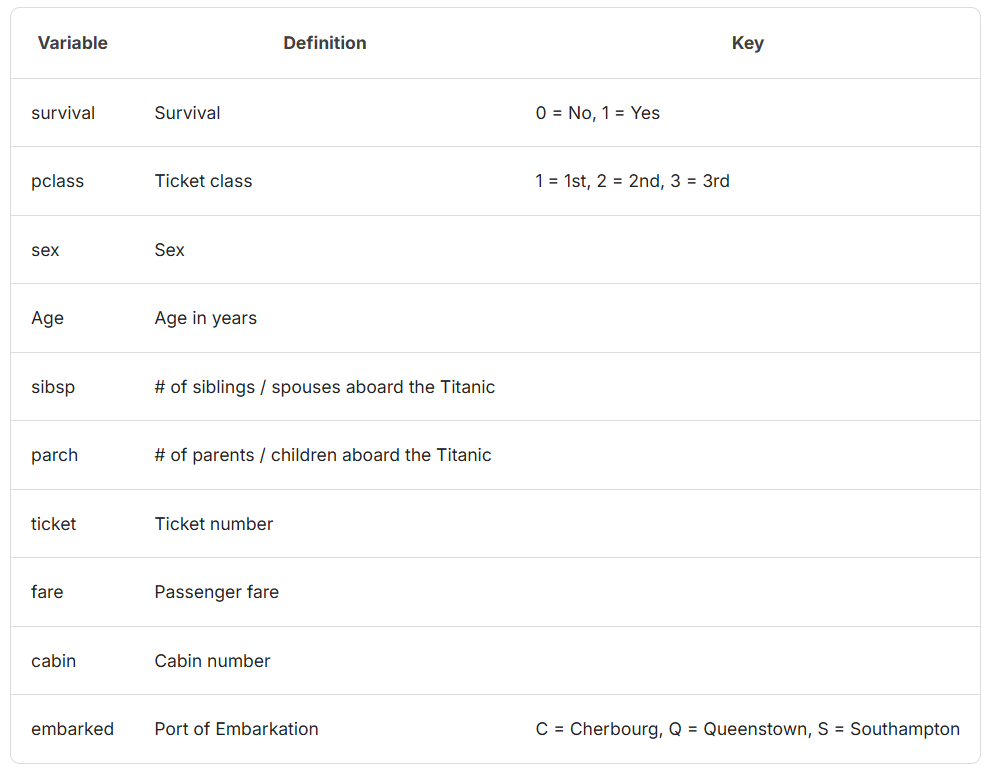
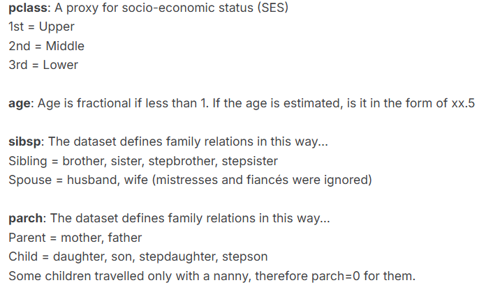
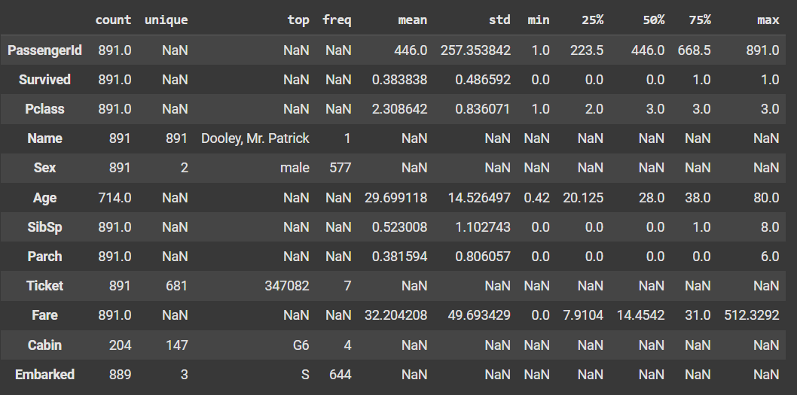
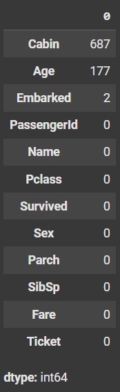
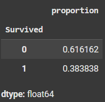
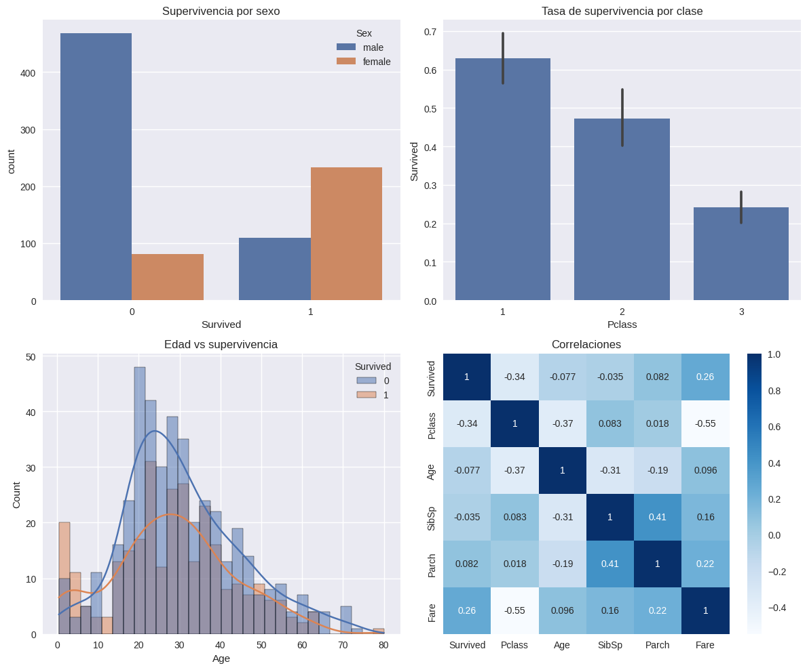

# Práctica 1: EDA del Titanic en Google Colab

## Contexto
La práctica consiste en analizar el dataset del Titanic. Ademas de ver algunas herramientas y librerias de análisis de datos como Pandas, Seaborn, Matplotlib, comprender la estructura del dataset y sacar conclusiones sobre los factores que influyeron en la supervivencia de los pasajeros.

## Objetivos
- Explorar el dataset del Titanic, identificando atributos y valores faltantes.
- Analizar la relación entre variables como sexo, clase, edad y tarifa con la supervivencia.

## Actividades (con tiempos estimados)
- Investigación del Dataset del Titanic (10 min)
- Setup en Colab (5 min)
- Cargar el dataset de Kaggle (5-10 min)
- Conocer el dataset (10 min)
- EDA visual con seaborn/matplotlib (15 min)

## Desarrollo

### 1. Investigación del dataset

El dataset del Titanic es un conjunto de datos que contiene información de los pasajeros a bordo del Titanic. Incluye variables demográficas, socioeconómicas y de contexto, que indica si el pasajero sobrevivió o no.

El objetivo es construir un modelo predictivo que, en base a los datos de los pasajeros, pueda estimar la probabilidad de supervivencia. 

### Atributos del dataset:

- PassengerId: identificador único de cada pasajero.
- Survived: variable objetivo (0 = no sobrevivió, 1 = sobrevivió).
- Pclass: clase del boleto (1ª, 2ª, 3ª), indicador de estatus socioeconómico.
- Name: nombre del pasajero.
- Sex: sexo del pasajero.
- Age: edad (en años).
- SibSp: número de hermanos/esposos a bordo.
- Parch: número de padres/hijos a bordo.
- Ticket: número de boleto.
- Fare: tarifa pagada por el boleto.
- Cabin: cabina asignada (muchos valores faltantes).
- Embarked: puerto de embarque (C = Cherbourg, Q = Queenstown, S = Southampton).

La variable objetivo es Survived (0 = no sobrevivió, 1 = sobrevivió).

### ¿Qué factores crees que más influyeron en la supervivencia?
- Sexo: las mujeres tuvieron prioridad en los botes salvavidas.
- Clase: los pasajeros de 1ª clase tuvieron más acceso a salvamento.
- Edad: los niños también recibieron preferencia.
- Tarifa: puede estar correlacionada con clase y, por lo tanto, con probabilidad de supervivencia.

### ¿Qué desafíos de calidad de datos esperas encontrar?
- Valores faltantes en Age, Cabin y algunos en Embarked.
- Datos no estructurados en Name y Ticket que requieren limpieza o transformación.
- Distribución sesgada en algunas variables (ej. pocos valores altos de Fare).

### ¿Qué variables podrían estar correlacionadas?
- Pclass y Fare (pasajes más caros corresponden a clases más altas).
- SibSp y Parch (familias grandes).
- Sex y Survived (mujeres más propensas a sobrevivir).
- Age y Survived (niños más propensos a sobrevivir).





### 2. Setup en Colab

Se configuró el entorno en Google Colab instalando dependencias (Pandas, Numpy, Matplotlib, Seaborn).

Se montó Google Drive para almacenar resultados y se prepararon directorios (data/, results/).

```python hl_lines="2 6" linenums="1"
import pandas as pd
import numpy as np
import matplotlib.pyplot as plt
import seaborn as sns
import warnings
warnings.filterwarnings('ignore')

plt.style.use('seaborn-v0_8')
sns.set_palette('deep')
```

```python hl_lines="2 6" linenums="1"
from pathlib import Path
try:
    from google.colab import drive
    drive.mount('/content/drive')
    ROOT = Path('/content/drive/MyDrive/IA-UT1')
except Exception:
    ROOT = Path.cwd() / 'IA-UT1'

DATA_DIR = ROOT / 'data'
RESULTS_DIR = ROOT / 'results'
for d in (DATA_DIR, RESULTS_DIR):
    d.mkdir(parents=True, exist_ok=True)
print('Outputs →', ROOT)
```

### 3. Carga del dataset

Con Kaggle API, configurando credenciales y descargando automáticamente train.csv y test.csv.

```python hl_lines="2 6" linenums="1"
!pip -q install kaggle
from google.colab import files
files.upload()  # Subí tu archivo kaggle.json descargado
!mkdir -p ~/.kaggle && cp kaggle.json ~/.kaggle/ && chmod 600 ~/.kaggle/kaggle.json
!kaggle competitions download -c titanic -p data
!unzip -o data/titanic.zip -d data

train = pd.read_csv('data/train.csv')
test = pd.read_csv('data/test.csv')
```

### 4. Conocer el dataset

```python hl_lines="2 6" linenums="1"
train.shape, train.columns
```

```python hl_lines="2 6" linenums="1"
((891, 12),
 Index(['PassengerId', 'Survived', 'Pclass', 'Name', 'Sex', 'Age', 'SibSp', 'Parch', 'Ticket', 'Fare', 'Cabin', 'Embarked'], dtype='object'))
```

```python hl_lines="2 6" linenums="1"
train.info()
```

```python hl_lines="2 6" linenums="1"
<class 'pandas.core.frame.DataFrame'>
RangeIndex: 891 entries, 0 to 890
Data columns (total 12 columns):
 #   Column       Non-Null Count  Dtype  
---  ------       --------------  -----  
 0   PassengerId  891 non-null    int64  
 1   Survived     891 non-null    int64  
 2   Pclass       891 non-null    int64  
 3   Name         891 non-null    object 
 4   Sex          891 non-null    object 
 5   Age          714 non-null    float64
 6   SibSp        891 non-null    int64  
 7   Parch        891 non-null    int64  
 8   Ticket       891 non-null    object 
 9   Fare         891 non-null    float64
 10  Cabin        204 non-null    object 
 11  Embarked     889 non-null    object 
dtypes: float64(2), int64(5), object(5)
```

Se identificaron valores faltantes principalmente en Age y Cabin.

```python hl_lines="2 6" linenums="1"
train.describe(include='all').T
```



```python hl_lines="2 6" linenums="1"
train.isna().sum().sort_values(ascending=False)
```



```python hl_lines="2 6" linenums="1"
train['Survived'].value_counts(normalize=True)
```



Distribución de supervivencia: aproximadamente 38% sobrevivió, 62% no sobrevivió.

### 5. EDA visual

```python hl_lines="2 6" linenums="1"
fig, axes = plt.subplots(2, 2, figsize=(12, 10))

# Supervivencia global por sexo
sns.countplot(data=train, x='Survived', hue='Sex', ax=axes[0,0])
axes[0,0].set_title('Supervivencia por sexo')

# Tasa de supervivencia por clase
sns.barplot(data=train, x='Pclass', y='Survived', estimator=np.mean, ax=axes[0,1])
axes[0,1].set_title('Tasa de supervivencia por clase')

# Distribución de edad por supervivencia
sns.histplot(data=train, x='Age', hue='Survived', kde=True, bins=30, ax=axes[1,0])
axes[1,0].set_title('Edad vs supervivencia')

# Correlaciones numéricas
numeric_cols = ['Survived', 'Pclass', 'Age', 'SibSp', 'Parch', 'Fare']
sns.heatmap(train[numeric_cols].corr(), annot=True, cmap='Blues', ax=axes[1,1])
axes[1,1].set_title('Correlaciones')

plt.tight_layout()
plt.show()
```



Sexo: las mujeres tuvieron una tasa de supervivencia mucho mayor.

Clase (Pclass): los pasajeros de 1ª clase sobrevivieron más que los de 2ª y 3ª.

Edad: mayor proporción de supervivencia en niños.

Correlaciones numéricas: Fare y Pclass están relacionados con la supervivencia; SibSp y Parch aportan información adicional.

### Atributos del dataset

- PassengerId: identificador único de cada pasajero.
- Survived: variable objetivo (0 = no sobrevivió, 1 = sobrevivió).
- Pclass: clase del boleto (1ª, 2ª, 3ª), indicador de estatus socioeconómico.
- Name: nombre del pasajero.
- Sex: sexo del pasajero.
- Age: edad (en años).
- SibSp: número de hermanos/esposos a bordo.
- Parch: número de padres/hijos a bordo.
- Ticket: número de boleto.
- Fare: tarifa pagada por el boleto.
- Cabin: cabina asignada (muchos valores faltantes).
- Embarked: puerto de embarque (C = Cherbourg, Q = Queenstown, S = Southampton).

La variable objetivo es Survived.

## Preguntas

### ¿Qué variables parecen más relacionadas con Survived?

- Sexo: las mujeres tuvieron una tasa de supervivencia muy superior.
- Clase (Pclass): la 1ª clase presenta mayor supervivencia.
- Edad: mayor proporción de niños sobrevivientes.
- Tarifa (Fare): los pasajeros que pagaron más tuvieron más chances de sobrevivir.

### ¿Dónde hay más valores faltantes? ¿Cómo los imputarías?

- Cabin: demasiados valores nulos, probablemente convenga descartar.
- Age: imputación con mediana.
- Embarked: imputar con la moda.

### ¿Qué hipótesis probarías a continuación?

- Los pasajeros de 1ª clase tuvieron mayor probabilidad de supervivencia que los de 3ª.
- Las mujeres tuvieron más chances de sobrevivir que los hombres, independientemente de la clase.

## Reflexión
Comprendí el flujo basico de EDA, ya sea la carga, exploración inicial, visualización, ... 

Por parte del analisis del de los datos concluí que mas que nada el sexo y clase tuvieron un factor importante en la supervivencia.

Ademas en los datos hay valores faltantes en Age y Cabin que requieren completarlos o descartarlos.

## Referencias
- Dataset: https://www.kaggle.com/competitions/titanic/data/
- Kaggle: https://www.kaggle.com/
- Documentación Pandas: https://pandas.pydata.org/docs/
- Documentación Seaborn: https://seaborn.pydata.org/
- Documentación Matplotlib: https://matplotlib.org/stable/