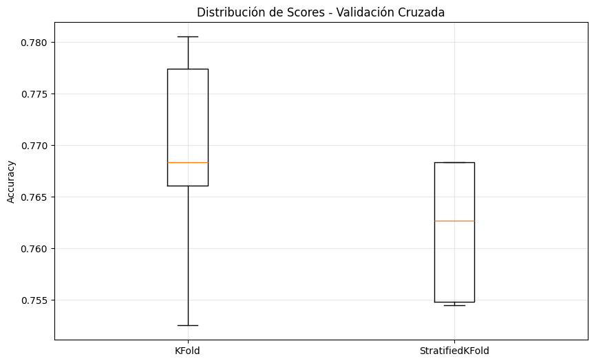
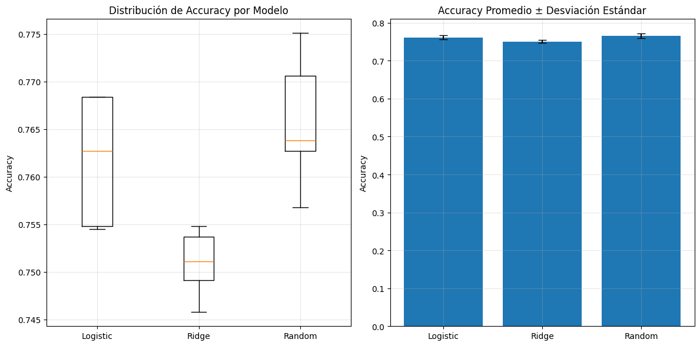
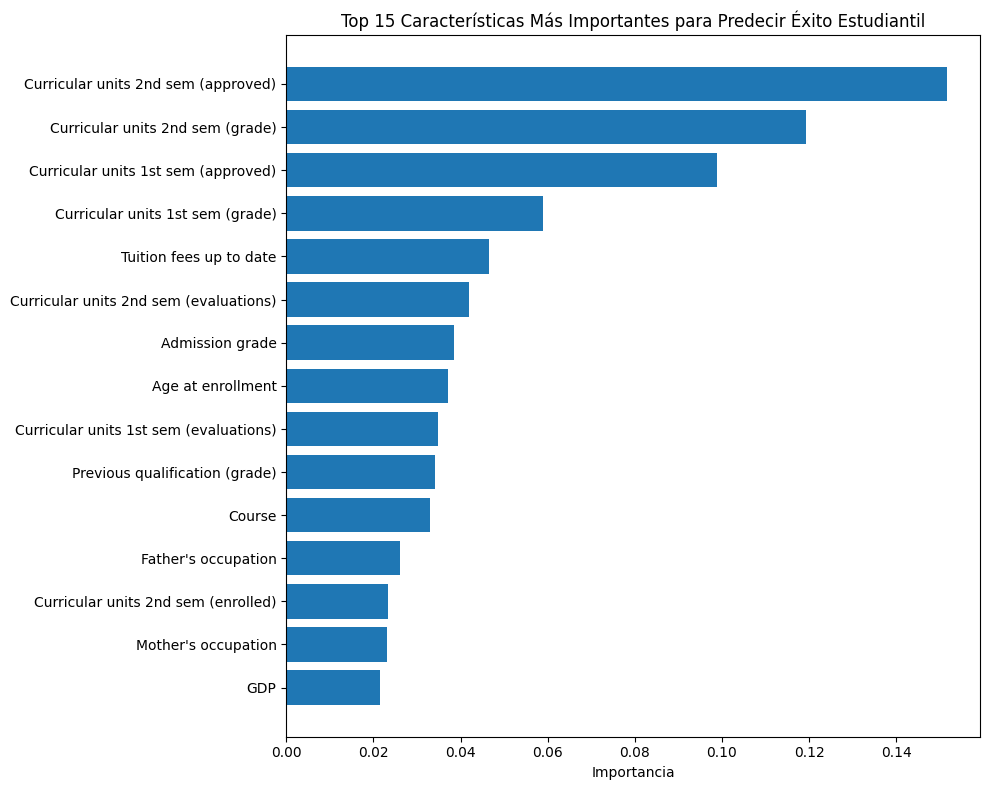
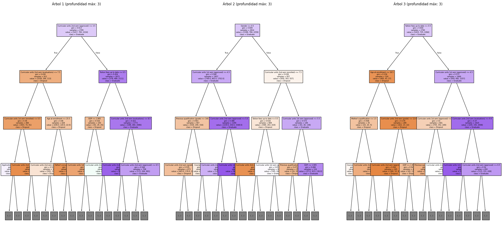

# Práctica 5: Validación y Selección de Modelos  

## Contexto
En esta práctica vamos a trabajar sobre validación y selección de modelos, un paso importante en cualquier pipeline de machine learning.

Nos enfocaremos en cómo evitar data leakage, cómo usar validación cruzada para tener buenos resultados, y cómo comparar diferentes algoritmos para elegir el más adecuado.

## Objetivos
- Aprender a prevenir data leakage usando pipelines.  
- Implementar validación cruzada.  
- Comparar múltiples modelos.  
- Interpretar métricas de estabilidad y selección de modelos.  

## Actividades
- Setup Inicial
- Cargar y Explorar Datos de Estudiantes
- Parte 1: Cross-Validation - Validación Robusta
    - Preparar datos para validación
- Parte 2: Cross-Validation - Validación Robusta
    - Implementar Validación Cruzada
- Parte 3: Comparación de Modelos - ¡El Torneo!
    - Competencia de Múltiples Modelos
- Bonus 1: Optimización de Hiperparámetros
    - GridSearchCV vs RandomizedSearchCV
- Bonus 2: Explicabilidad del Modelo
    - 쯇or qué el modelo toma esas decisiones?

## Desarrollo

### 1. Setup Inicial

```python
!pip install ucimlrepo

# Importar librerías que vamos a usar
import pandas as pd
import numpy as np
import matplotlib.pyplot as plt

# Para validación y selección de modelos
from sklearn.linear_model import LogisticRegression, RidgeClassifier
from sklearn.ensemble import RandomForestClassifier
from sklearn.model_selection import train_test_split, cross_val_score, KFold, StratifiedKFold
from sklearn.preprocessing import StandardScaler
from sklearn.pipeline import Pipeline
# Para cargar datos desde UCI ML Repository
from ucimlrepo import fetch_ucirepo
from sklearn.metrics import accuracy_score, classification_report

print("Setup completo!")
```

```python
Collecting ucimlrepo
  Downloading ucimlrepo-0.0.7-py3-none-any.whl.metadata (5.5 kB)
Requirement already satisfied: pandas>=1.0.0 in /usr/local/lib/python3.12/dist-packages (from ucimlrepo) (2.2.2)
Requirement already satisfied: certifi>=2020.12.5 in /usr/local/lib/python3.12/dist-packages (from ucimlrepo) (2025.8.3)
Requirement already satisfied: numpy>=1.26.0 in /usr/local/lib/python3.12/dist-packages (from pandas>=1.0.0->ucimlrepo) (2.0.2)
Requirement already satisfied: python-dateutil>=2.8.2 in /usr/local/lib/python3.12/dist-packages (from pandas>=1.0.0->ucimlrepo) (2.9.0.post0)
Requirement already satisfied: pytz>=2020.1 in /usr/local/lib/python3.12/dist-packages (from pandas>=1.0.0->ucimlrepo) (2025.2)
Requirement already satisfied: tzdata>=2022.7 in /usr/local/lib/python3.12/dist-packages (from pandas>=1.0.0->ucimlrepo) (2025.2)
Requirement already satisfied: six>=1.5 in /usr/local/lib/python3.12/dist-packages (from python-dateutil>=2.8.2->pandas>=1.0.0->ucimlrepo) (1.17.0)
Downloading ucimlrepo-0.0.7-py3-none-any.whl (8.0 kB)
Installing collected packages: ucimlrepo
Successfully installed ucimlrepo-0.0.7
Setup completo!
```

### 2. Cargar y Explorar Datos de Estudiantes

```python
# Cargar dataset de estudiantes desde UCI
student_data = fetch_ucirepo(id=697)

# Preparar datos
X = student_data.data.features
y = student_data.data.targets

print("Dataset: Student Dropout and Academic Success")
print(f"Estudiantes: {X.shape[0]}, Características: {X.shape[1]}")
print(f"Objetivo: Predecir {len(y.columns)} variable(s)")

# Explorar variable objetivo
target_col = y.columns[0]  # Primera columna objetivo
y_series = y[target_col]
print(f"\nVariable objetivo: {target_col}")

# Mapear valores para mejor interpretación
target_mapping = {'Dropout': 0, 'Enrolled': 1, 'Graduate': 2}
y_mapped = y_series.map(target_mapping)

# Distribución de clases
print("\nDistribución de resultados académicos:")
value_counts = y_mapped.value_counts()
for outcome, count in value_counts.items():
    percentage = (count / len(y_mapped)) * 100
    print(f"  {outcome}: {count} estudiantes ({percentage:.1f}%)")

# Ver algunas características
print(f"\nPrimeras características:")
print(X.columns.tolist()[:10], "...")

# Estadísticas básicas
print(f"\nAge at enrollment:")
if 'Age at enrollment' in X.columns:
    age_col = X['Age at enrollment']
    print(f"  Promedio: {age_col.mean():.1f} años")
    print(f"  Rango: {age_col.min():.0f}-{age_col.max():.0f} años")
```

```
Dataset: Student Dropout and Academic Success
Estudiantes: 4424, Características: 36
Objetivo: Predecir 1 variable(s)
Variable objetivo: Target
Distribución de resultados académicos:
  2: 2209 estudiantes (49.9%)
  0: 1421 estudiantes (32.1%)
  1: 794 estudiantes (17.9%)
Primeras características:
['Marital Status', 'Application mode', 'Application order', 'Course', 'Daytime/evening attendance', 'Previous qualification', 'Previous qualification (grade)', 'Nacionality', "Mother's qualification", "Father's qualification"] ...

Age at enrollment:
  Promedio: 23.3 años
  Rango: 17-70 años
```

- 쮺uántas muestras y características tiene el dataset? 
    - El dataset tiene 4424 muestras y 37 características.
- 쯈ué tipos de variables incluye?
    - Incluye variables demográficas, académicas y socioeconómicas.
- 쯃as clases están balanceadas o desbalanceadas? 
    - Las clases están desbalanceadas (más graduados que abandonos o inscriptos).
- 쯈ué significan las 3 categorías objetivo?
    - Las 3 categorías son:
    0: Dropout (abandono)
    1: Enrolled (cursando)
    2: Graduate (graduado).

### 3. Preparar datos para validación

```python
# Preparar variable objetivo como serie simple
# Convertir strings a números para sklearn
target_mapping = {0: 'Dropout', 1: 'Enrolled', 2: 'Graduate'}
reverse_mapping = {'Dropout': 0, 'Enrolled': 1, 'Graduate': 2}

# Si y_series contiene strings, convertir a números
if y_series.dtype == 'object':
    y_target = y_series.map(reverse_mapping)
else:
    y_target = y_series

X_features = X       # Features del dataset

print("Datos preparados para validación:")
print(f"X shape: {X_features.shape}")
print(f"y shape: {y_target.shape}")
print(f"Clases únicas: {sorted(y_target.unique())}")
print(f"Mapeo: {target_mapping}")
```

```python
Datos preparados para validación:
X shape: (4424, 36)
y shape: (4424,)
Clases únicas: [np.int64(0), np.int64(1), np.int64(2)]
Mapeo: {0: 'Dropout', 1: 'Enrolled', 2: 'Graduate'}
```

### 4. Implementar Validación Cruzada

```python
# === VALIDACIÓN CRUZADA PARA ESTABILIDAD ===

print("游댧 VALIDACIÓN CRUZADA: 쯈ué tan estable es nuestro modelo?")

# 1. Crear pipeline robusto para usar en CV
pipeline_robust = Pipeline([
    ('scaler', StandardScaler()),
    ('classifier', LogisticRegression(max_iter=1000, random_state=42))
])

print("Pipeline creado para validación cruzada")

# 2. Crear KFold básico
kfold = KFold(n_splits=5, shuffle=True, random_state=42)

# 3. Evaluar con KFold usando cross_val_score
scores_kfold = cross_val_score(
    pipeline_robust, X_features, y_target, cv=kfold, scoring='accuracy'
)

print(f"\nKFOLD RESULTS:")
print(f"   Scores individuales: {scores_kfold}")
print(f"   Media: {scores_kfold.mean():.4f}")
print(f"   Desviación estándar: {scores_kfold.std():.4f}")
print(f"   Resultado: {scores_kfold.mean():.4f} ± {scores_kfold.std():.4f}")

# 4. Crear StratifiedKFold (mantiene proporción de clases)
stratified_kfold = StratifiedKFold(n_splits=5, shuffle=True, random_state=42)

# 5. Evaluar con StratifiedKFold
scores_stratified = cross_val_score(
    pipeline_robust, X_features, y_target, cv=stratified_kfold, scoring='accuracy'
)

print(f"\nSTRATIFIED KFOLD RESULTS:")
print(f"   Scores individuales: {scores_stratified}")
print(f"   Media: {scores_stratified.mean():.4f}")
print(f"   Desviación estándar: {scores_stratified.std():.4f}")
print(f"   Resultado: {scores_stratified.mean():.4f} ± {scores_stratified.std():.4f}")

# 6. Comparar estabilidad (menor desviación = más estable)
print(f"\nCOMPARACIÓN DE ESTABILIDAD:")
if scores_stratified.std() < scores_kfold.std():
    print("   StratifiedKFold es MÁS ESTABLE (menor variabilidad)")
    mejor_cv = "StratifiedKFold"
else:
    print("   KFold es MÁS ESTABLE (menor variabilidad)")
    mejor_cv = "KFold"

print(f"   Recomendación: Usar {mejor_cv} para este dataset")

# 7. Visualizar la distribución de scores
import matplotlib.pyplot as plt
plt.figure(figsize=(10, 6))
plt.boxplot([scores_kfold, scores_stratified], labels=['KFold', 'StratifiedKFold'])
plt.title('Distribución de Scores - Validación Cruzada')
plt.ylabel('Accuracy')
plt.grid(True, alpha=0.3)
plt.show()
```

```python
游댧 VALIDACIÓN CRUZADA: 쯈ué tan estable es nuestro modelo?
Pipeline creado para validación cruzada
KFOLD RESULTS:
   Scores individuales: [0.75254237 0.76610169 0.76836158 0.77740113 0.78054299]
   Media: 0.7690
   Desviación estándar: 0.0098
   Resultado: 0.7690 ± 0.0098
STRATIFIED KFOLD RESULTS:
   Scores individuales: [0.76836158 0.76836158 0.76271186 0.75480226 0.75452489]
   Media: 0.7618
   Desviación estándar: 0.0061
   Resultado: 0.7618 ± 0.0061
COMPARACIÓN DE ESTABILIDAD:
   StratifiedKFold es MÁS ESTABLE (menor variabilidad)
   Recomendación: Usar StratifiedKFold para este dataset
```



- 쮺uál método mantiene la proporción de clases en cada fold?
    - El método que mantiene la proporción de clases en cada fold es StratifiedKFold.
- 쮺uál parámetro especifica el tipo de validación cruzada en cross_val_score?
    - El parámetro que especifica el tipo de validación cruzada en cross_val_score es cv.

### 5. Competencia de Múltiples Modelos

```python
# === COMPETENCIA DE MODELOS ===

print("游끥 TORNEO: 쮺uál modelo funciona mejor para diagnóstico médico?")

# 1. Definir candidatos (diferentes algoritmos)
models = {
    'Logistic Regression': Pipeline([
        ('scaler', StandardScaler()),
        ('classifier', LogisticRegression(max_iter=1000, random_state=42))
    ]),

    # 2. Ridge Classifier (regresión logística con regularización L2)
    'Ridge Classifier': Pipeline([
        ('scaler', StandardScaler()),
        ('classifier', RidgeClassifier(alpha=1.0, random_state=42))
    ]),

    # 3. Random Forest (ensemble, no necesita escalado)
    'Random Forest': Pipeline([
        ('classifier', RandomForestClassifier(n_estimators=100, random_state=42))
    ])
}

print(f"Modelos en competencia: {list(models.keys())}")

# 4. Evaluar cada modelo con validación cruzada
print(f"\nEVALUANDO MODELOS CON 5-FOLD CV...")

results = {}
for name, model in models.items():
    print(f"   Evaluando {name}...")

    # Usar StratifiedKFold para mantener balance de clases
    scores = cross_val_score(
        model, X_features, y_target,
        cv=StratifiedKFold(n_splits=5, shuffle=True, random_state=42),
        scoring='accuracy'
    )

    results[name] = scores

    print(f"   {name}: {scores.mean():.4f} ± {scores.std():.4f}")
    print(f"      Scores: {[f'{s:.3f}' for s in scores]}")

# 5. Encontrar el mejor modelo
print(f"\nRESULTADOS FINALES:")

# Encontrar modelo con mayor accuracy promedio
best_mean_score = 0
best_model_name = ""

for name, scores in results.items():
    if scores.mean() > best_mean_score:
        best_mean_score = scores.mean()
        best_model_name = name

print(f"GANADOR: {best_model_name}")
print(f"Score: {best_mean_score:.4f}")

# 6. Análisis detallado de estabilidad
print(f"\nANÁLISIS DE ESTABILIDAD:")
for name, scores in results.items():
    stability = scores.std()

    if stability < 0.02:
        status = "MUY ESTABLE"
    elif stability < 0.05:
        status = "ESTABLE"
    else:
        status = "INESTABLE"

    print(f"   {name}: {status} (std: {stability:.4f})")

# 7. Visualización comparativa
plt.figure(figsize=(12, 6))

# Boxplot de distribución de scores
plt.subplot(1, 2, 1)
plt.boxplot([results[name] for name in models.keys()], 
           labels=[name.split()[0] for name in models.keys()])
plt.title('Distribución de Accuracy por Modelo')
plt.ylabel('Accuracy')
plt.grid(True, alpha=0.3)

# Barplot de medias con error bars
plt.subplot(1, 2, 2)
names = list(models.keys())
means = [results[name].mean() for name in names]
stds = [results[name].std() for name in names]

plt.bar(range(len(names)), means, yerr=stds, capsize=5)
plt.xticks(range(len(names)), [name.split()[0] for name in names])
plt.title('Accuracy Promedio ± Desviación Estándar')
plt.ylabel('Accuracy')
plt.grid(True, alpha=0.3)

plt.tight_layout()
plt.show()
```

```python
游끥 TORNEO: 쮺uál modelo funciona mejor para diagnóstico médico?
Modelos en competencia: ['Logistic Regression', 'Ridge Classifier', 'Random Forest']

EVALUANDO MODELOS CON 5-FOLD CV...
   Evaluando Logistic Regression...
   Logistic Regression: 0.7618 ± 0.0061
      Scores: ['0.768', '0.768', '0.763', '0.755', '0.755']
   Evaluando Ridge Classifier...
   Ridge Classifier: 0.7509 ± 0.0032
      Scores: ['0.755', '0.746', '0.754', '0.749', '0.751']
   Evaluando Random Forest...
   Random Forest: 0.7658 ± 0.0064
      Scores: ['0.775', '0.764', '0.771', '0.763', '0.757']
      
RESULTADOS FINALES:
GANADOR: Random Forest
Score: 0.7658

ANÁLISIS DE ESTABILIDAD:
   Logistic Regression: MUY ESTABLE (std: 0.0061)
   Ridge Classifier: MUY ESTABLE (std: 0.0032)
   Random Forest: MUY ESTABLE (std: 0.0064)
```



- Random Forest no necesita escalado, 쯣or qué no incluir StandardScaler?
    - rs un modelo basado en árboles de decisión, y estos no se ven afectados por la escala de las variables.
- 쮺uál métrica es mejor para clasificación: 'accuracy', 'precision', o 'f1'?
    - Accuracy es útil si las clases están balanceadas. Precision prioriza evitar falsos positivos. F1 tiene un balance entre precision y recall.

#### 쯈ué significan las métricas de validación?

- Cross-Validation: Técnica que divide los datos en k partes para entrenar y evaluar múltiples veces.
- Accuracy promedio: La estimación de rendimiento esperado en datos nuevos.
- Desviación estándar: Indica qué tan estable es el modelo entre diferentes divisiones de datos.
- StratifiedKFold: Mantiene la proporción de clases en cada fold, especialmente importante en datasets desbalanceados.

### 6. GridSearchCV vs RandomizedSearchCV

```python
from sklearn.model_selection import GridSearchCV, RandomizedSearchCV

# Seleccionar el mejor modelo de la competencia anterior
best_model_base = models[best_model_name]

print(f"Optimizando hiperparámetros para: {best_model_name}")

# Definir espacio de búsqueda de hiperparámetros
if 'Random Forest' in best_model_name:
    param_grid = {
        'classifier__n_estimators': [50, 100, 200],
        'classifier__max_depth': [None, 10, 20, 30],
        'classifier__min_samples_split': [2, 5, 10]
    }
elif 'Logistic' in best_model_name:
    param_grid = {
        'classifier__C': [0.1, 1, 10, 100],
        'classifier__max_iter': [1000, 2000]
    }
else:  # Ridge
    param_grid = {
        'classifier__alpha': [0.1, 1, 10, 100]
    }

# MÉTODO 1: GridSearchCV (búsqueda exhaustiva)
print("\nMétodo 1: GridSearchCV (búsqueda exhaustiva)")
grid_search = GridSearchCV(
    best_model_base,
    param_grid,
    cv=5,
    scoring='accuracy',
    n_jobs=-1,
    verbose=1
)

grid_search.fit(X_features, y_target)

print(f"Mejores parámetros (Grid): {grid_search.best_params_}")
print(f"Mejor score (Grid): {grid_search.best_score_:.4f}")

# MÉTODO 2: RandomizedSearchCV (búsqueda aleatoria, más eficiente)
print("\nMétodo 2: RandomizedSearchCV (búsqueda aleatoria)")
random_search = RandomizedSearchCV(
    best_model_base,
    param_grid,
    n_iter=20,  # Solo 20 combinaciones aleatorias
    cv=5,
    scoring='accuracy',
    n_jobs=-1,
    random_state=42,
    verbose=1
)

random_search.fit(X_features, y_target)

print(f"Mejores parámetros (Random): {random_search.best_params_}")
print(f"Mejor score (Random): {random_search.best_score_:.4f}")

# Comparar eficiencia
print(f"\nComparación de eficiencia:")
print(f"GridSearch probó: {len(grid_search.cv_results_['params'])} combinaciones")
print(f"RandomSearch probó: {len(random_search.cv_results_['params'])} combinaciones")

# Evaluar modelo final optimizado
final_model = grid_search.best_estimator_
final_scores = cross_val_score(final_model, X_features, y_target, cv=5)
print(f"\nModelo final optimizado: {final_scores.mean():.4f} ± {final_scores.std():.4f}")
```

```python
Optimizando hiperparámetros para: Random Forest

Método 1: GridSearchCV (búsqueda exhaustiva)
Fitting 5 folds for each of 36 candidates, totalling 180 fits
Mejores parámetros (Grid): {'classifier__max_depth': None, 'classifier__min_samples_split': 5, 'classifier__n_estimators': 100}
Mejor score (Grid): 0.7783

Método 2: RandomizedSearchCV (búsqueda aleatoria)
Fitting 5 folds for each of 20 candidates, totalling 100 fits
Mejores parámetros (Random): {'classifier__n_estimators': 100, 'classifier__min_samples_split': 5, 'classifier__max_depth': 30}
Mejor score (Random): 0.7783

Comparación de eficiencia:
GridSearch probó: 36 combinaciones
RandomSearch probó: 20 combinaciones

Modelo final optimizado: 0.7783 ± 0.0067
```

#### 쮺uándo usar cada método?
- GridSearchCV cuando tienes pocos hiperparámetros y suficiente tiempo de cómputo.
- RandomizedSearchCV cuando tienes muchos hiperparámetros o poco tiempo limitado.
- Pipeline + SearchCV siempre previene data leakage automáticamente.
- cross_val_score en el resultado final valida que la optimización no causó overfitting.

### 7. 쯇or qué el modelo toma esas decisiones?

```python
# Usar Random Forest para explicabilidad (si no ganó, crearlo)
if 'Random Forest' not in best_model_name:
    # Crear Random Forest específico para explicabilidad
    # Random Forest no necesita escalado, así que lo omitimos para simplicidad
    rf_model = Pipeline([
        ('classifier', RandomForestClassifier(n_estimators=100, random_state=42))
    ])
    rf_model.fit(X_features, y_target)
    print("Creado Random Forest específico para análisis de explicabilidad")
else:
    rf_model = final_model
    print("Usando el modelo ganador para explicabilidad")

# Verificar estructura del pipeline
print(f"Componentes del pipeline: {list(rf_model.named_steps.keys())}")

# 1. FEATURE IMPORTANCE - 쯈ué características son más importantes?
feature_names = X_features.columns
importances = rf_model.named_steps['classifier'].feature_importances_

# Crear DataFrame para mejor visualización
feature_importance_df = pd.DataFrame({
    'feature': feature_names,
    'importance': importances
}).sort_values('importance', ascending=False)

print("\nTOP 10 CARACTERÍSTICAS MÁS IMPORTANTES:")
for i, row in feature_importance_df.head(10).iterrows():
    print(f"{row['feature']}: {row['importance']:.4f}")

# Visualizar importancia de características
plt.figure(figsize=(10, 8))
top_features = feature_importance_df.head(15)
plt.barh(range(len(top_features)), top_features['importance'])
plt.yticks(range(len(top_features)), top_features['feature'])
plt.xlabel('Importancia')
plt.title('Top 15 Características Más Importantes para Predecir Éxito Estudiantil')
plt.gca().invert_yaxis()
plt.tight_layout()
plt.show()

# 2. ANÁLISIS POR CATEGORÍAS - Agrupar características relacionadas
academic_features = [col for col in feature_names if any(word in col.lower() 
                    for word in ['grade', 'units', 'curricular', 'semester'])]
demographic_features = [col for col in feature_names if any(word in col.lower() 
                       for word in ['age', 'gender', 'nationality', 'marital'])]
economic_features = [col for col in feature_names if any(word in col.lower() 
                    for word in ['scholarship', 'debt', 'fee', 'tuition'])]

def calculate_category_importance(features, importance_df):
    if not features:
        return 0
    category_importance = importance_df[importance_df['feature'].isin(features)]['importance'].sum()
    return category_importance

academic_importance = calculate_category_importance(academic_features, feature_importance_df)
demographic_importance = calculate_category_importance(demographic_features, feature_importance_df)
economic_importance = calculate_category_importance(economic_features, feature_importance_df)

print(f"\nIMPORTANCIA POR CATEGORÍAS:")
print(f"Factores académicos: {academic_importance:.4f}")
print(f"Factores demográficos: {demographic_importance:.4f}")
print(f"Factores económicos: {economic_importance:.4f}")

# 3. INTERPRETACIÓN PRÁCTICA - 쯈ué significa esto?
print(f"\nINTERPRETACIÓN PARA INTERVENCIONES:")
print(f"La característica más importante es: {feature_importance_df.iloc[0]['feature']}")
print(f"Esto sugiere que para reducir abandono estudiantil debemos enfocarnos en:")

# Generar recomendaciones basadas en las top features
top_3_features = feature_importance_df.head(3)['feature'].tolist()
for i, feature in enumerate(top_3_features, 1):
    print(f"{i}. Monitorear y mejorar: {feature}")

# 4. PREDICCIÓN INDIVIDUAL - 쯇or qué un estudiante específico está en riesgo?
print(f"\nANÁLISIS DE ESTUDIANTE INDIVIDUAL (ejemplo):")
student_idx = 0
student_data = X_features.iloc[student_idx:student_idx+1]
prediction = rf_model.predict(student_data)[0]
prediction_proba = rf_model.predict_proba(student_data)[0]

# Definir mapeo localmente para esta sección
outcome_mapping = {0: 'Dropout', 1: 'Enrolled', 2: 'Graduate'}

# Manejar si prediction es string o número
if isinstance(prediction, str):
    predicted_outcome = prediction
else:
    predicted_outcome = outcome_mapping[prediction]

print(f"Estudiante #{student_idx}:")
print(f"Predicción: {predicted_outcome}")
print(f"Probabilidades:")
for i, prob in enumerate(prediction_proba):
    outcome_name = outcome_mapping[i]
    print(f"  {outcome_name}: {prob:.3f}")

# Mostrar las características más importantes de este estudiante
student_features = pd.DataFrame({
    'feature': feature_names,
    'value': student_data.iloc[0].values,
    'importance': importances
}).sort_values('importance', ascending=False)

print(f"\nTop 5 características que influyen en esta predicción:")
for i, row in student_features.head(5).iterrows():
    print(f"{row['feature']}: {row['value']:.2f} (importancia: {row['importance']:.4f})")

# 5. VISUALIZACIÓN DE ÁRBOLES INDIVIDUALES
print(f"\nVISUALIZACIÓN DE ÁRBOLES DEL RANDOM FOREST:")

# Instalar graphviz si no está disponible
try:
    from sklearn.tree import export_graphviz, plot_tree, export_text
    import matplotlib.pyplot as plt

    # Obtener algunos árboles del bosque
    forest = rf_model.named_steps['classifier']
    n_trees_to_show = min(3, len(forest.estimators_))

    print(f"Mostrando {n_trees_to_show} árboles de {len(forest.estimators_)} totales")

    # Visualizar árboles con plot_tree (más simple)
    fig, axes = plt.subplots(1, n_trees_to_show, figsize=(25, 12))
    if n_trees_to_show == 1:
        axes = [axes]

    for i in range(n_trees_to_show):
        tree = forest.estimators_[i]

        # Limitar profundidad para que sea legible
        plot_tree(tree, 
                 ax=axes[i],
                 feature_names=list(feature_names),  # Usar todos los nombres de características
                 class_names=list(outcome_mapping.values()),
                 filled=True,
                 max_depth=3,  # Limitar profundidad
                 fontsize=6)  # Fuente más pequeña para que quepa

        axes[i].set_title(f'Árbol {i+1} (profundidad máx: 3)', fontsize=12)

    plt.tight_layout()
    plt.show()

    # Información sobre la estructura de los árboles
    print(f"\nESTADÍSTICAS DE LOS ÁRBOLES:")
    depths = [tree.get_depth() for tree in forest.estimators_[:5]]
    n_nodes = [tree.tree_.node_count for tree in forest.estimators_[:5]]

    print(f"Profundidad promedio (primeros 5 árboles): {sum(depths)/len(depths):.1f}")
    print(f"Número promedio de nodos (primeros 5): {sum(n_nodes)/len(n_nodes):.1f}")

    # Mostrar un árbol muy simple por texto
    print(f"\nEJEMPLO DE REGLAS DE DECISIÓN (Árbol 1, simplificado):")
    tree_rules = export_text(forest.estimators_[0], 
                           feature_names=list(feature_names),
                           max_depth=2)
    print(tree_rules[:500] + "..." if len(tree_rules) > 500 else tree_rules)

except ImportError:
    print("Para visualizar árboles, instala: pip install graphviz")
    print("Alternativamente, mostramos la estructura del bosque:")

    forest = rf_model.named_steps['classifier']
    print(f"Random Forest contiene {len(forest.estimators_)} árboles")
    print(f"Cada árbol fue entrenado con {forest.max_features_} características aleatorias")

    # Estadísticas básicas sin visualización
    if len(forest.estimators_) > 0:
        depths = [tree.get_depth() for tree in forest.estimators_[:5]]
        print(f"Profundidad promedio: {sum(depths)/len(depths):.1f}")

# 6. DIVERSIDAD DEL BOSQUE
print(f"\nDIVERSIDAD EN EL RANDOM FOREST:")
print("El poder del Random Forest viene de la diversidad de sus árboles:")
print("- Cada árbol ve una muestra diferente de datos (bootstrap)")
print("- Cada split considera solo un subconjunto aleatorio de características")
print("- La predicción final es el voto mayoritario de todos los árboles")

# Mostrar diferencias en predicciones individuales
student_sample = X_features.iloc[0:1]
individual_predictions = []

# Preparar datos dependiendo de si el modelo tiene scaler o no
if 'scaler' in rf_model.named_steps:
    # Modelo con scaler
    scaled_sample = rf_model.named_steps['scaler'].transform(student_sample)
    print("Usando datos escalados para árboles individuales")
else:
    # Modelo sin scaler (ej: Random Forest sin preprocesamiento)
    scaled_sample = student_sample.values
    print("Usando datos sin escalar para árboles individuales")

for i, tree in enumerate(forest.estimators_[:5]):
    tree_pred = tree.predict(scaled_sample)[0]
    individual_predictions.append(tree_pred)

print(f"\nPredicciones de árboles individuales para el Estudiante #0:")
for i, pred in enumerate(individual_predictions):
    pred_name = outcome_mapping[pred] if isinstance(pred, int) else pred
    print(f"  Árbol {i+1}: {pred_name}")

final_pred = max(set(individual_predictions), key=individual_predictions.count)
final_pred_name = outcome_mapping[final_pred] if isinstance(final_pred, int) else final_pred
print(f"Predicción final (voto mayoritario): {final_pred_name}")
```

```python
Usando el modelo ganador para explicabilidad
Componentes del pipeline: ['classifier']

TOP 10 CARACTERÍSTICAS MÁS IMPORTANTES:
Curricular units 2nd sem (approved): 0.1516
Curricular units 2nd sem (grade): 0.1193
Curricular units 1st sem (approved): 0.0987
Curricular units 1st sem (grade): 0.0589
Tuition fees up to date: 0.0466
Curricular units 2nd sem (evaluations): 0.0419
Admission grade: 0.0385
Age at enrollment: 0.0372
Curricular units 1st sem (evaluations): 0.0349
Previous qualification (grade): 0.0343
```



```python
IMPORTANCIA POR CATEGORÍAS:
Factores académicos: 0.6443
Factores demográficos: 0.0499
Factores económicos: 0.0769

INTERPRETACIÓN PARA INTERVENCIONES:
La característica más importante es: Curricular units 2nd sem (approved)
Esto sugiere que para reducir abandono estudiantil debemos enfocarnos en:
1. Monitorear y mejorar: Curricular units 2nd sem (approved)
2. Monitorear y mejorar: Curricular units 2nd sem (grade)
3. Monitorear y mejorar: Curricular units 1st sem (approved)

ANÁLISIS DE ESTUDIANTE INDIVIDUAL (ejemplo):
Estudiante #0:
Predicción: Dropout
Probabilidades:
  Dropout: 0.737
  Enrolled: 0.082
  Graduate: 0.181

Top 5 características que influyen en esta predicción:
Curricular units 2nd sem (approved): 0.00 (importancia: 0.1516)
Curricular units 2nd sem (grade): 0.00 (importancia: 0.1193)
Curricular units 1st sem (approved): 0.00 (importancia: 0.0987)
Curricular units 1st sem (grade): 0.00 (importancia: 0.0589)
Tuition fees up to date: 1.00 (importancia: 0.0466)

VISUALIZACIÓN DE ÁRBOLES DEL RANDOM FOREST:
Mostrando 3 árboles de 100 totales

ESTADÍSTICAS DE LOS ÁRBOLES:
Profundidad promedio (primeros 5 árboles): 21.2
Número promedio de nodos (primeros 5): 1139.0

EJEMPLO DE REGLAS DE DECISIÓN (Árbol 1, simplificado):
|--- Curricular units 2nd sem (approved) <= 3.50
|   |--- Curricular units 2nd sem (evaluations) <= 7.50
|   |   |--- Curricular units 1st sem (enrolled) <= 0.50
|   |   |   |--- truncated branch of depth 10
|   |   |--- Curricular units 1st sem (enrolled) >  0.50
|   |   |   |--- truncated branch of depth 10
|   |--- Curricular units 2nd sem (evaluations) >  7.50
|   |   |--- Age at enrollment <= 25.50
|   |   |   |--- truncated branch of depth 16
|   |   |--- Age at enrollment >  25.50
|   |  ...
```



```python
DIVERSIDAD EN EL RANDOM FOREST:
El poder del Random Forest viene de la diversidad de sus árboles:
- Cada árbol ve una muestra diferente de datos (bootstrap)
- Cada split considera solo un subconjunto aleatorio de características
- La predicción final es el voto mayoritario de todos los árboles
Usando datos sin escalar para árboles individuales

Predicciones de árboles individuales para el Estudiante #0:
  Árbol 1: 2.0
  Árbol 2: 0.0
  Árbol 3: 0.0
  Árbol 4: 0.0
  Árbol 5: 0.0
Predicción final (voto mayoritario): 0.0
```

#### 쯇or qué es importante la explicabilidad?
- Confianza: Los educadores necesitan entender por qué el modelo predice abandono.
- Intervenciones: Knowing las características importantes permite crear estrategias educativas específicas.
- Bias detection: La explicabilidad ayuda a detectar sesgos en el modelo.
- Regulaciones: Muchos contextos requieren modelos interpretables por ley.
- Mejora continua: Entender el modelo ayuda a optimizar futuras versiones.

### Preguntas de Reflexión

1. 쯈ué es data leakage y por qué es peligroso?
Es cuando el modelo tiene acceso a información del futuro o del test durante el entrenamiento. Genera métricas irreales y el modelo falla en datos reales.

2. 쮺uándo usar KFold vs StratifiedKFold?
Usa KFold con datasets balanceados. Usa StratifiedKFold cuando hay clases desbalanceadas, porque mantiene la proporción en cada fold.

3. 쮺칩mo interpretar "95.2% ± 2.1%" en cross-validation?
95.2% = rendimiento promedio esperado. ± 2.1% = variabilidad entre folds (qué tan estable es el modelo).

4. 쯇or qué Random Forest no necesita StandardScaler?
Porque está basado en árboles de decisión, que dividen datos por umbrales, no por distancias. La escala de las variables no afecta.

5. En diagnóstico médico, 쯣refieres 98% accuracy pero inestable, o 95% accuracy muy estable?
Prefiero el 95% estable, porque en medicina la confiabilidad y consistencia son más importantes que un pico de rendimiento.

## Reflexión
La validación y selección de modelos son pasos importantes para construir sistemas confiables. No alcanza con obtener un modelo con alto accuracy, necesitamos que sea estable, explicable y reproducible. Además, la explicabilidad no solo mejora la confianza en el modelo, sino que también permite detectar sesgos y diseñar mejores estrategias de intervención.

## Referencias

- Dataset: https://archive.ics.uci.edu/dataset/697/student+dropout+and+academic+success
- Scikit-learn: https://scikit-learn.org/stable/index.html
- Ridge Classifier: https://scikit-learn.org/stable/modules/generated/sklearn.linear_model.RidgeClassifier.html
- Random Forest: https://scikit-learn.org/stable/modules/generated/sklearn.ensemble.RandomForestClassifier.html
- Cross-validation: https://scikit-learn.org/stable/modules/cross_validation.html
https://colab.research.google.com/drive/1xy7JUUjUr1CrQDYVZdIVBy9xrulPtuKM?usp=sharing