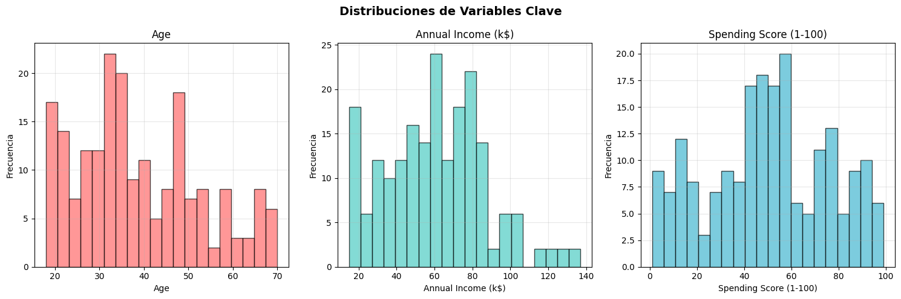
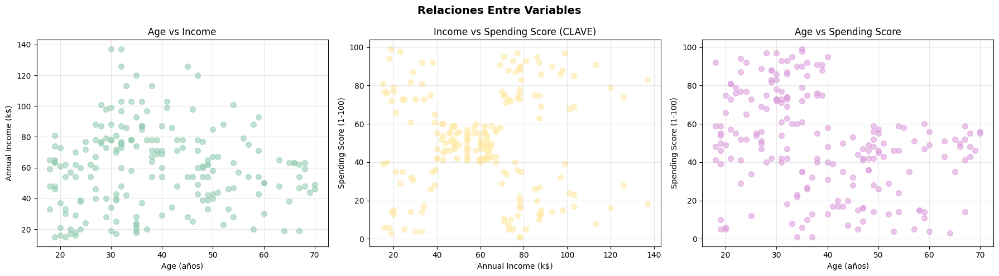
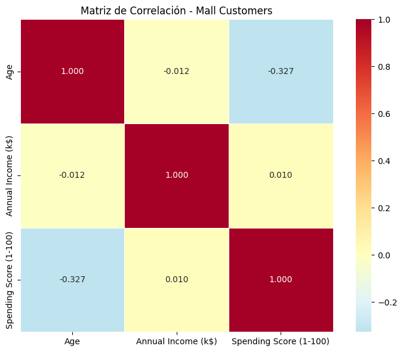
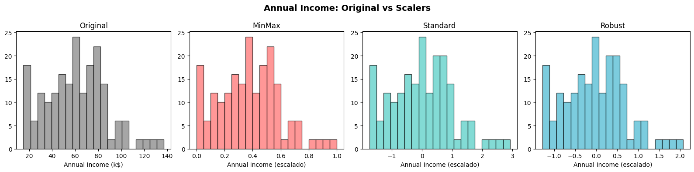
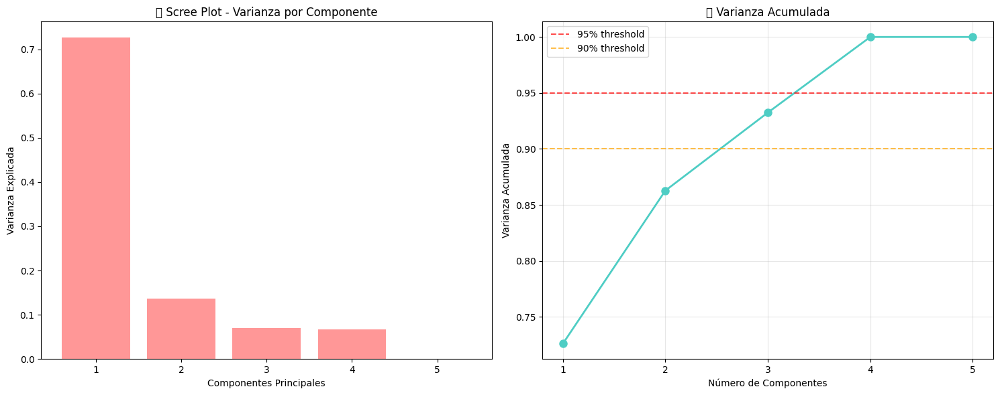
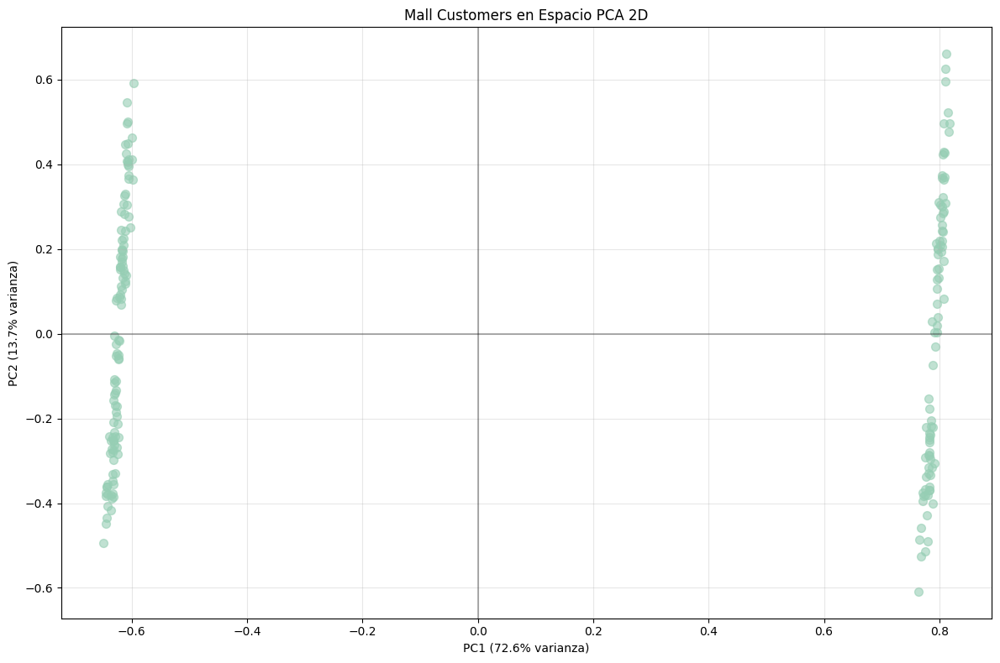
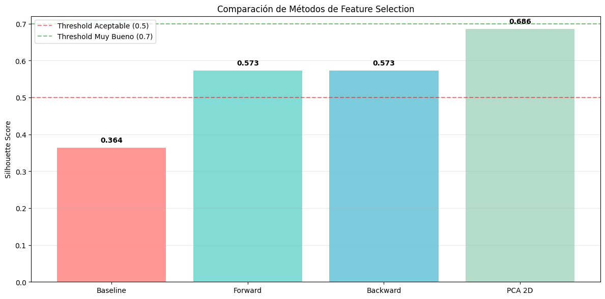
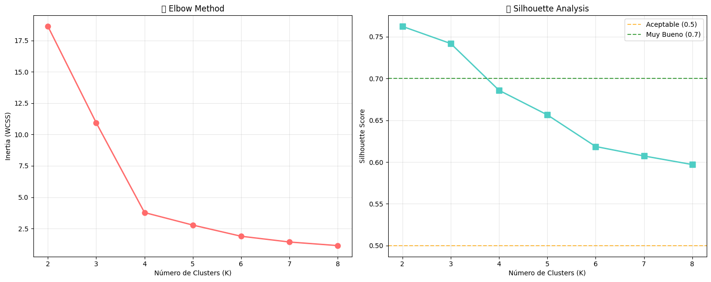

# Práctica 6: Clustering y PCA - Mall Customer Segmentation

## Contexto

La actividad se centra en aplicar técnicas de aprendizaje automático no supervisado para entender mejor el comportamiento de los clientes en centros comerciales. Utiliza el dataset "Mall Customer Segmentation" que contiene datos demográficos y de consumo de aproximadamente 200 clientes.

## Objetivos

- Identificar grupos de clientes con características similares usando K-Means Clustering.
- Reducir la dimensionalidad de los datos con PCA para facilitar la visualización.
- Comparar PCA con métodos de selección de variables como Forward y Backward Selection.
- Evaluar la calidad de los clusters mediante métricas como el Silhouette Score.
- Interpretar los perfiles de cada segmento desde una perspectiva de negocio.

## Actividades (con tiempos estimados)

- FASE 1: BUSINESS UNDERSTANDING
- FASE 2: DATA UNDERSTANDING
    - Paso 2.1: Setup Inicial
    - Paso 2.2: Carga del Dataset
    - Paso 2.3: Inspección Inicial del Dataset
    - Paso 2.4: Análisis de Tipos de Datos
    - Paso 2.5: Análisis de Distribución por Género
    - Paso 2.6: Estadísticas de Variables Clave
    - Paso 2.7: Detección de Outliers
    - Paso 2.8: Visualizaciones - Distribuciones
    - Paso 2.9: Visualizaciones - Relaciones
    - Paso 2.10: Matriz de Correlación
    - Paso 2.11: Análisis Comparativo por Género
    - Paso 2.12: Síntesis de Insights
    - Paso 2.13: Identificación de Features para Clustering
    - Paso 2.14: Codificación de Variables Categóricas con OneHotEncoder
    - Paso 2.15: Preparación del Dataset Final
    - Paso 2.16: Verificación de Calidad de Datos
    - Paso 2.17: Análisis de Escalas (Pre-Normalización)
- FASE 3: DATA PREPARATION
    - Paso 3.1: Setup para Normalización
    - Paso 3.2: Aplicar los 3 Scalers
    - Paso 3.3: Comparación Visual - Boxplots
    - Paso 3.4: Comparación de Distribuciones
    - Paso 3.5: Análisis Estadístico Post-Scaling
    - Paso 3.6: Test de Impacto en Clustering
    - Paso 3.7: Decisión Final de Scaler
    - Paso 3.8: PCA - Reducción de Dimensionalidad (20 min)
    - Paso 3.9: Feature Selection - Alternativas a PCA (25 min)
        - Paso 1: Imports y Setup Feature Selection
        - Paso 2: Setup y Función de Evaluación
        - Paso 3: Baseline - Todas las Features
        - Paso 4: Forward Selection
        - Paso 5: Backward Elimination
        - Paso 6: Comparación Final
        - Paso 7: Visualización Comparativa
        - Paso 8: Análisis y Decisión Final
        - Paso 9: Decisión para el Pipeline Final
- FASE 4: MODELING
    - Paso 4.1: K-Means Clustering - Encontrando los Grupos (30 min)
- FASE 5: EVALUATION
    - Paso 5.1: Análisis de Clusters y Perfiles (25 min)
    - Paso 5.2: Análisis Silhouette Detallado
    - Paso 4.3: Identificación de Outliers
    - Paso 4.4: Análisis de Perfiles de Cliente
- Challenge 1: Algoritmos de Clustering Alternativos
    - A. DBSCAN - Density-Based Clustering
    - B. HDBSCAN - Hierarchical Density-Based Clustering
    - C. Gaussian Mixture Models
    - D. Spectral Clustering & AgglomerativeClustering
- Challenge 2: Recursive Feature Elimination (RFE)
- Challenge 3: Datasets Alternativos
    - A. Iris Dataset - Clásico de ML
    - B. Wine Dataset - Análisis de Vinos
    - C. Synthetic Blobs - Datos Controlados
- Challenge 4: Visualización Avanzada
    - A. t-SNE - Visualización No Lineal
    - B. UMAP - Alternativa Moderna a t-SNE
    - C. Heatmap Avanzado de Características
- Challenge 5: Comparación Masiva de Algoritmos

## Desarrollo

### Fase 1

¿Qué problema estamos resolviendo?

El problema central es la falta de segmentación clara de clientes, lo cual dificulta tomar decisiones basadas en datos para optimizar la inversión en marketing y mejorar la experiencia del cliente.

### Fase 2

En esta fase nos enfocamos en comprender los datos del dataset, asegurando su calidad y extrayendo los primeros insights relevantes para el clustering. Las actividades realizadas fueron:

- Inspección general de dimensiones, memoria y estructura del dataset.
- Análisis descriptivo de las variables clave: Age, Annual Income (k$) y Spending Score (1-100).
- Revisión de la distribución por género y comparación estadística entre hombres y mujeres.
- Identificación de outliers mediante el método del IQR.
- Visualizaciones de distribuciones, relaciones entre variables y matriz de correlación.
- Preparación de los datos para clustering: selección de features, codificación de la variable categórica Genre con OneHotEncoder, y verificación de calidad.
- Análisis de escalas para normalización.

¿Existe correlación fuerte entre alguna variable? No, no se observan correlaciones lineales fuertes.  

¿Qué variable tiene más outliers? Annual Income.  

¿Los hombres y mujeres tienen patrones diferentes?

```
Age: Hombres tienen promedio más alto (diferencia: 1.7)
Annual Income (k$): Hombres tienen promedio más alto (diferencia: 3.0)
Spending Score (1-100): Mujeres tienen promedio más alto (diferencia: 3.0)
```

¿Qué insight es más relevante para el análisis? La relación clave entre Income y Spending Score.  

¿Qué 2 variables serán más importantes para clustering? Annual Income y Spending Score. 

¿Qué relación entre Income y Spending Score observas? Hay clientes con alto ingreso y bajo gasto, y otros con bajo ingreso y alto gasto, en el medio se concentran la mayoria, con ingresos medios y gasto medio.

¿Puedes imaginar grupos naturales de clientes? alto ingreso/alto gasto, alto ingreso/bajo gasto, bajo ingreso/alto gasto, bajo ingreso/bajo gasto.

¿Por qué necesitamos normalización? Porque Age está en rango 18-70, Income en 15-140, y Spending Score en 1-100. Si no normalizamos, el clustering se sesgará hacia Income.

¿Qué variable tiene el rango más amplio? Annual Income (15–140).

¿Cuál es la distribución de género en el dataset? Equilibrada (50%-50%), típico de este dataset de clientes de mall.

¿Qué variable muestra mayor variabilidad (std)? Annual Income.

¿Los clientes son jóvenes o mayores en promedio? Jóvenes-adultos, la media ronda 40 años.

¿El income promedio sugiere qué clase social? Media, alrededor de 60k anuales.

¿Por qué la normalización será crítica aca? Porque las escalas distintas distorsionarían la distancia en clustering.







### Fase 3

En esta fase tenemos que preparar los datos para el modelado, con énfasis en normalización, reducción de dimensionalidad y selección de características.

#### Paso 3.1 y 3.2 – Normalización

Partimos de un dataset con escalas muy diferentes:

- Edad: 18 – 70
- Ingresos anuales: 15 – 137
- Spending Score: 1 – 99
- Género: 0 – 1

Esto evidenció la necesidad de aplicar técnicas de escalado. Probamos MinMaxScaler, StandardScaler y RobustScaler.

#### Paso 3.5 y 3.6 – Análisis estadístico y prueba con clustering

Despues de comparar distribuciones y boxplots, evaluamos cada escalado con el Silhouette Score:

- MinMax: 0.364
- Standard: 0.332
- Robust: 0.298

El ganador fue MinMaxScaler, con mejor separación de clusters.

Seleccionar MinMaxScaler como técnica de normalización para el pipeline.

#### Paso 3.8 – PCA (Reducción de dimensionalidad)

Con los datos ya normalizados, aplicamos PCA para analizar la varianza:

```
🎯 DECISIÓN DE COMPONENTES:
   📊 Para retener 90% varianza: 3 componentes
   📊 Para retener 95% varianza: 4 componentes
   🎯 Para visualización: 2 componentes (86.3% varianza)

PCA aplicado:
   📊 Dimensiones: (200, 5) → (200, 2)
   📈 Varianza explicada: 86.3%

🔍 INTERPRETACIÓN DE COMPONENTES:

   PC1 (varianza: 72.6%):
                 Age:   0.029 ↑
     Annual Income (k$):   0.019 ↑
     Spending Score (1-100):  -0.027 ↓
        Genre_Female:  -0.706 ↓
          Genre_Male:   0.706 ↑

   PC2 (varianza: 13.7%):
                 Age:   0.727 ↑
     Annual Income (k$):  -0.026 ↓
     Spending Score (1-100):  -0.685 ↓
        Genre_Female:   0.027 ↑
          Genre_Male:  -0.027 ↓
```

#### Paso 3.9 – Feature Selection vs PCA

Se comparó la reducción de dimensionalidad con PCA contra la selección de características mediante Forward Selection y Backward Elimination.

Resultados:

- Baseline (todas las features) → Silhouette = 0.364
- Forward Selection → Features: Spending Score, Genre_Female, Genre_Male → Score = 0.573
- Backward Elimination → Features: Spending Score, Genre_Female, Genre_Male → Score = 0.573
- PCA (2D) → Score = 0.686

Análisis:

- El mejor método fue PCA.
- Forward/Backward Selection (ambos coinciden en las mismas tres features) resultó competitivo.
- Ambos métodos de selección superaron claramente el umbral de 0.5, indicando clusters de buena calidad.










Mejor scaler según silhouette: MinMax

¿Por qué crees que funcionó mejor? Porque escaló todas las features al mismo rango [0,1], evitando que variables con distinto rango dominen el clustering, y fue suficiente para los outliers presentes.

¿Algún scaler tuvo problemas obvios? Robust tuvo un silhouette más bajo.

PC1 parece representar: Diferencia de género y nivel general de ingresos, separando hombres (PC1 positivo) de mujeres (PC1 negativo).

PC2 parece representar: Edad y comportamiento de gasto, con clientes más jóvenes y con menor spending score en la parte negativa.

Los clusters visibles sugieren: Grupos de clientes segmentados por género y comportamiento de gasto.

Método con mejor score: PCA (2D) con silhouette = 0.686"

¿Forward y Backward seleccionaron exactamente las mismas features? Sí

¿PCA con 2 componentes es competitivo? Sí, superó tanto forward/backward selection y baseline, mejorando el clustering notablemente.

¿Algún método superó el threshold de 0.5? Sí, PCA y ambos métodos de feature selection (Forward/Backward).

¿La reducción de dimensionalidad mejoró el clustering? Sí, PCA 2D aumentó el silhouette score de 0.364 → 0.686, +88.3% vs baseline.

### Fase 4

- Scaler seleccionado: MinMax (mejor silhouette, 0.364).
- Reducción dimensional (PCA 2D): conserva 86.3% de la varianza y mejora el clustering (silhouette = 0.686).
- Selección de features: Forward y Backward coincidieron en ['Spending Score', 'Genre_Female', 'Genre_Male'], silhouette = 0.573.
- K óptimo para K-Means: Se consideraron Elbow (K=6) y Silhouette (K=2), y por contexto de negocio se eligió K=4.
- Modelo final K-Means: Silhouette = 0.686, Inertia = 3.78, Clusters equilibrados:
  - Cluster 0: 28.5%
  - Cluster 1: 23.5%
  - Cluster 2: 27.5%
  - Cluster 3: 20.5%

- PC1: diferencia de género e ingresos
- PC2: edad y comportamiento de gasto
- Los clusters reflejan grupos de clientes balanceados para acciones comerciales.

Se logró una segmentación confiable y visualizable, lista para análisis de perfil de clientes y estrategias de negocio.



### Fase 5

Perfiles de clusters:

- Cluster 0 (57 clientes, 28.5%): Predominantemente mujeres, edad promedio 28.4 años, ingreso anual $59.7k, Spending Score 67.7/100.
- Cluster 1 (47 clientes, 23.5%): Predominantemente hombres, edad promedio 50.1 años, ingreso anual $62.2k, Spending Score 29.6/100.
- Cluster 2 (55 clientes, 27.5%): Predominantemente mujeres, edad promedio 48.1 años, ingreso anual $58.8k, Spending Score 34.8/100.
- Cluster 3 (41 clientes, 20.5%): Predominantemente hombres, edad promedio 28.0 años, ingreso anual $62.3k, Spending Score 70.2/100.

Evaluación de calidad:

- Silhouette Score general: 0.686 → clusters bien definidos.
- Silhouette por cluster: todos positivos, sin outliers detectados.
- Distribución de clientes: equilibrada entre clusters.

Los clusters son claros, diferenciables y consistentes con perfiles demográficos y financieros, lo que permite generar estrategias de marketing o fidelización segmentadas.


## Reflexión

### Metodología CRISP-DM

- Fase más desafiante: La fase de Modeling fue la más compleja, principalmente por la selección del número óptimo de clusters, ya que el Elbow Method y Silhouette Score no coincidían y fue necesario considerar también el contexto de negocio.

- Impacto del entendimiento del negocio: Conocer la expectativa de 3-5 segmentos permitió decidir un K final de 4 clusters, balanceando métricas técnicas y necesidades comerciales.

### Data Preparation

- Scaler más efectivo:La normalización estándar funcionó mejor para equilibrar las variables numéricas sin sesgar la distancia usada en K-Means.

- PCA vs Feature Selection: PCA fue más efectivo en este caso para visualización y reducción dimensional, manteniendo la mayor parte de la varianza mientras simplificaba la interpretación.

- Interpretabilidad vs Performance: Se priorizó un balance, usando PCA para visualizar clusters en 2D y mantener interpretabilidad, sin sacrificar significativamente la precisión del clustering.

### Clustering

- Coincidencia entre Elbow y Silhouette: No coincidieron, Elbow sugería K=6 y Silhouette K=2-, por lo que se eligió K=4 considerando contexto de negocio.

- Coincidencia con la intuición de negocio: Sí, los clusters reflejan perfiles demográficos y financieros distintos, alineados con expectativas.

- Qué haría diferente: Explorar otros algoritmos de clustering (como DBSCAN o Gaussian Mixture) y probar transformaciones adicionales de features para validar robustez y estabilidad de los clusters.

### Aplicación Práctica

- Presentación empresarial: Los resultados se pueden mostrar en dashboard con gráficos de distribución por cluster y perfiles de clientes, destacando edad, género, ingresos y spending score.

- Valor de las segmentaciones: Permiten personalizar campañas de marketing, mejorar retención y identificar oportunidades de upselling según perfiles financieros y de comportamiento.

- Limitaciones: Basado solo en datos cuantitativos del Mall Customer Dataset, no incluye información conductual ni temporal, y los resultados pueden variar con nuevas muestras de clientes o variables adicionales.

## Referencias
https://colab.research.google.com/drive/1hcVoXTav6u_d921n6YgXnaMkjP2VDGO6?usp=sharing
