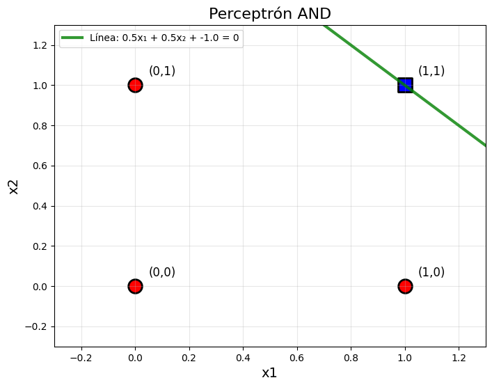
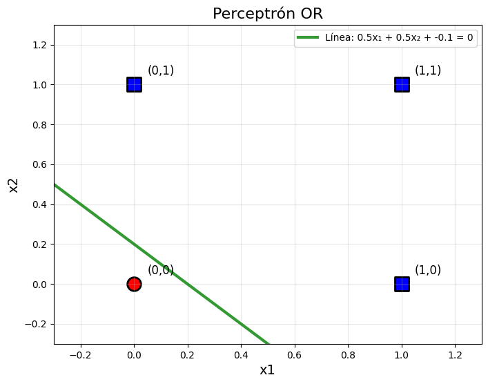
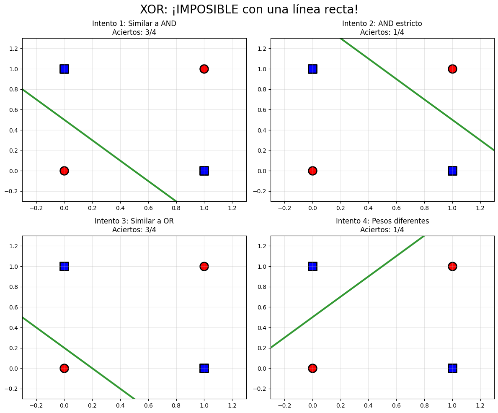
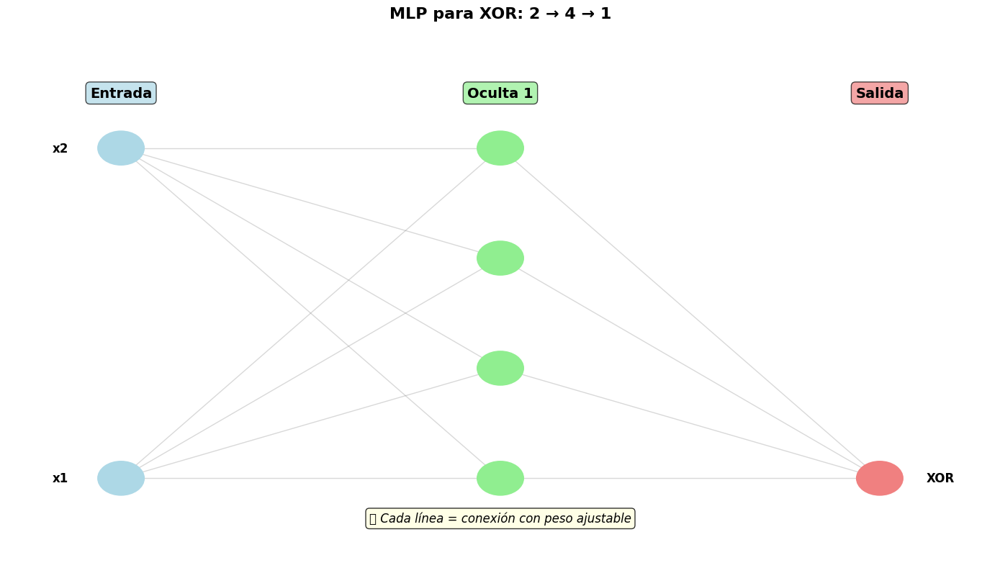
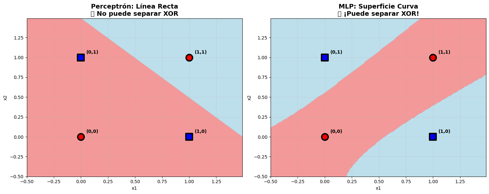
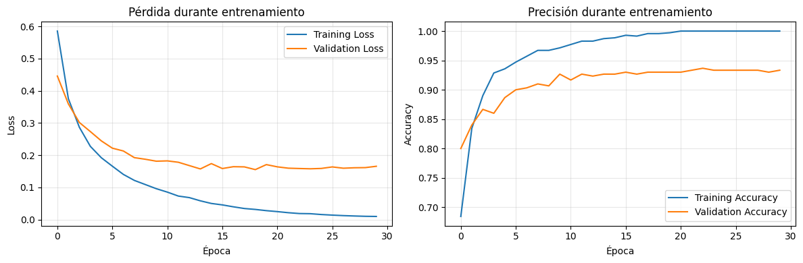
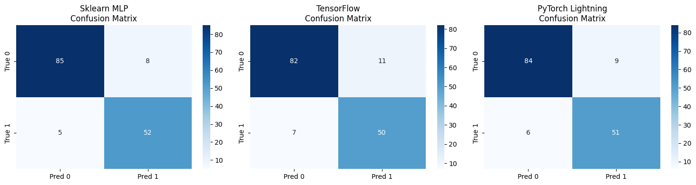

# Páctica 7: De Perceptrón a Redes Neuronales

## Contexto

Esta práctica presenta la evolución desde el perceptrón simple hasta las redes neuronales multicapa. 

Se busca comprender tanto las limitaciones de un modelo lineal, con el ejemplo del problema XOR, como el potencial de arquitecturas más complejas que permiten resolver problemas reales. 


## Objetivos

- Identificar las limitaciones del perceptrón simple al enfrentarse con problemas no linealmente separables.
- Construir y evaluar redes multicapa con scikit-learn para resolver el problema XOR.
- Implementar redes neuronales más avanzadas utilizando TensorFlow y PyTorch Lightning, aplicadas a datasets realistas.
- Analizar y comparar los resultados entre diferentes enfoques, comprendiendo cuándo conviene usar cada herramienta.
- Iniciarse en programación de modelos de deep learning, visualización de arquitecturas y evaluación de desempeño.

## Actividades

- PARTE 1: Conceptos Interactivos
    - Actividad Interactiva: "Explorando el Perceptrón"
        - Setup Súper Rápido
        - Paso 1: Resolver AND
        - Paso 2: Resolver OR
        - Paso 3: Resolver NOT
        - Paso 4: XOR
- PARTE 2: Herramientas Reales
    - Actividad 1: Sklearn MLP
        - Resolver XOR con MLP
        - Visualizar la Arquitectura de Red MLP
        - Visualizar Superficie de Decisión
        - Dataset Real con MLP
    - Actividad 2: TensorFlow - Red Profesional
        - Red Neuronal con TensorFlow
        - Visualizar Entrenamiento
        - PyTorch Lightning (Bonus)
        - Entrenar PyTorch Lightning
        - Visualización de Matriz de Confusión

## Desarrollo

### Parte 1

En esta parte trabajamos de manera progresiva con el perceptrón simple, aplicándolo a distintos problemas lógicos.

#### Paso 1: AND

- Se probó el perceptrón para la compuerta AND, donde solo se activa cuando ambas entradas son 1.
- Se decidio utilizar pesos iguales w1=0.5, w2=0.5 y un bias=-1.
- Como resultado, todas las combinaciones fueron clasificadas correctamente.
- La línea de separación logró dividir perfectamente los puntos de clase 0 (rojo) y clase 1 (azul).



#### Paso 2: OR

- Se implementó la compuerta OR, que se activa con al menos una entrada en 1.
- Se decidio mantener w1=0.5, w2=0.5, pero el bias se ajustó a -0.1, permitiendo que una sola entrada sea suficiente para activar la salida.
- Como resultado el perceptrón resolvió correctamente todos los casos.
- Nuevamente la línea verde separó con éxito las dos clases.



#### Paso 3: NOT

- Se evaluó la compuerta NOT (de una sola entrada).
- Se decidio el usó de un peso negativo w1=-0.5 y un bias positivo 0.25 para invertir el valor de entrada.
- Como resultado el modelo clasificó correctamente los dos casos posibles.
- Se confirmó que el perceptrón también puede implementarse como un inversor simple.


#### Paso 4: XOR

- Finalmente, la compuerta XOR, que se activa únicamente cuando las entradas son diferentes.
- Se probaron varios intentos con diferentes combinaciones de pesos y bias:
    - Intentos 1 y 3 lograron un 75% de aciertos.
    - Intentos 2 y 4 bajaron a un 25%.
- Como resultados, en ningún caso se alcanzó el 100%.
Por lo tanto, el perceptrón simple no puede resolver XOR porque no es posible separar las clases con una sola línea recta.



### Parte 2 - Actividad 1

En esta segunda parte se aplicaron herramientas reales de machine learning con la librería scikit-learn, enfocándose en el uso del MLPClassifier para resolver problemas no linealmente separables.

El primer paso fue resolver el problema XOR, que el perceptrón simple no puede resolver debido a su naturaleza lineal.

- Se decidio utilizó un perceptrón multicapa con una capa oculta de 4 neuronas.
- Para la función de activación se eligió ReLU, aunque también se probaron tanh y logistic como alternativas.

Los resultados mostraron que la red logró una accuracy del 100% en el conjunto XOR, validando que una arquitectura multicapa sí puede aprender relaciones no lineales.

```
x1 | x2 | esperado | predicción | ✓
0  | 0  |    0     |     0      | ✓
0  | 1  |    1     |     1      | ✓
1  | 0  |    1     |     1      | ✓
1  | 1  |    0     |     0      | ✓
Accuracy: 100.0%
```

---

Se desarrolló una función para graficar la red neuronal, mostrando las capas de entrada (2), oculta (4) y salida (1). El análisis de parámetros entrenables arrojó:

- Capa 1: 2 → 4 = 12 parámetros
- Capa 2: 4 → 1 = 5 parámetros
- Total: 17 parámetros entrenables

Esto permite comprender que cada conexión implica un peso y un bias adicional por neurona.



---

Se comparó visualmente la capacidad de separación:

- Perceptrón simple: solo puede generar una línea recta, lo que resulta insuficiente para el problema XOR.
- MLP: produce una superficie de decisión curva, capaz de separar correctamente las clases.

El análisis visual mostró zonas claramente delimitadas, confirmando la superioridad del MLP frente al perceptrón lineal.



---

Finalmente, se aplicó MLP a un dataset sintético más complejo.

- Se dividió el dataset 70% entrenamiento, 30% prueba.
- Arquitectura elegida: dos capas ocultas con tamaños (100, 50), lo que equivale a una red 20 → 100 → 50 → 2.
- Se utilizó activación ReLU, solver adam y un máximo de 1000 iteraciones.

Los resultados fueron:

- Training accuracy: 100%
- Test accuracy: 93%

Esto evidencia un ligero overfitting, el modelo se adapta perfectamente al conjunto de entrenamiento, pero pierde algo de generalización en el conjunto de prueba.

### Parte 2 - Actividad 2

En esta segunda actividad se buscó implementar una red neuronal profesional utilizando dos frameworks, TensorFlow/Keras y PyTorch Lightning. Se trabajó con el mismo dataset usado en scikit-learn, un conjunto de 700 muestras, con 20 características, dividido en entrenamiento y prueba.

Se definió un modelo Sequential con las siguientes capas:

- Capa oculta 1: `Dense(64, activation='relu', input_shape=(20,))`
- Capa oculta 2: `Dense(32, activation='relu')`
- Capa de salida: `Dense(1, activation='sigmoid')` para clasificación binaria.

El modelo se compiló con el optimizador Adam, la función de pérdida binary_crossentropy, y se evaluó con la métrica de accuracy. Se entrenó durante 30 épocas con batch size de 32, incluyendo validación sobre el conjunto de prueba.

- El entrenamiento mostró una mejora progresiva: en la primera época la accuracy fue de 60%, alcanzando rápidamente más del 90% en validación hacia la época 10.
- El entrenamiento continuó hasta llegar a un 100% de accuracy en training, mientras que la validación se estabilizó en torno al 93%.
- Total de parámetros entrenables: 9,793.

Esto indica que el modelo converge bien, pero presenta un ligero overfitting, ya que la accuracy en entrenamiento llegó al máximo mientras que en prueba se mantuvo en torno al 93%.



---

Para comparar con TensorFlow, se construyó una red neuronal equivalente en PyTorch Lightning. El modelo SimpleNet incluyó:

- Capa oculta 1: `nn.Linear(input_size, 64)` seguida de `nn.ReLU(True)`
- Capa oculta 2: `nn.Linear(64, 32)` seguida de `nn.ReLU(True)`
- Capa de salida: `nn.Linear(32, 2)` para clasificación binaria con softmax implícito en `cross_entropy`.

El optimizador elegido fue Adam con tasa de aprendizaje 0.001, durante 30 épocas.

- El modelo entrenó correctamente, alcanzando un test accuracy de 92.6%, con una pérdida en test de 0.188.
- Número de parámetros entrenables: 3,490, lo cual es menor que el modelo de TensorFlow, debido a diferencias en arquitectura y codificación de salida.

---

Para comparar de forma más visual, se generaron matrices de confusión con las predicciones de los tres frameworks:

- Scikit-learn MLP: 137 aciertos, 13 errores.
- TensorFlow: 132 aciertos, 18 errores.
- PyTorch Lightning: 135 aciertos, 15 errores.

En todos los casos, la mayoría de las predicciones se encuentran en la diagonal principal (correctas), con un pequeño número de falsos positivos y falsos negativos.



## Reflexión

Los experimentos confirmaron que el perceptrón simple solo resuelve problemas lineales, mientras que el MLP supera esta limitación y logra buen rendimiento incluso en problemas no lineales como XOR. En el dataset complejo, todos los modelos alcanzaron entre 92% y 93% de accuracy, mostrando resultados consistentes entre frameworks.

Se observó un ligero sobreajuste en TensorFlow (100% en entrenamiento vs 93% en test), mientras que PyTorch mostró un equilibrio más estable con menos parámetros entrenables. Las matrices de confusión indicaron que los errores se distribuyeron de manera uniforme, sin sesgo hacia una clase específica.

Como próximos pasos, se podrían aplicar técnicas de regularización y validación cruzada, además de experimentar con datasets más grandes para evaluar la capacidad de generalización y eficiencia de cada framework.

---

¿Por qué AND, OR y NOT funcionaron pero XOR no?

Porque AND, OR y NOT son problemas linealmente separables, mientras que XOR no puede separarse con una sola línea recta en el plano.

---

¿Cuál es la diferencia clave entre los pesos de AND vs OR?

En AND se necesita un umbral más alto (los dos deben estar activos), mientras que en OR basta con que uno supere el umbral, por lo que los pesos son más bajos.

---

¿Qué otros problemas del mundo real serían como XOR?

???

---

¿Por qué sklearn MLP puede resolver XOR pero un perceptrón no?

El perceptrón solo crea una línea de decisión, mientras que el MLP combina varias líneas mediante sus capas ocultas, permitiendo separar regiones no lineales.

---

¿Cuál es la principal diferencia entre TensorFlow/Keras y sklearn MLP?

TensorFlow/Keras ofrece mayor control y flexibilidad sobre la arquitectura y el entrenamiento, mientras que sklearn MLP es más limitado pero fácil de usar.

---

¿Por qué TensorFlow usa epochs y batch_size mientras sklearn MLP no?

Porque TensorFlow entrena en lotes (batch training) y permite controlar el ciclo de entrenamiento, mientras que sklearn entrena todo de forma más automática.

---

¿Cuándo usarías sigmoid vs relu como función de activación?

- Sigmoid: en la capa de salida para problemas de clasificación binaria.
- ReLU: en las capas ocultas, porque evita saturación y acelera el entrenamiento.

---

¿Qué ventaja tiene PyTorch Lightning sobre TensorFlow puro?

Requiere menos código repetitivo y facilita organizar experimentos de manera clara y modular.

---

¿Por qué PyTorch Lightning separa training_step y test_step?

Porque en entrenamiento se hace backpropagation y optimización, mientras que en test solo se evalúa el rendimiento sin actualizar pesos.

---

¿Cuál framework elegirías para cada escenario?

- Prototipo rápido: sklearn (rápido y simple).
- Modelo en producción: TensorFlow/Keras (industrial, robusto).
- Investigación avanzada: PyTorch Lightning (flexible y modular).

---

¿Por qué el error `mat1 and mat2 shapes cannot be multiplied` es común en PyTorch?

Porque el tamaño de entrada del dataset no coincide con el número de neuronas en la primera capa lineal.

---

¿Qué significa el parámetro `deterministic=True` en PyTorch Lightning Trainer?

Fuerza a que los resultados sean reproducibles entre ejecuciones, eliminando aleatoriedad.

---

¿Por qué TensorFlow muestra curvas de `loss` y `val_loss` durante entrenamiento?

Para detectar overfitting visualmente: si la pérdida de entrenamiento baja pero la de validación sube, hay sobreajuste.

---

¿Cuál es la diferencia entre `trainer.test()` y `trainer.predict()` en PyTorch Lightning?

- `test()`: calcula métricas de rendimiento en un dataset de prueba.
- `predict()`: solo devuelve las predicciones del modelo, sin métricas.

---

¿Por qué sklearn MLP es más fácil pero menos flexible?

Porque abstrae el entrenamiento en unas pocas líneas, pero eso significa menos control sobre la arquitectura, funciones de activación, optimizadores y ciclos de entrenamiento.

## Referencias

- https://colab.research.google.com/drive/1DoBC3bAhqRbgs6NwiiFkEUr5I88do4_B?usp=sharing