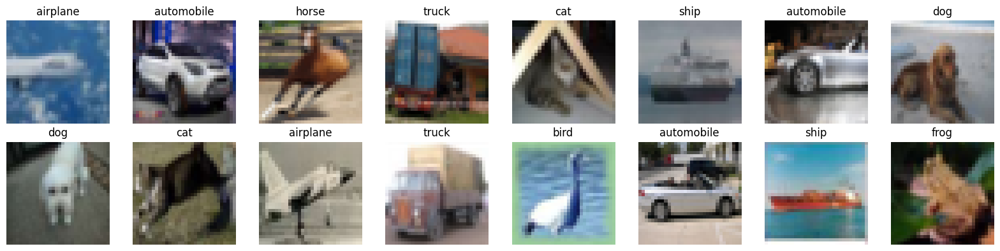
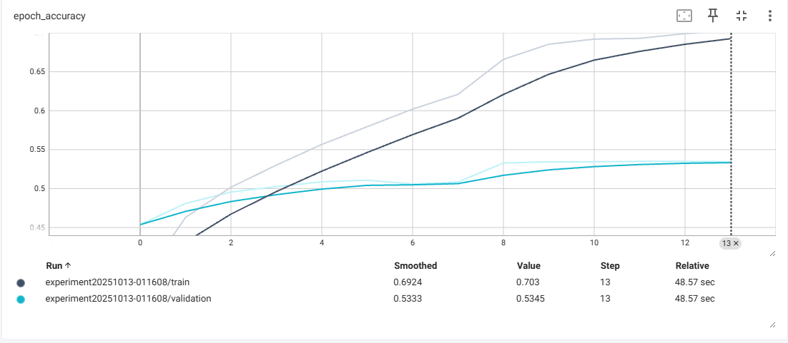
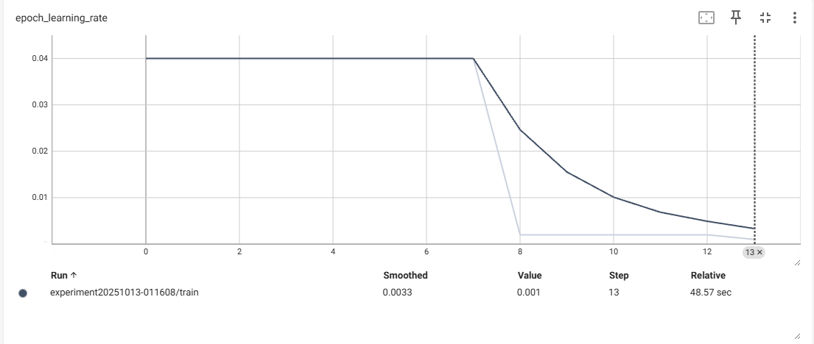
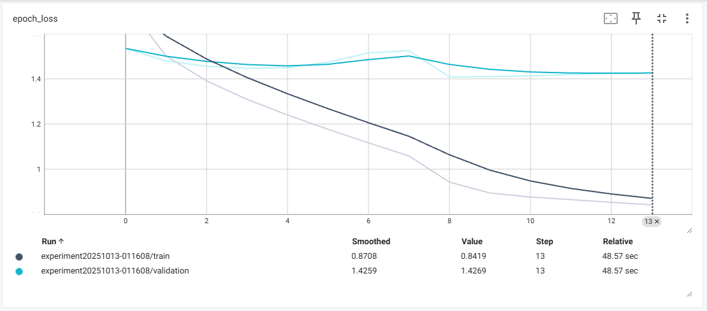
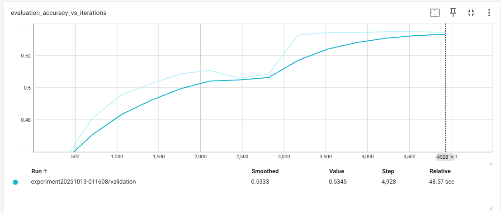

# Páctica 8: Backpropagation y Optimizadores

## Contexto

En esta actividad se introduce el algoritmo de backpropagation y el uso de distintos optimizadores en redes neuronales. Se trabaja con el dataset CIFAR-10, implementando un perceptrón multicapa en TensorFlow/Keras y analizando su entrenamiento mediante TensorBoard. 

La práctica busca explorar cómo la elección de arquitecturas, funciones de activación, regularización y optimizadores impacta en el rendimiento del modelo.

## Objetivos

- Implementar un MLP en TensorFlow/Keras para clasificación de imágenes en CIFAR-10.
- Comparar el desempeño de distintos optimizadores (Adam, SGD, RMSprop, AdamW) y sus hiperparámetros.
- Explorar arquitecturas y técnicas de regularización (Dropout, L2, BatchNormalization) para reducir overfitting.
- Utilizar callbacks de Keras para experimentar con la dinámica de entrenamiento.
- Medir resultados con métricas de clasificación y visualizar curvas de entrenamiento para interpretar la eficacia de cada configuración.

## Actividades

- Preparar liberias
- Cargar datos
- Red neuronal
- Tensorboard

## Desarrollo

Se trabajó con el dataset CIFAR-10, compuesto por 60.000 imágenes a color de 32x32 distribuidas en 10 clases. Las imágenes fueron normalizadas al rango [−1,1] y se realizó un split en conjuntos de entrenamiento, validación y prueba.



Para el modelo se construyó una red neuronal multicapa con varias capas densas, funciones de activación no lineales (ReLU, tanh, GELU), normalización por lotes y regularización mediante Dropout. Se probaron distintos optimizadores (Adam, SGD, RMSprop) y se implementaron callbacks como EarlyStopping y ReduceLROnPlateau para controlar el sobreajuste y ajustar la tasa de aprendizaje dinámicamente.

El entrenamiento se llevó a cabo por hasta 30 épocas, con batch size de 128, registrando métricas en TensorBoard. Como resultado, el modelo alcanzó aproximadamente un 69,5% de exactitud en entrenamiento y un 52,2% en el conjunto de prueba, con un total de ~6 millones de parámetros entrenables.

Los resultados mostraron que, si bien la red fue capaz de aprender patrones, el rendimiento en test evidenció limitaciones de la arquitectura MLP para datos de tipo imagen, sugiriendo que las capas utilizadas quizas no serían las más adecuados para este tipo de tarea.

```python
# === RED NEURONAL ===
import tensorflow as tf
from tensorflow import keras
from tensorflow.keras import layers

# Crear modelo Sequential
model = keras.Sequential([
    layers.Dense(128, activation='relu', input_shape=(x_train.shape[1],)),
    layers.BatchNormalization(),
    layers.Dense(256, activation='relu'),
    layers.Dense(1024, activation='gelu'),
    layers.Dropout(0.2),
    layers.Dense(2048, activation='relu'),
    layers.Dropout(0.2),
    layers.BatchNormalization(),
    layers.Dense(1024, activation='tanh'),
    layers.Dense(1024, activation='tanh'),
    layers.Dense(len(class_names), activation='softmax')  # salida binaria
])

adam = keras.optimizers.Adam(
    learning_rate=0.001,
    beta_1=0.9,
    beta_2=0.999,
    epsilon=1e-07,
    amsgrad=False,
    weight_decay=None,
    clipnorm=None,
    clipvalue=None,
    global_clipnorm=None,
    use_ema=False,
    ema_momentum=0.99,
    ema_overwrite_frequency=None,
    loss_scale_factor=None,
    gradient_accumulation_steps=None,
    name="adam"
)

sgd = keras.optimizers.SGD(
    learning_rate=0.04,
    momentum=0.0,
    nesterov=False,
    weight_decay=None,
    clipnorm=None,
    clipvalue=None,
    global_clipnorm=None,
    use_ema=False,
    ema_momentum=0.99,
    ema_overwrite_frequency=None,
    loss_scale_factor=None,
    gradient_accumulation_steps=None,
    name="SGD"
)

rmsprop = keras.optimizers.RMSprop(
    learning_rate=0.001,
    rho=0.9,
    momentum=0.0,
    epsilon=1e-07,
    centered=False,
    weight_decay=None,
    clipnorm=None,
    clipvalue=None,
    global_clipnorm=None,
    use_ema=False,
    ema_momentum=0.99,
    ema_overwrite_frequency=None,
    loss_scale_factor=None,
    gradient_accumulation_steps=None,
    name="rmsprop"
)

reduce_lr = tf.keras.callbacks.ReduceLROnPlateau(
    monitor='val_loss', factor=0.05,
                              patience=4, min_lr=0.001
)

call2 = tf.keras.callbacks.EarlyStopping(
    monitor='val_loss',
    min_delta=0,
    patience=5,
    verbose=0,
    mode='auto',
    baseline=None,
    restore_best_weights=False,
    start_from_epoch=0
)

# Compilar modelo
model.compile(
    optimizer=sgd,              # adam, sgd, rmsprop
    loss='sparse_categorical_crossentropy',
    metrics=['accuracy']
)

# Entrenar
print("Entrenando red neuronal...")
history = model.fit(
    x_train, y_train,
    epochs=30,                   # número de épocas
    batch_size=128,               # tamaño de batch
    validation_data=(x_test, y_test),
    verbose=1,
    callbacks=[keras.callbacks.TensorBoard(log_dir=run_dir, histogram_freq=1), reduce_lr, call2]
)

# Evaluar
train_loss, train_acc = model.evaluate(x_train, y_train, verbose=0)
test_loss, test_acc = model.evaluate(x_test, y_test, verbose=0)

print(f"\n🎯 Resultados TensorFlow:")
print(f"  Training Accuracy: {train_acc:.1%}")
print(f"  Test Accuracy: {test_acc:.1%}")
print(f"  Parámetros totales: {model.count_params():,}")
```

```python
Entrenando red neuronal...
Epoch 1/30
352/352 ━━━━━━━━━━━━━━━━━━━━ 13s 21ms/step - accuracy: 0.3330 - loss: 1.8713 - val_accuracy: 0.4537 - val_loss: 1.5349 - learning_rate: 0.0400
Epoch 2/30
352/352 ━━━━━━━━━━━━━━━━━━━━ 4s 11ms/step - accuracy: 0.4552 - loss: 1.5285 - val_accuracy: 0.4809 - val_loss: 1.4793 - learning_rate: 0.0400
Epoch 3/30
352/352 ━━━━━━━━━━━━━━━━━━━━ 3s 9ms/step - accuracy: 0.4966 - loss: 1.4047 - val_accuracy: 0.4956 - val_loss: 1.4557 - learning_rate: 0.0400
Epoch 4/30
352/352 ━━━━━━━━━━━━━━━━━━━━ 5s 9ms/step - accuracy: 0.5255 - loss: 1.3269 - val_accuracy: 0.5025 - val_loss: 1.4467 - learning_rate: 0.0400
Epoch 5/30
352/352 ━━━━━━━━━━━━━━━━━━━━ 4s 12ms/step - accuracy: 0.5534 - loss: 1.2538 - val_accuracy: 0.5087 - val_loss: 1.4499 - learning_rate: 0.0400
Epoch 6/30
352/352 ━━━━━━━━━━━━━━━━━━━━ 3s 9ms/step - accuracy: 0.5760 - loss: 1.1907 - val_accuracy: 0.5108 - val_loss: 1.4739 - learning_rate: 0.0400
Epoch 7/30
352/352 ━━━━━━━━━━━━━━━━━━━━ 3s 9ms/step - accuracy: 0.5979 - loss: 1.1317 - val_accuracy: 0.5059 - val_loss: 1.5151 - learning_rate: 0.0400
Epoch 8/30
352/352 ━━━━━━━━━━━━━━━━━━━━ 4s 11ms/step - accuracy: 0.6167 - loss: 1.0699 - val_accuracy: 0.5085 - val_loss: 1.5245 - learning_rate: 0.0400
Epoch 9/30
352/352 ━━━━━━━━━━━━━━━━━━━━ 4s 11ms/step - accuracy: 0.6431 - loss: 1.0072 - val_accuracy: 0.5328 - val_loss: 1.4088 - learning_rate: 0.0020
Epoch 10/30
352/352 ━━━━━━━━━━━━━━━━━━━━ 5s 9ms/step - accuracy: 0.6682 - loss: 0.9354 - val_accuracy: 0.5344 - val_loss: 1.4100 - learning_rate: 0.0020
Epoch 11/30
352/352 ━━━━━━━━━━━━━━━━━━━━ 4s 10ms/step - accuracy: 0.6751 - loss: 0.9169 - val_accuracy: 0.5344 - val_loss: 1.4132 - learning_rate: 0.0020
Epoch 12/30
352/352 ━━━━━━━━━━━━━━━━━━━━ 4s 10ms/step - accuracy: 0.6804 - loss: 0.9032 - val_accuracy: 0.5349 - val_loss: 1.4189 - learning_rate: 0.0020
Epoch 13/30
352/352 ━━━━━━━━━━━━━━━━━━━━ 3s 9ms/step - accuracy: 0.6855 - loss: 0.8869 - val_accuracy: 0.5349 - val_loss: 1.4240 - learning_rate: 0.0020
Epoch 14/30
352/352 ━━━━━━━━━━━━━━━━━━━━ 3s 9ms/step - accuracy: 0.6887 - loss: 0.8770 - val_accuracy: 0.5345 - val_loss: 1.4269 - learning_rate: 0.0010

🎯 Resultados TensorFlow:
  Training Accuracy: 73.8%
  Test Accuracy: 53.5%
  Parámetros totales: 5,955,466
```






> Como aclaración, el código es corto porque la mayoría de las pruebas las hice en el mismo bloque, por lo que se fueron borrando. Igualmente, los resultados oscilaron entre un 20% aproximadamente y un 55%.

## Reflexión

Este trabajo permitió comprender de manera práctica cómo funcionan las redes neuronales multicapa aplicadas a un problema de clasificación de imágenes. Aprendí la importancia del preprocesamiento de datos y la normalización. También quedó en evidencia cómo los hiperparámetros (optimización, tasa de aprendizaje, regularización) influyen directamente en el desempeño del modelo.

Como limitación, el modelo alcanzó resultados decentes en entrenamiento, pero la brecha con el desempeño en prueba mostró problemas de generalización. Esto refleja que no son la arquitectura más eficiente para imagenes, donde se pierden las relaciones espaciales al aplanar las imágenes.

Los próximos pasos serían probar con redes convolucionales y aplicar técnicas de data augmentation, explorar regularización más avanzada y comparar distintos optimizadores y arquitecturas para evaluar su impacto en el rendimiento final.

## Referencias

https://colab.research.google.com/drive/1fVls9p_cTOx28q99l0d9Jm-BFBLXSI_3?usp=sharing