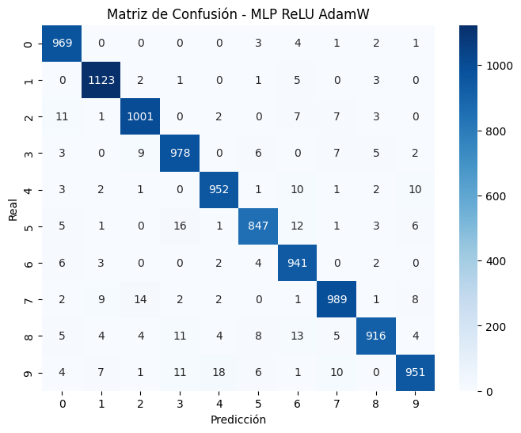
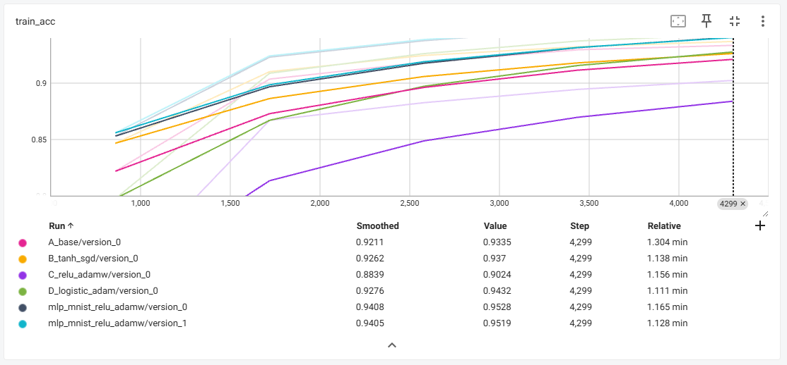
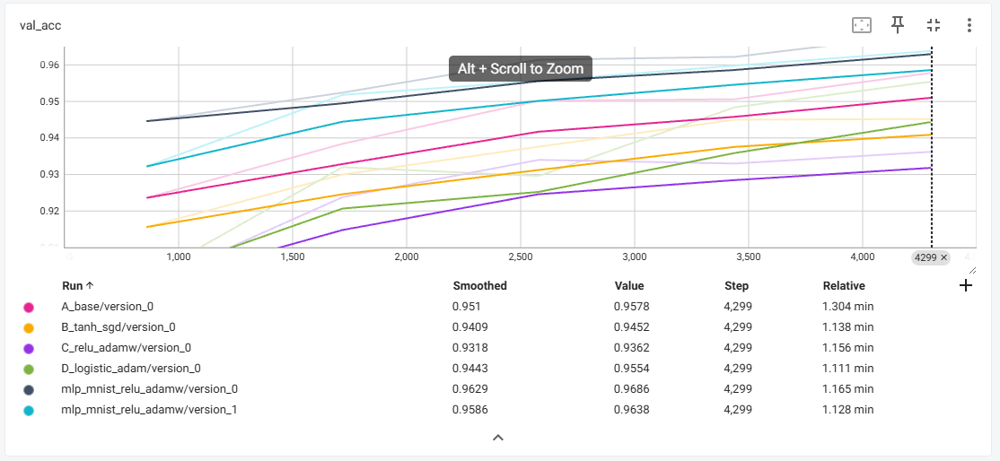

# Clasificación de Dígitos Manuscritos con MLP y PyTorch Lightning

## Contexto

Esta práctica se centra en el entrenamiento y evaluación de un modelo de red neuronal multicapa (MLP) para la clasificación del conjunto de datos MNIST, utilizando PyTorch Lightning como framework de entrenamiento estructurado.

El objetivo principal fue explorar cómo distintos hiperparámetros, funciones de activación y optimizadores afectan el rendimiento de modelos supervisados sobre un dataset de visión.

## Objetivos

* Implementar una arquitectura MLP modular y parametrizable para el reconocimiento de dígitos manuscritos.
* Emplear PyTorch Lightning para estructurar el flujo de entrenamiento, validación y prueba.
* Comparar el desempeño de distintas configuraciones de modelo (capas ocultas, activaciones, optimizadores, dropout).
* Registrar resultados y métricas con TensorBoard y seleccionar el mejor modelo según la precisión de validación.

## Desarrollo

### Preparación del Dataset

Se utilizó el dataset MNIST, compuesto por imágenes en escala de grises de 28×28 píxeles, representando dígitos del 0 al 9.

Las imágenes fueron normalizadas en el rango ([-1, 1]) mediante transformaciones de `torchvision.transforms`.

El conjunto de entrenamiento se dividió en 55,000 imágenes para entrenamiento y 5,000 para validación, reservando 10,000 para prueba.

### Arquitectura del Modelo

El modelo base (`MLPClassifier`) fue implementado como un módulo de PyTorch Lightning, parametrizable mediante:

* Número y tamaño de capas ocultas (`hidden_layers`),
* Función de activación (`ReLU`, `Tanh`, `Sigmoid`),
* Tasa de dropout (`dropout_rate`),
* Tipo de optimizador (`Adam`, `SGD`, `AdamW`),
* Tasa de aprendizaje (`lr`).

La pérdida utilizada fue CrossEntropyLoss y la métrica de desempeño Accuracy.

### Entrenamiento y Evaluación

Se entrenaron cuatro configuraciones de modelo bajo distintos hiperparámetros:

| Configuración   | Activación | Optimizador | Capas ocultas  | Dropout | Mejor Val. Acc |
| --------------- | ---------- | ----------- | -------------- | ------- | -------------- |
| A_base          | ReLU       | Adam        | [128, 64]      | 0.3     | 0.9578     |
| B_tanh_sgd      | Tanh       | SGD         | [64, 32]       | 0.2     | 0.9452         |
| C_relu_adamw    | ReLU       | AdamW       | [256, 128, 64] | 0.5     | 0.9362         |
| D_logistic_adam | Sigmoid    | Adam        | [128, 128]     | 0.3     | 0.9554         |

La configuración A_base resultó la más efectiva, alcanzando una precisión del 95.78% en validación y 95.87% en test.

Se emplearon callbacks para guardar el mejor checkpoint de cada entrenamiento (`ModelCheckpoint`) y TensorBoardLogger para el seguimiento de métricas.

* El modelo mostró una convergencia estable, sin sobreajuste evidente tras 5 épocas.
* Se comprobó que Adam y ReLU constituyen una combinación muy robusta para MLP en MNIST.

### Análisis Visual

Se generó una matriz de confusión para evaluar los errores de clasificación por dígito. Los mayores errores se concentraron entre clases visualmente similares (por ejemplo, 4 y 9, 3 y 5), lo que es común en este dataset.

## Conclusiones

* PyTorch Lightning facilita la separación clara entre definición de modelo, entrenamiento y registro de métricas, permitiendo experimentación ágil y reproducible.
* La arquitectura A_base (ReLU + Adam) demostró el mejor equilibrio entre simplicidad y rendimiento.
* Incorporar dropout moderado (0.3) ayudó a mejorar la generalización sin afectar la velocidad de convergencia.
* Este enfoque demuestra cómo un MLP correctamente regularizado puede alcanzar precisiones superiores al 95% en MNIST sin necesidad de arquitecturas convolucionales.

> Aclaro que la mayoría del código lo hizo ChatGPT, la idea y el análisis fueron por mi parte.

## Codigo

https://colab.research.google.com/drive/1lq2AORaiCdzoDOCjXPehVW50cyzPAvm-?usp=sharing