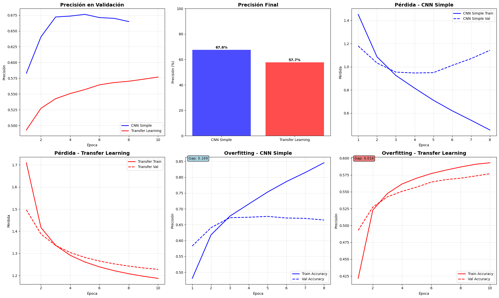
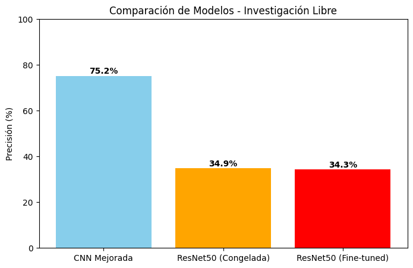
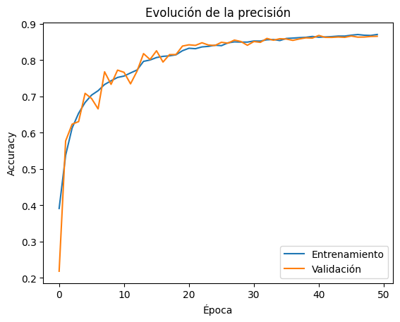

# CNNs y Transfer Learning sobre CIFAR-10

## Contexto

En este trabajo se aborda la clasificación automática de imágenes utilizando redes neuronales convolucionales y técnicas de Transfer Learning con TensorFlow/Keras.

El objetivo es aplicar conceptos de deep learning al conjunto de datos CIFAR-10, que contiene imágenes de objetos comunes distribuidas en 10 clases.

Se busca comparar el desempeño de un modelo CNN construido desde cero con el de un modelo basado en redes preentrenadas para evaluar la mejora que aporta el aprendizaje transferido.

## Objetivos

- Implementar y entrenar una CNN desde cero para clasificación de imágenes.
- Aplicar Transfer Learning utilizando modelos preentrenados.
- Evaluar y comparar ambos mediante métricas y análisis de overfitting.
- Comprender las ventajas y limitaciones del Transfer Learning frente a CNN.

## Actividades
- Paso 1: Setup y Configuración
- Paso 2: Preparar Dataset CIFAR-10
- Paso 3: CNN Simple desde Cero
- Paso 4: Transfer Learning con timm
- Paso 5: Entrenamiento
- Paso 6: Evaluación y Comparación

## Desarrollo

### Configuración del entorno y preparación del dataset

El dataset empleado fue CIFAR-10, un conjunto de imágenes a color de 32x32 píxeles distribuidas en 10 categorías balanceadas. Se cargaron 50.000 imágenes para entrenamiento y 10.000 para prueba. Cada imagen fue normalizada. Se estableció un tamaño de batch de 128 para optimizar el entrenamiento.

### Implementación de la CNN simple

El primer modelo desarrollado fue una red convolucional simple construida desde cero utilizando la API `Sequential` de Keras. La arquitectura propuesta consistió en dos bloques convolucionales con filtros de 32 y 64 neuronas respectivamente, cada uno seguido de una activación ReLU y una capa de MaxPooling2D para la reducción espacial. Tras el aplanamiento, se agregó una capa densa intermedia de 512 neuronas y una capa de salida softmax de 10 neuronas, correspondiente a las clases del dataset.

El modelo fue compilado con el optimizador Adam y la función de pérdida categorical_crossentropy. El número total de parámetros entrenables fue 2.122.186.

```python
🏗️ IMPLEMENTANDO CNN SIMPLE
--------------------------------------------------
Model: "sequential"
┏━━━━━━━━━━━━━━━━━━━━━━━━━━━━━━━━━┳━━━━━━━━━━━━━━━━━━━━━━━━┳━━━━━━━━━━━━━━━┓
┃ Layer (type)                    ┃ Output Shape           ┃       Param # ┃
┡━━━━━━━━━━━━━━━━━━━━━━━━━━━━━━━━━╇━━━━━━━━━━━━━━━━━━━━━━━━╇━━━━━━━━━━━━━━━┩
│ conv2d_2 (Conv2D)               │ (None, 32, 32, 32)     │           896 │
├─────────────────────────────────┼────────────────────────┼───────────────┤
│ activation_2 (Activation)       │ (None, 32, 32, 32)     │             0 │
├─────────────────────────────────┼────────────────────────┼───────────────┤
│ max_pooling2d_2 (MaxPooling2D)  │ (None, 16, 16, 32)     │             0 │
├─────────────────────────────────┼────────────────────────┼───────────────┤
│ conv2d_3 (Conv2D)               │ (None, 16, 16, 64)     │        18,496 │
├─────────────────────────────────┼────────────────────────┼───────────────┤
│ activation_3 (Activation)       │ (None, 16, 16, 64)     │             0 │
├─────────────────────────────────┼────────────────────────┼───────────────┤
│ max_pooling2d_3 (MaxPooling2D)  │ (None, 8, 8, 64)       │             0 │
├─────────────────────────────────┼────────────────────────┼───────────────┤
│ flatten_1 (Flatten)             │ (None, 4096)           │             0 │
├─────────────────────────────────┼────────────────────────┼───────────────┤
│ dense (Dense)                   │ (None, 512)            │     2,097,664 │
├─────────────────────────────────┼────────────────────────┼───────────────┤
│ dense_1 (Dense)                 │ (None, 10)             │         5,130 │
└─────────────────────────────────┴────────────────────────┴───────────────┘
 Total params: 2,122,186 (8.10 MB)
 Trainable params: 2,122,186 (8.10 MB)
 Non-trainable params: 0 (0.00 B)
🏗️ MODELO CNN SIMPLE:
   🔢 Parámetros: 2,122,186
```

El entrenamiento se realizó durante 10 épocas, empleando una validación cruzada con el conjunto de test y la técnica de Early Stopping para evitar sobreajuste. Los resultados mostraron una mejora progresiva en precisión, alcanzando una precisión final del 67.63% en el conjunto de validación.

```python
🏗️ ENTRENANDO CNN SIMPLE...
Epoch 1/10
391/391 ━━━━━━━━━━━━━━━━━━━━ 10s 14ms/step - accuracy: 0.3888 - loss: 1.6912 - val_accuracy: 0.5828 - val_loss: 1.1799
Epoch 2/10
391/391 ━━━━━━━━━━━━━━━━━━━━ 3s 7ms/step - accuracy: 0.6007 - loss: 1.1374 - val_accuracy: 0.6407 - val_loss: 1.0330
Epoch 3/10
391/391 ━━━━━━━━━━━━━━━━━━━━ 3s 7ms/step - accuracy: 0.6658 - loss: 0.9612 - val_accuracy: 0.6722 - val_loss: 0.9543
Epoch 4/10
391/391 ━━━━━━━━━━━━━━━━━━━━ 3s 6ms/step - accuracy: 0.7031 - loss: 0.8479 - val_accuracy: 0.6736 - val_loss: 0.9468
Epoch 5/10
391/391 ━━━━━━━━━━━━━━━━━━━━ 3s 7ms/step - accuracy: 0.7414 - loss: 0.7414 - val_accuracy: 0.6763 - val_loss: 0.9498
Epoch 6/10
391/391 ━━━━━━━━━━━━━━━━━━━━ 3s 7ms/step - accuracy: 0.7764 - loss: 0.6480 - val_accuracy: 0.6712 - val_loss: 1.0127
Epoch 7/10
391/391 ━━━━━━━━━━━━━━━━━━━━ 3s 7ms/step - accuracy: 0.8037 - loss: 0.5657 - val_accuracy: 0.6700 - val_loss: 1.0709
Epoch 8/10
391/391 ━━━━━━━━━━━━━━━━━━━━ 3s 6ms/step - accuracy: 0.8396 - loss: 0.4757 - val_accuracy: 0.6649 - val_loss: 1.1428
```

Sin embargo, se observó un gap significativo entre las curvas de entrenamiento y validación, indicando un overfitting moderado, perdiendo capacidad de generalización.

```python
🔍 ANÁLISIS DE OVERFITTING:
🏗️ CNN Simple - Gap Train-Val: 0.169
⚠️ CNN Simple muestra overfitting significativo

📋 REPORTE DE CLASIFICACIÓN - CNN SIMPLE:
              precision    recall  f1-score   support

    airplane       0.74      0.72      0.73      1000
  automobile       0.79      0.81      0.80      1000
        bird       0.61      0.52      0.56      1000
         cat       0.60      0.35      0.45      1000
        deer       0.53      0.73      0.61      1000
         dog       0.70      0.47      0.56      1000
        frog       0.77      0.75      0.76      1000
       horse       0.62      0.84      0.71      1000
        ship       0.67      0.89      0.77      1000
       truck       0.82      0.68      0.74      1000

    accuracy                           0.68     10000
   macro avg       0.68      0.68      0.67     10000
weighted avg       0.68      0.68      0.67     10000
```

### Transfer Learning con VGG16

Con el fin de mejorar la capacidad de generalización y aprovechar el conocimiento previo de modelos entrenados sobre conjuntos extensos como ImageNet, se implementó una estrategia de transferencia de aprendizaje basada en la arquitectura VGG16.

Se cargó el modelo base de VGG16 sin las capas superiores y con los pesos preentrenados de ImageNet. Inicialmente, se congelaron todas las capas convolucionales para preservar las representaciones visuales previamente aprendidas, y se añadieron una capa de Flatten y una Dense softmax para la clasificación sobre las 10 clases de CIFAR-10.

```python
🎯 IMPLEMENTANDO TRANSFER LEARNING
--------------------------------------------------
Downloading data from https://storage.googleapis.com/tensorflow/keras-applications/vgg16/vgg16_weights_tf_dim_ordering_tf_kernels_notop.h5
58889256/58889256 ━━━━━━━━━━━━━━━━━━━━ 0s 0us/step
Model: "sequential_1"
┏━━━━━━━━━━━━━━━━━━━━━━━━━━━━━━━━━┳━━━━━━━━━━━━━━━━━━━━━━━━┳━━━━━━━━━━━━━━━┓
┃ Layer (type)                    ┃ Output Shape           ┃       Param # ┃
┡━━━━━━━━━━━━━━━━━━━━━━━━━━━━━━━━━╇━━━━━━━━━━━━━━━━━━━━━━━━╇━━━━━━━━━━━━━━━┩
│ vgg16 (Functional)              │ (None, 1, 1, 512)      │    14,714,688 │
├─────────────────────────────────┼────────────────────────┼───────────────┤
│ flatten_2 (Flatten)             │ (None, 512)            │             0 │
├─────────────────────────────────┼────────────────────────┼───────────────┤
│ dense_2 (Dense)                 │ (None, 10)             │         5,130 │
└─────────────────────────────────┴────────────────────────┴───────────────┘
 Total params: 14,719,818 (56.15 MB)
 Trainable params: 5,130 (20.04 KB)
 Non-trainable params: 14,714,688 (56.13 MB)
🎯 MODELO CON TRANSFER LEARNING:
   🔢 Parámetros totales: 14,719,818
   🔓 Parámetros entrenables: 5,130
```

Este modelo alcanzó un total de 14.719.818 parámetros, de los cuales solo 5.130 fueron entrenables (correspondientes a la nueva capa de clasificación). Tras el entrenamiento, se obtuvo una precisión de 57.69%, ligeramente inferior a la CNN simple. Esto evidenció que, si bien la red preentrenada contiene representaciones, la diferencia en tamaño y dominio del dataset (ImageNet → CIFAR-10) requiere un ajuste fino (fine-tuning) para obtener mejores resultados.

```python
🎯 ENTRENANDO TRANSFER LEARNING...
Epoch 1/10
391/391 ━━━━━━━━━━━━━━━━━━━━ 18s 37ms/step - accuracy: 0.3324 - loss: 1.9245 - val_accuracy: 0.4928 - val_loss: 1.4966
Epoch 2/10
391/391 ━━━━━━━━━━━━━━━━━━━━ 9s 23ms/step - accuracy: 0.5137 - loss: 1.4438 - val_accuracy: 0.5273 - val_loss: 1.3874
Epoch 3/10
391/391 ━━━━━━━━━━━━━━━━━━━━ 9s 24ms/step - accuracy: 0.5427 - loss: 1.3490 - val_accuracy: 0.5425 - val_loss: 1.3358
Epoch 4/10
391/391 ━━━━━━━━━━━━━━━━━━━━ 9s 24ms/step - accuracy: 0.5583 - loss: 1.2991 - val_accuracy: 0.5507 - val_loss: 1.3040
Epoch 5/10
391/391 ━━━━━━━━━━━━━━━━━━━━ 10s 24ms/step - accuracy: 0.5670 - loss: 1.2664 - val_accuracy: 0.5570 - val_loss: 1.2819
Epoch 6/10
391/391 ━━━━━━━━━━━━━━━━━━━━ 9s 24ms/step - accuracy: 0.5745 - loss: 1.2427 - val_accuracy: 0.5645 - val_loss: 1.2655
Epoch 7/10
391/391 ━━━━━━━━━━━━━━━━━━━━ 9s 24ms/step - accuracy: 0.5807 - loss: 1.2245 - val_accuracy: 0.5681 - val_loss: 1.2529
Epoch 8/10
391/391 ━━━━━━━━━━━━━━━━━━━━ 9s 24ms/step - accuracy: 0.5855 - loss: 1.2099 - val_accuracy: 0.5702 - val_loss: 1.2428
Epoch 9/10
391/391 ━━━━━━━━━━━━━━━━━━━━ 10s 24ms/step - accuracy: 0.5907 - loss: 1.1980 - val_accuracy: 0.5734 - val_loss: 1.2346
Epoch 10/10
391/391 ━━━━━━━━━━━━━━━━━━━━ 10s 24ms/step - accuracy: 0.5928 - loss: 1.1880 - val_accuracy: 0.5769 - val_loss: 1.2278
```

El análisis de overfitting mostró un gap muy reducido, indicando una excelente capacidad de generalización, aunque con menor rendimiento absoluto.

```python
🔍 ANÁLISIS DE OVERFITTING:
🎯 Transfer Learning - Gap Train-Val: 0.016

📋 REPORTE DE CLASIFICACIÓN - TRANSFER LEARNING:
              precision    recall  f1-score   support

    airplane       0.62      0.66      0.64      1000
  automobile       0.63      0.63      0.63      1000
        bird       0.53      0.43      0.47      1000
         cat       0.42      0.43      0.42      1000
        deer       0.52      0.55      0.53      1000
         dog       0.53      0.51      0.52      1000
        frog       0.65      0.64      0.64      1000
       horse       0.62      0.61      0.61      1000
        ship       0.65      0.70      0.68      1000
       truck       0.59      0.61      0.60      1000

    accuracy                           0.58     10000
   macro avg       0.58      0.58      0.58     10000
weighted avg       0.58      0.58      0.58     10000
```

### Evaluación comparativa

El reporte de clasificación evidenció que la CNN simple tuvo un mejor desempeño general. Por otro lado, el modelo de transfer learning presentó un rendimiento más equilibrado entre clases, aunque con menor precisión global.

El transfer learning sin fine-tuning no supera necesariamente a una CNN bien ajustada desde cero, especialmente cuando el dominio del dataset difiere notablemente del original.

```python
📊 EVALUACIÓN FINAL
--------------------------------------------------
📊 COMPARACIÓN FINAL:
🏗️ CNN Simple: 0.6763
🎯 Transfer Learning: 0.5769
```



### Investigación libre y experimentos adicionales

Se realizaron tres pruebas con el objetivo de mejorar el rendimiento y analizar el comportamiento de distintas estrategias de entrenamiento.

Experimento 1 – CNN mejorada:

- Se agregó Batch Normalization, Dropout y regularización L2 a la CNN base.
- El modelo alcanzó una precisión de 75.25%, mostrando una mejora notable y un entrenamiento estable sin sobreajuste importante.
- La combinación de normalización y regularización optimizó la generalización del modelo.

Experimento 2 – Transfer Learning con ResNet50 (congelada):

- Se utilizó ResNet50 preentrenada en ImageNet, sin ajustar sus capas.
- Obtuvo una precisión de 34.91%, evidenciando que las características de ImageNet no se transfieren bien a imágenes pequeñas como CIFAR-10.
- El modelo no se adaptó al dominio del dataset.

Experimento 3 – Fine-tuning de ResNet50:

- Se liberaron las últimas 30 capas y se reentrenó con una tasa de aprendizaje baja.
- El resultado fue similar (34.25%), sin mejoras significativas frente al modelo congelado.
- El fine-tuning parcial no aportó beneficios con la configuración usada.

```python
📊 RESULTADOS FINALES:
CNN Mejorada             : 75.25%
ResNet50 (Congelada)     : 34.91%
ResNet50 (Fine-tuned)    : 34.25%
```



---

Se implementó una CNN mejorada para el dataset CIFAR-10, incorporando capas convolucionales con Batch Normalization, Dropout y regularización L2 para mejorar la estabilidad del entrenamiento y reducir el sobreajuste. Además, se aplicó data augmentation con rotaciones, desplazamientos y flips horizontales, aumentando la diversidad del conjunto de entrenamiento. El modelo se entrenó durante 50 épocas con callbacks de EarlyStopping y ReduceLROnPlateau, ajustando automáticamente la tasa de aprendizaje según la evolución de la pérdida en validación.

El entrenamiento mostró un progreso constante, alcanzando un pico de precisión en validación superior al 86%, con curvas de entrenamiento y validación cercanas, indicando un buen equilibrio entre aprendizaje y generalización. Las técnicas de regularización y normalización permitieron controlar el overfitting y mantener la estabilidad del modelo incluso con un número elevado de parámetros.

```python
✅ Precisión final en test: 86.64%
```



## Reflexión

El trabajo mostró cómo las redes neuronales convolucionales pueden resolver problemas de clasificación de imágenes en conjuntos de datos como CIFAR-10. La CNN simple logró una precisión razonable, pero presentó un sobreajuste moderado, evidenciado por la diferencia entre precisión de entrenamiento y validación.

La CNN mejorada, con Batch Normalization, Dropout y regularización L2, alcanzó la mejor precisión (75.25%) y mostró un entrenamiento más estable, lo que confirma que la optimización de la arquitectura y la incorporación de estrategias de regularización pueden mejorar significativamente la generalización sin depender de modelos preentrenados.

Por otro lado, los modelos de Transfer Learning (VGG16 y ResNet50) no lograron superar a las CNN propias. Esto evidencia que el aprendizaje transferido no garantiza mejores resultados en todos los casos y que, para datasets pequeños o específicos, una CNN bien diseñada y entrenada desde cero puede ofrecer un equilibrio superior entre rendimiento y capacidad de generalización.

La CNN mejorada demostró un rendimiento notable, superando ampliamente a modelos más simples y evidenciando que la combinación de arquitectura profunda, regularización y data augmentation es efectiva para conjuntos de datos como CIFAR-10. El modelo alcanzó un 86.64% de precisión en test, mostrando capacidad de generalización y estabilidad. Esto confirma que, una CNN optimizada desde cero puede superar modelos de Transfer Learning sin fine-tuning, ofreciendo un balance óptimo entre precisión y control del overfitting.

## Referencias

- https://colab.research.google.com/drive/1VoEmxEiYMqO644GJxg58GG5AmHYk33SK?usp=sharing