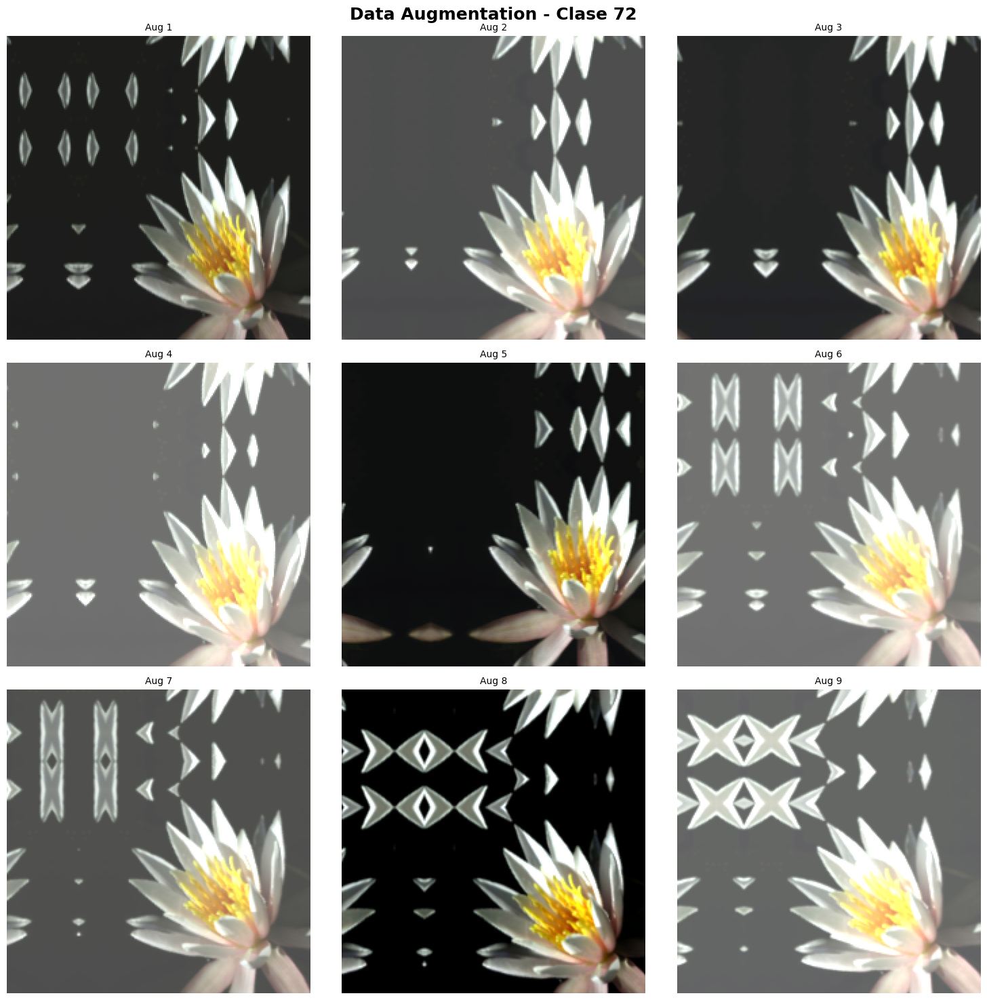
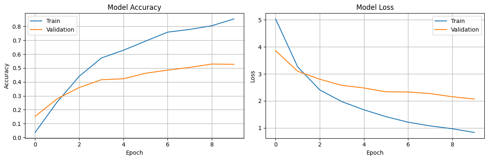
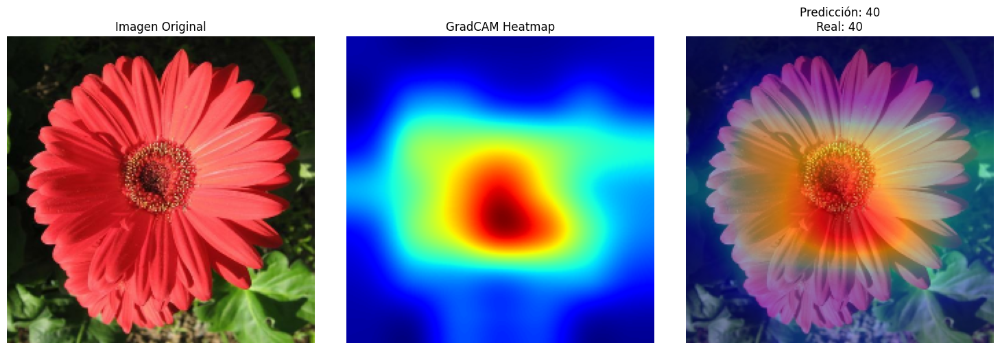
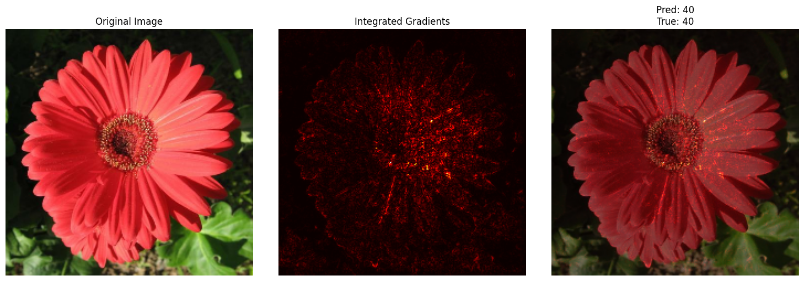

# Data Augmentation Avanzado de Modelos de Clasificación de Flores

## Contexto

Esta actividad se centra en entrenar y evaluar modelos de clasificación de imágenes utilizando el dataset Oxford Flowers102. Se busca mejorar la robustez de los modelos mediante técnicas avanzadas de data augmentation y proporcionar explicaciones visuales de sus predicciones usando GradCAM e Integrated Gradients. 

El objetivo final es desarrollar un modelo confiable para la identificación de flores, capaz de clasificar 102 especies diferentes bajo condiciones variables de iluminación, ángulo y fondo.

## Objetivos

* Implementar pipelines de data augmentation avanzadas para mejorar la generalización del modelo.
* Evaluar la robustez del modelo ante variaciones en condiciones de captura de imágenes.
* Aplicar GradCAM para visualizar las regiones de atención del modelo durante la predicción.
* Implementar Integrated Gradients para obtener explicaciones detalladas de las predicciones.

## Actividades

- Parte 1: Setup y Carga del Dataset
    - PASO 1: Instalación e Imports
    - PASO 2: Descargar y Preparar Dataset
- Parte 2: Pipelines de Data Augmentation
    - PASO 3: Pipeline Baseline (Sin Augmentation Avanzada)
    - PASO 4: Pipeline con Augmentation Avanzado
    - PASO 5: Visualizar Augmentations
- Parte 3 (OPCIONAL): Explorar Mixup/CutMix
- Parte 4: Entrenar tu Modelo
    - PASO 8: Crear tu Modelo
    - PASO 9: Entrenar el Modelo
    - PASO 10: Evaluar Resultados
- Parte 5: Explicabilidad con GradCAM
    - PASO 11: GradCAM
- Parte 6: Integrated Gradients
    - PASO 12: Integrated Gradients

## Desarrollo

### Carga y preparación del dataset

El dataset utilizado fue Oxford Flowers102, compuesto por 102 clases de flores, con 1020 imágenes de entrenamiento y 6149 de prueba. Para agilizar los experimentos iniciales se decidió trabajar con un subset de 5000 imágenes de entrenamiento y 1000 de prueba, lo que permitió realizar iteraciones rápidas sin sacrificar la diversidad de las clases. Todas las imágenes fueron redimensionadas a 224x224 píxeles, preparándolas para ser procesadas por los modelos de deep learning.

Se implementaron dos pipelines de datos. El primero, un pipeline baseline, aplicaba shuffle, batching y normalización usando el preprocesamiento de EfficientNet. El segundo incorporaba data augmentation avanzada, mediante capas de Keras que realizaban transformaciones geométricas y fotométricas como flips, rotaciones, zoom, traslaciones, brillo y contraste. Se realizaron visualizaciones de las augmentations para confirmar que las transformaciones eran coherentes y aportaban diversidad al conjunto de entrenamiento.



### Definición y entrenamiento del modelo

Se eligió un enfoque de transfer learning usando ResNet50 preentrenada en ImageNet. La base convolucional se mantuvo congelada inicialmente y se agregó un clasificador con GlobalAveragePooling2D y una capa densa con activación softmax para las 102 clases. El modelo se compiló con el optimizador Adam y la función de pérdida `sparse_categorical_crossentropy`.

El entrenamiento se realizó durante 10 epochs utilizando el pipeline con augmentations, logrando un accuracy de validación máximo de 52.9%. Estos resultados indicaron que el modelo estaba aprendiendo patrones relevantes a pesar de trabajar con un subset reducido del dataset.

```python
✅ Modelo creado
   Parámetros: 23,796,710

🚀 ENTRENANDO MODELO
============================================================
Epoch 1/10
32/32 ━━━━━━━━━━━━━━━━━━━━ 41s 870ms/step - accuracy: 0.0283 - loss: 5.3766 - val_accuracy: 0.1520 - val_loss: 3.8605
Epoch 2/10
32/32 ━━━━━━━━━━━━━━━━━━━━ 18s 485ms/step - accuracy: 0.2008 - loss: 3.4561 - val_accuracy: 0.2790 - val_loss: 3.0985
Epoch 3/10
32/32 ━━━━━━━━━━━━━━━━━━━━ 21s 515ms/step - accuracy: 0.4365 - loss: 2.4720 - val_accuracy: 0.3600 - val_loss: 2.8030
Epoch 4/10
32/32 ━━━━━━━━━━━━━━━━━━━━ 17s 481ms/step - accuracy: 0.5784 - loss: 1.9866 - val_accuracy: 0.4160 - val_loss: 2.5751
Epoch 5/10
32/32 ━━━━━━━━━━━━━━━━━━━━ 21s 486ms/step - accuracy: 0.6320 - loss: 1.7032 - val_accuracy: 0.4230 - val_loss: 2.4790
Epoch 6/10
32/32 ━━━━━━━━━━━━━━━━━━━━ 21s 479ms/step - accuracy: 0.7295 - loss: 1.3317 - val_accuracy: 0.4630 - val_loss: 2.3358
Epoch 7/10
32/32 ━━━━━━━━━━━━━━━━━━━━ 18s 495ms/step - accuracy: 0.7598 - loss: 1.1908 - val_accuracy: 0.4850 - val_loss: 2.3307
Epoch 8/10
32/32 ━━━━━━━━━━━━━━━━━━━━ 21s 490ms/step - accuracy: 0.7708 - loss: 1.0920 - val_accuracy: 0.5050 - val_loss: 2.2712
Epoch 9/10
32/32 ━━━━━━━━━━━━━━━━━━━━ 18s 480ms/step - accuracy: 0.8113 - loss: 0.9344 - val_accuracy: 0.5290 - val_loss: 2.1537
Epoch 10/10
32/32 ━━━━━━━━━━━━━━━━━━━━ 18s 472ms/step - accuracy: 0.8482 - loss: 0.8579 - val_accuracy: 0.5270 - val_loss: 2.0677
WARNING:absl:You are saving your model as an HDF5 file via `model.save()` or `keras.saving.save_model(model)`. This file format is considered legacy. We recommend using instead the native Keras format, e.g. `model.save('my_model.keras')` or `keras.saving.save_model(model, 'my_model.keras')`. 

✅ Entrenamiento completado
   📊 Mejor accuracy: 52.90%

16/16 ━━━━━━━━━━━━━━━━━━━━ 3s 157ms/step - accuracy: 0.5247 - loss: 2.0220

📊 RESULTADOS FINALES:
   Test Accuracy: 52.70%
   Test Loss: 2.0677
```



### Evaluación e interpretabilidad

La evaluación final sobre el conjunto de test arrojó un accuracy de 52.7% y una pérdida de 2.0677, coherentes con la evolución durante el entrenamiento. Para analizar la interpretabilidad del modelo se implementaron técnicas de GradCAM e Integrated Gradients, las cuales permitieron visualizar qué regiones de las imágenes influyen más en las predicciones. Estas herramientas ayudaron a verificar que el modelo se enfocaba en las áreas correctas de las flores, aumentando la confianza en los resultados obtenidos.

```python
🔍 Aplicando GradCAM...
   Predicción: Clase 40
   Real: Clase 40
```



```python
🔍 Aplicando Integrated Gradients...
```



## Reflexión

Durante este trabajo se profundizó en el uso de técnicas de data augmentation y en la aplicación de métodos de explicabilidad para modelos de clasificación de imágenes. 

Se aprendió cómo combinar pipelines de preprocesamiento, normalización y transformaciones para aumentar la diversidad del conjunto de entrenamiento, lo que es crucial al trabajar con datasets limitados o con muchas clases, como Oxford Flowers102. 

Además, la implementación de GradCAM e Integrated Gradients permitió comprender mejor cómo el modelo toma decisiones, identificando qué regiones de la imagen influyen en la predicción y evaluando la confiabilidad del modelo.

Es importante entender la relación entre la cantidad y calidad de datos, la complejidad del modelo y la robustez de las predicciones. El hecho de que el subset de entrenamiento fuese pequeño y la base convolucional se mantuviese congelada limitó el rendimiento final, reflejado en un accuracy de validación y test cercano al 53%. Esto evidencia que, aunque el modelo aprende patrones relevantes, todavía hay margen de mejora. Con 50 porciento de probabilidades sobre 102 clases.

Para mejorar los resultados futuros, se podrían aumentar el número de imágenes de entrenamiento o generando más datos con augmentations, realizar fine-tuning de las capas superiores de la red preentrenada, probar arquitecturas, optimizar hiperparámetros como el learning rate y el batch size. Asimismo, explorar augmentations como Mixup o CutMix para mejorar la generalización del modelo.

## Referencias

https://colab.research.google.com/drive/1TtwyZT2eb8AVlergPqSW4V5PZgojuW1K?usp=sharing