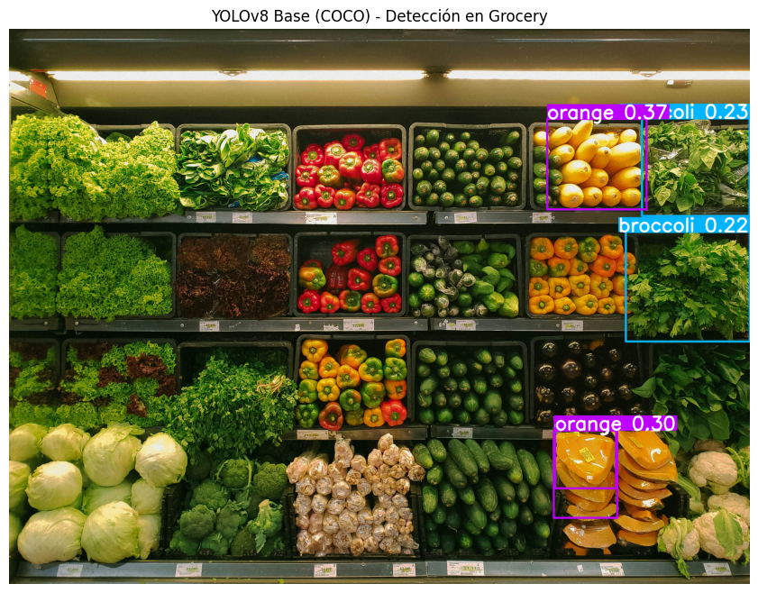
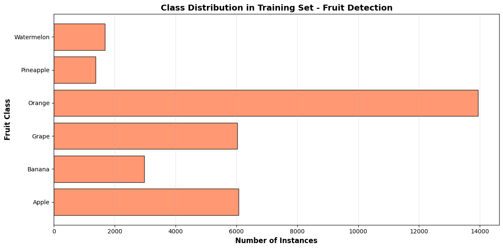
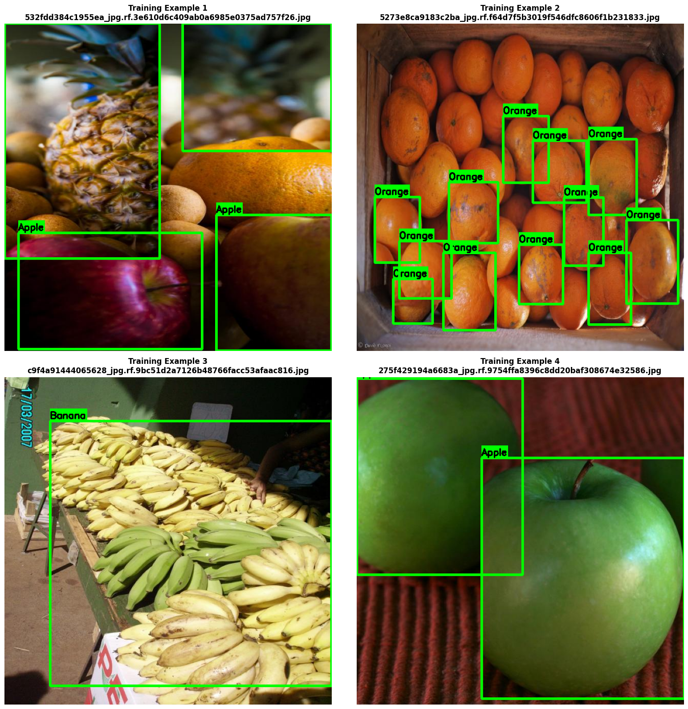
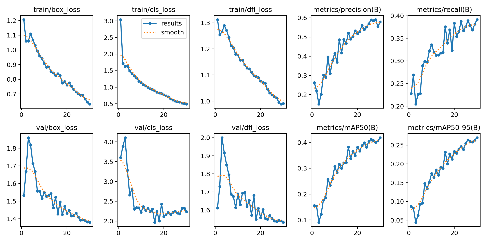
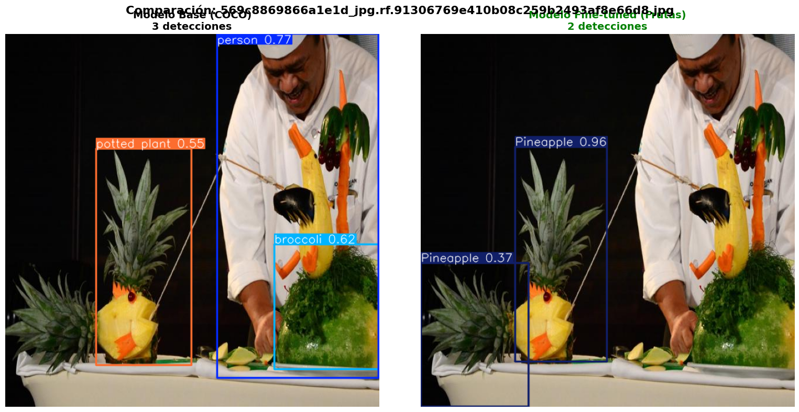
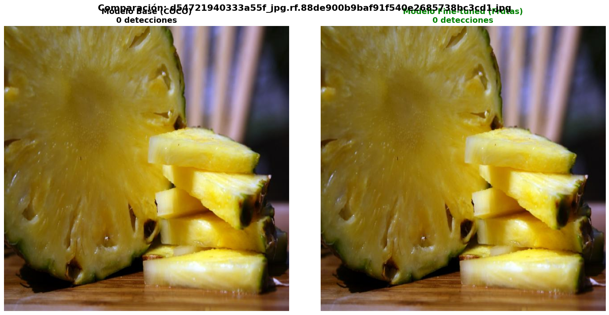
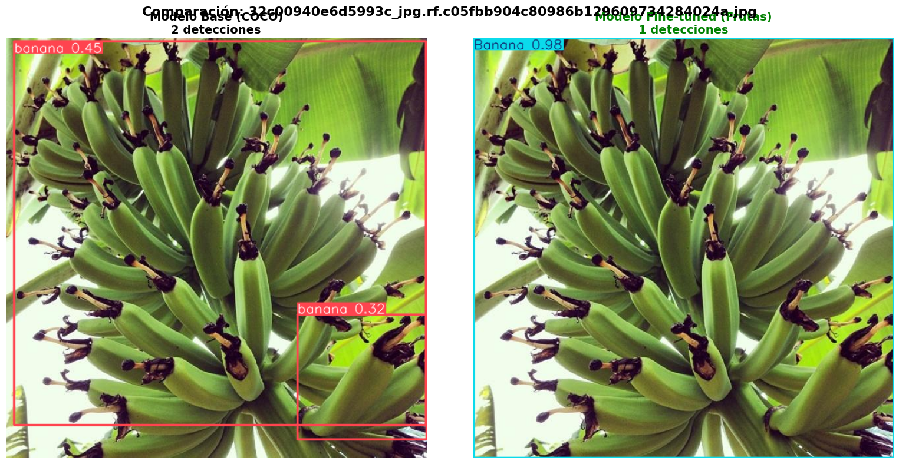
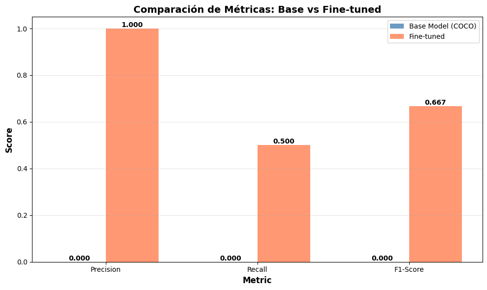
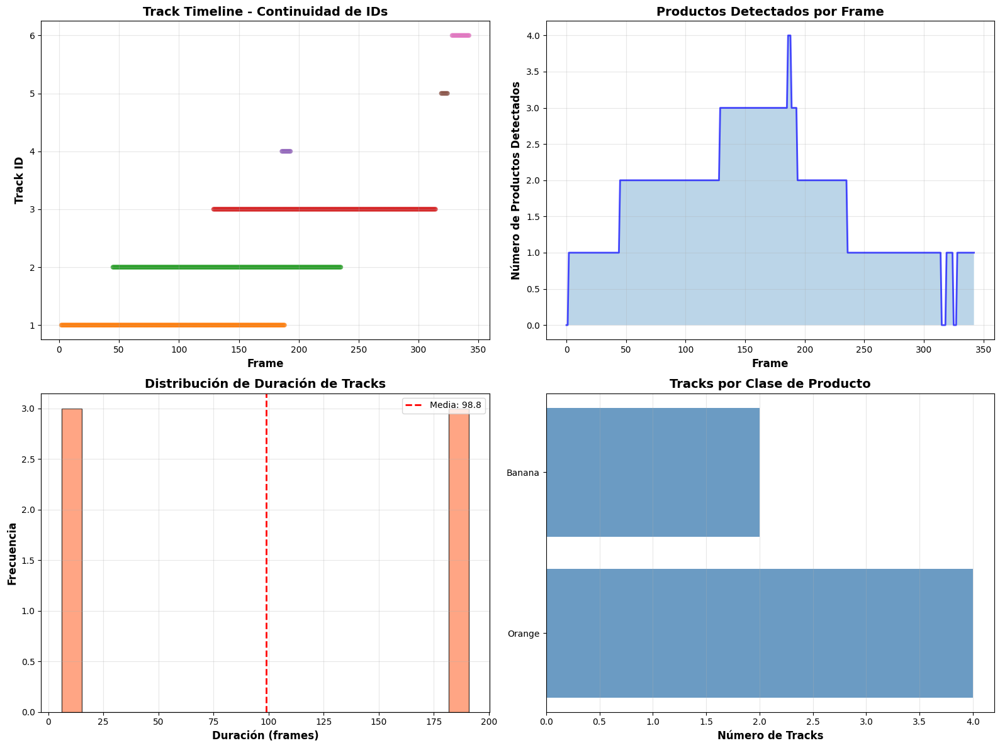

# YOLO Fine-tuning & Tracking

## Contexto

Un equipo de Computer Vision de una cadena de supermercados necesita mejorar la detección y el seguimiento de productos en entornos de grocery. El modelo YOLOv8 pre-entrenado en COCO falla al identificar productos específicos, por lo que se propone fine-tuning sobre un dataset especializado y añadir un módulo de tracking para aplicaciones reales, control de inventario en estantes, conteo en cintas de checkout, y monitoreo de reposición en tiempo real. 

## Objetivos

Mejorar la detección y el seguimiento de productos en entornos de supermercado mediante el uso de un modelo YOLOv8 fine-tuned sobre un conjunto de datos específico de productos, permitiendo una identificación más precisa y un seguimiento continuo en video.

- Implementar la inferencia con un modelo YOLOv8 preentrenado para establecer una línea base de rendimiento.
- Realizar el fine-tuning del modelo utilizando un dataset de productos de grocery, con el fin de adaptar el detector a las características visuales reales del entorno.
- Evaluar las mejoras obtenidas después del entrenamiento mediante métricas estándar y análisis cualitativo de los resultados.
- Analizar los errores más comunes del modelo (falsos positivos y negativos) para comprender sus limitaciones y posibles mejoras futuras.
- Implementar un sistema de tracking que permita seguir los productos detectados a lo largo del tiempo en videos, facilitando tareas de monitoreo, conteo y control de inventario.

## Actividades

- Parte 1: Setup e Inferencia Básica
    - Paso 1.1: Instalación
    - Paso 1.2: Cargar Modelo Base
    - Paso 1.3: Test en Imágenes de Grocery
- Parte 2: Fine-tuning YOLOv8 en Fruit Detection Dataset
    - Paso 2.1: Descargar Dataset de Frutas (YOLOv8 Format)
    - Paso 2.1b: Verificar Estructura y data.yaml
    - Paso 2.2: Explorar Dataset
    - Paso 2.3: Visualizar Ejemplos del Dataset
    - Paso 2.4: Arreglar data.yaml y Fine-tuning YOLOv8
    - Paso 2.5: Cargar Modelo Fine-tuned
    - Paso 2.6: Métricas de Evaluación
    - Paso 2.7: Comparación Antes vs Después
    - Paso 2.8: Análisis de Errores
- Parte 3: Tracking con Modelo Fine-tuned
    - Paso 3.1: Descargar Video de Frutas
    - Paso 3.2: Configurar Norfair Tracker
    - Paso 3.3: Aplicar Tracking en Video
    - Paso 3.4: Visualizar Video con Tracking
    - Paso 3.5: Análisis de Tracking

## Desarrollo

### Parte 1: Setup e Inferencia Básica

Como modelo base se seleccionó YOLOv8n (nano), la versión más liviana de la familia YOLOv8. Modelos más grandes (como yolov8m o yolov8l) ofrecen mayor precisión, pero requieren mayor capacidad de cómputo, lo cual no es necesario en esta fase inicial de análisis.

El modelo cargado fue preentrenado en el dataset COCO, que contiene 80 clases genéricas. Sin embargo, estas clases son demasiado generales para nuestro caso de uso, ya que el objetivo es detectar productos específicos de supermercado. Aunque COCO incluye categorías como apple o orange, su entrenamiento se basa en ejemplos genéricos y no representa adecuadamente las condiciones visuales reales del entorno grocery.

Una vez cargado el modelo, se realizó una prueba de inferencia sobre una imagen realista de supermercado. Se utilizó un umbral de confianza de 0.2, que permite detectar objetos sin exigir alta certeza inicial, para observar el comportamiento general del modelo.



El modelo logró detectar cinco objetos, identificados como oranges y broccolis. Se evidenció que no es capaz de reconocer correctamente productos específicos.

El experimento confirma que el modelo YOLOv8 preentrenado en COCO no resulta adecuado para tareas específicas de detección de productos de supermercado. Esto justifica la necesidad de un proceso de fine-tuning con un dataset especializado, que contenga imágenes representativas del entorno real y clases específicas del dominio de grocery.

### Parte 2: Preparación del Dataset y Entrenamiento del Modelo

Una vez configurado el entorno, se procedió a descargar el conjunto de datos necesario para el entrenamiento del modelo. Para este proyecto se utilizó el Fruit Detection Dataset. Este conjunto contiene imágenes de distintas frutas, ya etiquetadas y listas para ser usadas en tareas de detección de objetos.

Posteriormente, se realizó un análisis exploratorio del conjunto de datos. Se revisó la cantidad de imágenes y etiquetas disponibles, y se evaluó la distribución de las clases. Este análisis permitió observar que algunas clases tenían muchas más imágenes que otras, lo que puede influir en el rendimiento del modelo.

```python
📊 Estadísticas:
Total de imágenes: 8479

=== DISTRIBUCIÓN DE CLASES (TRAIN) ===
Total de clases: 6
Clases del dataset: ['Apple', 'Banana', 'Grape', 'Orange', 'Pineapple', 'Watermelon']

Apple               : 6070 instancias
Banana              : 2971 instancias
Grape               : 6027 instancias
Orange              : 13938 instancias
Pineapple           : 1372 instancias
Watermelon          : 1683 instancias

📊 ESTADÍSTICAS ADICIONALES:
  Instancias totales: 32061
  Promedio por clase: 5343.5
  Clase más frecuente: Orange (13938 instancias)
  Clase menos frecuente: Pineapple (1372 instancias)
```

 

Para complementar el análisis, se visualizaron algunas imágenes del conjunto de entrenamiento junto con las cajas delimitadoras que indican la posición de cada fruta. Esto permitió confirmar que las anotaciones estaban bien hechas y que el modelo recibiría datos de calidad.

 

Finalmente, se configuraron los parámetros básicos del proceso de fine-tuning, incluyendo la cantidad de épocas, el tamaño de las imágenes y el tamaño del lote de datos procesado en cada iteración. Se utilizó un modelo base preentrenado YOLOv8n, que se adaptó a las nuevas clases del dataset de frutas.

```python
Model summary: 129 layers, 11,137,922 parameters, 11,137,906 gradients, 28.7 GFLOPs

optimizer: 'optimizer=auto' found, ignoring 'lr0=0.01' and 'momentum=0.937' and determining best 'optimizer', 'lr0' and 'momentum' automatically... 
optimizer: AdamW(lr=0.001, momentum=0.9) with parameter groups 57 weight(decay=0.0), 64 weight(decay=0.0005), 63 bias(decay=0.0)
Image sizes 640 train, 640 val
Starting training for 30 epochs...

      Epoch    GPU_mem   box_loss   cls_loss   dfl_loss  Instances       Size
       1/30      8.45G      1.207      3.041      1.312        162        640: 100% ━━━━━━━━━━━━ 56/56 1.5it/s 36.9s
                 Class     Images  Instances      Box(P          R      mAP50  mAP50-95): 100% ━━━━━━━━━━━━ 15/15 1.5it/s 9.7s
                   all        914       3227      0.263      0.228      0.156     0.0866

      Epoch    GPU_mem   box_loss   cls_loss   dfl_loss  Instances       Size
      10/30      7.58G     0.9088      1.137      1.177        121        640: 100% ━━━━━━━━━━━━ 56/56 1.8it/s 30.9s
                 Class     Images  Instances      Box(P          R      mAP50  mAP50-95): 100% ━━━━━━━━━━━━ 15/15 1.6it/s 9.4s
                   all        914       3227      0.415      0.336      0.307      0.174

      Epoch    GPU_mem   box_loss   cls_loss   dfl_loss  Instances       Size
      20/30      7.37G     0.7606     0.7735      1.077        150        640: 100% ━━━━━━━━━━━━ 56/56 1.8it/s 31.1s
                 Class     Images  Instances      Box(P          R      mAP50  mAP50-95): 100% ━━━━━━━━━━━━ 15/15 1.5it/s 10.0s
                   all        914       3227      0.518      0.383      0.382      0.233
      Epoch    GPU_mem   box_loss   cls_loss   dfl_loss  Instances       Size
      30/30      7.26G     0.6313     0.4888     0.9906         86        640: 100% ━━━━━━━━━━━━ 56/56 1.8it/s 31.4s
                 Class     Images  Instances      Box(P          R      mAP50  mAP50-95): 100% ━━━━━━━━━━━━ 15/15 1.7it/s 9.0s
                   all        914       3227      0.578      0.392      0.418       0.27

30 epochs completed in 0.353 hours.

Model summary (fused): 72 layers, 11,127,906 parameters, 0 gradients, 28.4 GFLOPs
                 Class     Images  Instances      Box(P          R      mAP50  mAP50-95): 100% ━━━━━━━━━━━━ 15/15 1.3it/s 11.9s
                   all        914       3227      0.583       0.39      0.418       0.27
                 Apple        188        557      0.591      0.354      0.379      0.266
                Banana        167        390      0.564      0.444       0.44      0.253
                 Grape        199        809      0.564      0.347      0.363      0.229
                Orange        197       1100      0.653      0.355      0.405      0.256
             Pineapple         77        154      0.583      0.354      0.413       0.25
            Watermelon        107        217      0.545      0.488       0.51      0.364
Speed: 0.2ms preprocess, 5.0ms inference, 0.0ms loss, 2.8ms postprocess per image
```

 

El entrenamiento se desarrolló correctamente, mostrando en cada época el progreso del modelo en términos de precisión y detección. A medida que avanzaba el proceso, se observó una mejora en la capacidad del modelo para reconocer las diferentes frutas.

Luego se cargó el modelo resultante del proceso de entrenamiento, seleccionando el correspondiente a los mejores pesos. El modelo cargado fue un YOLOv8 fine-tuned, especializado en la detección de frutas. Mientras que el modelo base (entrenado en el conjunto COCO) reconocía 80 clases genéricas, el modelo ajustado se centró en 6 clases específicas: manzana, banana, uva, naranja, ananá y sandía. Esta especialización permitió reducir la confusión con objetos no relacionados y mejorar la precisión en el dominio específico.

Una vez cargado el modelo, se evaluó su desempeño sobre el conjunto de validación. Los resultados mostraron valores moderados de precisión y recall, indicando que el modelo fue capaz de reconocer correctamente varias frutas, aunque aún existían casos de detecciones faltantes o incorrectas.

Entre las clases, sandía obtuvo el mejor desempeño individual, mientras que uva y banana mostraron mayores dificultades. Esto se explica en parte por la distribución desigual de las clases en el dataset y por las similitudes visuales entre ciertos tipos de frutas.

En general, el modelo fine-tuned mostró una mejora clara respecto al modelo base, al enfocarse exclusivamente en frutas y evitar confusiones con objetos genéricos del dataset COCO.

```python
=== EVALUACIÓN EN VALIDATION SET ===
                 Class     Images  Instances      Box(P          R      mAP50  mAP50-95): 100% ━━━━━━━━━━━━ 58/58 4.1it/s 14.1s
                   all        914       3227      0.578      0.392      0.418       0.27
                 Apple        188        557      0.582      0.354       0.38      0.267
                Banana        167        390      0.557      0.444       0.44      0.253
                 Grape        199        809      0.562       0.35      0.363       0.23
                Orange        197       1100      0.653      0.357      0.404      0.256
             Pineapple         77        154       0.58      0.357      0.411       0.25
            Watermelon        107        217      0.536      0.488       0.51      0.364

📊 MÉTRICAS DEL MODELO FINE-TUNED:
  mAP@0.5:     0.418
  mAP@0.5:0.95: 0.270
  Precision:   0.578
  Recall:      0.392

=== MÉTRICAS POR CLASE ===
Apple               : mAP@0.5 = 0.267
Banana              : mAP@0.5 = 0.253
Grape               : mAP@0.5 = 0.230
Orange              : mAP@0.5 = 0.256
Pineapple           : mAP@0.5 = 0.250
Watermelon          : mAP@0.5 = 0.364
```

Para visualizar las mejoras, se realizó una comparación directa entre ambos modelos sobre un mismo conjunto de imágenes del set de validación.

En las pruebas, se observó que el modelo base detectaba múltiples objetos irrelevantes (como personas o plantas), mientras que el modelo fine-tuned identificaba correctamente frutas concretas en la escena. Sin embargo, también se detectaron algunos casos donde el modelo ajustado no reconoció objetos que estaban presentes, lo que evidencia margen para optimización adicional.

En conjunto, la comparación visual mostró que el modelo fine-tuned logra detecciones más precisas y con cajas delimitadoras mejor ajustadas, además de una mayor coherencia en las clases detectadas.

 

 

 

Los resultados indicaron que el modelo base cometía más errores de falsa detección, mientras que el modelo fine-tuned redujo significativamente estos casos, aumentando la precisión general. A pesar de que aún se observaron falsos negativos, el balance global fue positivo.

En términos cualitativos, el modelo ajustado mostró un incremento en precisión y en la capacidad de generalización dentro del dominio de frutas.

```python 
=== ANÁLISIS DE ERRORES ===

=== RESULTADOS COMPARATIVOS ===

Modelo Base (COCO):
  TP: 0, FP: 5, FN: 6
  Precision: 0.000
  Recall:    0.000
  F1-Score:  0.000

Modelo Fine-tuned:
  TP: 3, FP: 0, FN: 3
  Precision: 1.000
  Recall:    0.500
  F1-Score:  0.667

=== MEJORA ===
  Δ Precision: +1.000
  Δ Recall:    +0.500
  Δ F1-Score:  +0.667
```

 

El fine-tuning permitió adaptar un modelo genérico a un dominio específico, obteniendo mejoras notables en la detección de frutas. Si bien los valores de mAP y recall todavía pueden optimizarse, el modelo fine-tuned representa un avance significativo respecto al modelo base, demostrando que la personalización del entrenamiento es efectiva cuando se dispone de un dataset representativo del contexto de aplicación.

### Parte 3: Tracking con Modelo Fine-tuned

En esta etapa se aplicó el modelo fine-tuned previamente entrenado para realizar el seguimiento de productos en un video. El propósito fue simular un escenario real, como una cinta transportadora o el monitoreo de estantes, donde las frutas se desplazan dentro del campo visual de la cámara.

Se utilizó un video que muestra frutas en movimiento. El video sirvió como base para aplicar el modelo de detección y analizar el comportamiento del sistema de tracking.

Para el seguimiento de objetos se empleó la librería Norfair. Se configuraron los parámetros principales del tracker, tales como el umbral de distancia para asociar detecciones entre frames, la cantidad de frames que un objeto puede permanecer sin ser detectado, y el retraso necesario para confirmar la aparición de un nuevo objeto.

Esta configuración permite que el sistema mantenga un equilibrio entre precisión y estabilidad, evitando que los objetos pierdan su identificación ante movimientos rápidos o detecciones inconsistentes.

El modelo fine-tuned se aplicó sobre cada cuadro del video, detectando las frutas presentes y asociándolas a sus identificadores de track. Cada objeto fue representado mediante un recuadro de color y un identificador único (ID) que se mantuvo a lo largo del tiempo. De esta forma, fue posible seguir a cada fruta mientras se desplazaba, incluso cuando salía y volvía al campo de visión de la cámara.

```python
🎬 Procesando video con tracking...
   Modelo: Fine-tuned
   Esto puede tomar 1-2 minutos...
     Procesados 30/343 frames (8.7%)
     Procesados 60/343 frames (17.5%)
     Procesados 90/343 frames (26.2%)
     Procesados 120/343 frames (35.0%)
     Procesados 150/343 frames (43.7%)
     Procesados 180/343 frames (52.5%)
     Procesados 210/343 frames (61.2%)
     Procesados 240/343 frames (70.0%)
     Procesados 270/343 frames (78.7%)
     Procesados 300/343 frames (87.5%)
     Procesados 330/343 frames (96.2%)

✅ Video tracking completado!
   Output guardado: videos/grocery_tracked.mp4
   Total tracks creados: 6
```

El sistema logró rastrear varios productos a lo largo del video, manteniendo la coherencia de los identificadores en la mayoría de los casos. Algunas frutas, como las naranjas, presentaron un seguimiento más estable, mientras que otras, como las bananas, tuvieron tracks más breves.

```python
======================================================================
ESTADÍSTICAS DE TRACKING
======================================================================

📊 Estadísticas generales:
  Total productos trackeados: 6
  Duración promedio: 98.8 frames (3.3s)
  Duración máxima: 191 frames (6.4s)
  Duración mínima: 6 frames (0.2s)

📋 Detalle por producto trackeado:
Track ID     Clase                Duración        Rango Frames        
----------------------------------------------------------------------
Track 1      Orange                187 frames ( 6.2s)    2 → 188 
Track 2      Orange                191 frames ( 6.4s)   45 → 235 
Track 3      Banana                186 frames ( 6.2s)  129 → 314 
Track 4      Banana                  8 frames ( 0.3s)  186 → 193 
Track 5      Orange                  6 frames ( 0.2s)  319 → 324 
Track 6      Orange                 15 frames ( 0.5s)  328 → 342 

📦 Productos por clase:
  Orange              :   4 tracks
  Banana              :   2 tracks


⚡ Métricas de calidad del tracking:
  Tracks cortos (<1s):  3 (50.0%)
  Tracks largos (>3s):  3 (50.0%)
  Tracks totales:       6
```



El experimento demostró que el modelo fine-tuned, combinado con el tracker de Norfair, puede realizar un seguimiento eficaz de productos en movimiento. Sin embargo, para lograr un rendimiento más robusto en entornos reales, sería necesario optimizar los parámetros del tracker y mejorar la consistencia de las detecciones del modelo.

## Reflexión

A lo largo del desarrollo se logró comprender el proceso de detección, fine-tuning y seguimiento de objetos mediante modelos de visión. El trabajo permitió no solo aplicar técnicas prácticas, sino también analizar los resultados y entender las limitaciones de cada componente del sistema.

### Sobre el Modelo

La mejora más significativa del fine-tuning se observó en la reducción de falsos positivos y falsos negativos, así como en un aumento del mAP, lo que demuestra que el modelo logró adaptarse correctamente al dominio específico de los productos del supermercado.

El modelo base preentrenado en COCO no fue inútil, al contrario, sirvió como una excelente base generalista, ya que poseía conocimiento previo sobre formas y patrones similares. Sin embargo, su precisión inicial era insuficiente para las clases concretas del dataset.

Esta experiencia enseñó que para adaptar un modelo a un nuevo dominio es fundamental partir de un modelo preentrenado y luego ajustar las últimas capas con ejemplos específicos y bien anotados.

### Sobre los Datos

El dataset de 8.479 imágenes resultó adecuado, aunque no excesivo. El hecho de que con solo un 25% de las imágenes ya se obtuvieran buenos resultados se explica por la coherencia visual del conjunto y la calidad de las etiquetas.

La calidad de las anotaciones fue clave, se observó que los errores o imprecisiones en los bounding boxes afectaban directamente la estabilidad del entrenamiento y la precisión final del modelo.

Si se agregaran 1.000 imágenes más, deberían enfocarse en casos difíciles, frutas parcialmente ocluidas, variaciones de iluminación, distintos ángulos y fondos más complejos, para mejorar la robustez del modelo.

### Sobre el Tracking

En el proceso de seguimiento, tanto el modelo como los parámetros del tracker resultaron importantes, pero la configuración del tracker fue decisiva para mantener la consistencia de los IDs y evitar saltos de identidad.

Norfair fue suficiente para esta practica.

El sistema podría fallar en escenarios con oclusiones prolongadas, iluminación variable o movimientos abruptos, donde las detecciones pierden coherencia entre frames.

### Sobre el Deployment

El sistema podría ejecutarse casi en tiempo real dependiendo del hardware; sería necesario mantener al menos 25–30 FPS para un monitoreo fluido.

En casos extremos, como oclusiones o variaciones de luz, podrían integrarse modelos complementarios o mecanismos de corrección temporal para mantener la estabilidad del seguimiento.

### Trade-offs y Decisiones

Durante el proyecto se identificaron varios trade-offs importantes:

1. Velocidad vs Precisión: aumentar la resolución y el tamaño del modelo mejora la detección, pero incrementa el tiempo de inferencia.
2. Cantidad de epochs vs Riesgo de overfitting: entrenar más tiempo mejora el mAP en el dataset de entrenamiento, pero puede degradar el rendimiento en datos nuevos.
3. Umbral de confianza vs Cobertura: un umbral alto reduce falsos positivos, pero puede eliminar detecciones válidas.

## Referencias

- https://colab.research.google.com/drive/1tuo4GpSfLMyMH1pruYZrBCWCp5Gh2Iqr?usp=sharing
