# Plantilla de entrada de portafolio

## Contexto

En esta actividad se aplica el modelo Segment Anything Model (SAM) para realizar segmentación semántica en la detección de zonas inundadas en imágenes satelitales. SAM se utiliza primero en modo zero-shot, mostrando sus capacidades generales, pero también sus limitaciones en dominios específicos como flood-mapping. Luego se realiza fine-tuning utilizando un dataset rotulado de áreas inundadas para mejorar la precisión de las máscaras.

El objetivo es comparar el desempeño entre el modelo base y el modelo ajustado, analizando métricas, visualizaciones y casos de error, validando la utilidad del fine-tuning para aplicaciones críticas como monitoreo de desastres naturales y respuesta en tiempo real.

## Objetivos

Evaluar el desempeño del modelo SAM para segmentación de inundaciones y demostrar las mejoras logradas mediante fine-tuning en un dataset específico, comparando resultados cuantitativos y cualitativos.

- Ejecutar inferencia zero-shot con SAM pretrained
- Implementar points/boxes y evaluar resultados
- Fine-tuning del decoder de SAM con dataset de inundaciones
- Comparar métricas entre pretrained y fine-tuned
- Visualizar ejemplos antes vs después

## Actividades

- Parte 1: Load Dataset y Exploración
    - 1.1 Download Flood Area Segmentation Dataset
        - Paso 1: Obtener API Key de Kaggle
        - Paso 2: Configurar Kaggle API en Colab/Jupyter
        - Paso 3: Descargar y Descomprimir Dataset
    - 1.2 Explorar Dataset
- Parte 2: Pretrained SAM Inference
    - 2.1 Cargar SAM Model
    - 2.2 Crear SAM Predictor
    - 2.3 Inference con Point Prompts
    - 2.4 Inference con Box Prompts
    - 2.5 Calcular Métricas
    - 2.6 Evaluación en Test Set Completo
- Parte 3: Fine-tuning SAM
    - 3.1 Crear Dataset Class
    - 3.2 Setup DataLoader
    - 3.3 Definir Loss Function
    - 3.4 Fine-tuning Setup
    - 3.5 Training Loop
    - 3.6 Training
- Parte 4: Evaluación y Comparación
    - 4.1 Cargar Best Model
    - 4.2 Comparación Pretrained vs Fine-tuned
    - 4.3 Visualización Cualitativa
    - 4.4 Análisis de Errores

## Desarrollo

### Exploración del dataset

Se implementó un cargador personalizado para leer pares imagen-máscara, validando que cada imagen tuviera su correspondiente máscara. Se obtuvieron 100 muestras iniciales para análisis preliminar. Las imágenes fueron convertidas a RGB y las máscaras binarizadas para asegurar consistencia en el entrenamiento y evaluación.

Se realizó un análisis exploratorio que evidenció una alta variabilidad en las dimensiones de las imágenes (81 tamaños únicos), lo cual refuerza la necesidad de aplicar transformaciones de normalización más adelante durante el preprocesamiento. Además, se calculó la proporción promedio de píxeles correspondientes a agua, obteniendo un water ratio aproximado de 42.80%, lo que indica un dataset relativamente balanceado entre clases agua y fondo.

```python
📥 Cargando 100 imágenes...
  Cargadas 20/100...
  Cargadas 40/100...
  Cargadas 60/100...
  Cargadas 80/100...
  Cargadas 100/100...
✅ Cargadas 100 imágenes con sus máscaras
=== DATASET CARGADO ===
Total images: 100
Image shape (primera imagen): (551, 893, 3)
Mask shape (primera máscara): (551, 893)

📊 Estadísticas del dataset:
Tamaños únicos de imágenes: 81

Water pixel ratio (promedio): 42.80%
Background ratio: 57.20%
```

Finalmente, se visualizaron muestras del dataset, confirmando visualmente la correcta alineación entre imágenes y máscaras, y verificando la calidad de las anotaciones. Esta etapa permitió validar que los datos estaban listos para ser procesados por SAM tanto en modo pretrained como para fine-tuning.

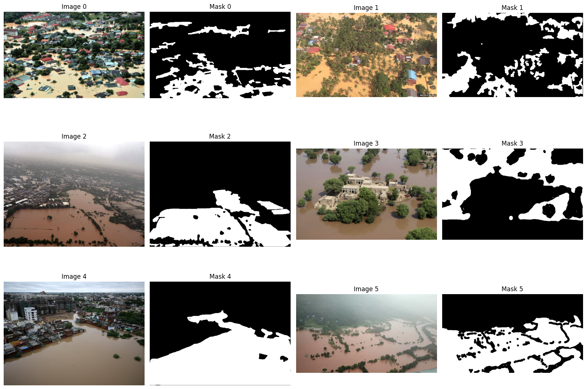

### Evaluación del modelo SAM preentrenado

Tras preparar y explorar el dataset, se procedió a integrar el modelo SAM en modalidad zero-shot para establecer una línea base de rendimiento antes del fine-tuning.

En esta etapa se definieron dos estrategias de inferencia:

1. Point Prompt: se seleccionó automáticamente un píxel representativo dentro del área inundada de la máscara real, simulando que un analista marca la región de interés.

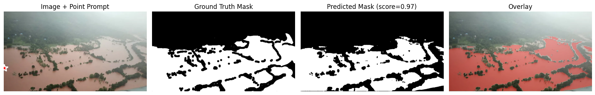


2. Box Prompt: se generó un bounding box a partir de la máscara real, emulando un escenario donde un detector preclasifica zonas potenciales de inundación.

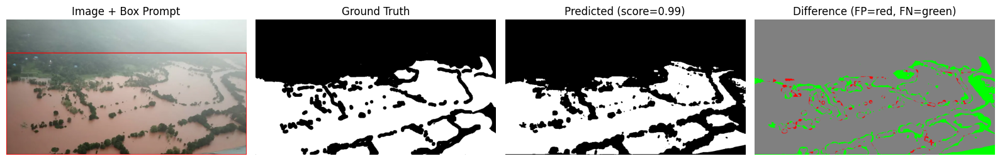

Se implementaron funciones específicas para realizar predicciones con ambos tipos de entrada, eligiendo la máscara con mayor confianza entre múltiples hipótesis del modelo. Además, se programaron métricas cuantitativas estándar para segmentación (IoU, Dice, Precisión y Recall), asegurando el ajuste automático de dimensiones y formatos de máscaras.

```python
=== MÉTRICAS - POINT PROMPT ===
IoU: 0.8070
Dice: 0.8932
Precision: 0.9681
Recall: 0.8290

=== MÉTRICAS - BOX PROMPT ===
IoU: 0.8016
Dice: 0.8899
Precision: 0.9756
Recall: 0.8180

=== COMPARACIÓN ===
Box prompt better: False
```

Inicialmente se ejecutaron pruebas visuales sobre una sola imagen, confirmando que SAM identificó correctamente las áreas de agua, con alta confianza en ambos enfoques. Posteriormente, se evaluaron las 100 imágenes del subconjunto, calculando métricas promedio y distribuciones.

```python
=== EVALUATING PRETRAINED SAM (Point Prompts) ===
  Processed 20/100 images...
  Processed 40/100 images...
  Processed 60/100 images...
  Processed 80/100 images...
  Processed 100/100 images...

=== PRETRAINED SAM - POINT PROMPTS ===
Mean IoU: 0.5291 ± 0.3214
Mean Dice: 0.6220 ± 0.3377
Mean Precision: 0.8193
Mean Recall: 0.5885

=== EVALUATING PRETRAINED SAM (Box Prompts) ===
  Processed 20/100 images...
  Processed 40/100 images...
  Processed 60/100 images...
  Processed 80/100 images...
  Processed 100/100 images...

=== PRETRAINED SAM - BOX PROMPTS ===
Mean IoU: 0.7230 ± 0.2088
Mean Dice: 0.8156 ± 0.1985
Mean Precision: 0.8476
Mean Recall: 0.8106
```

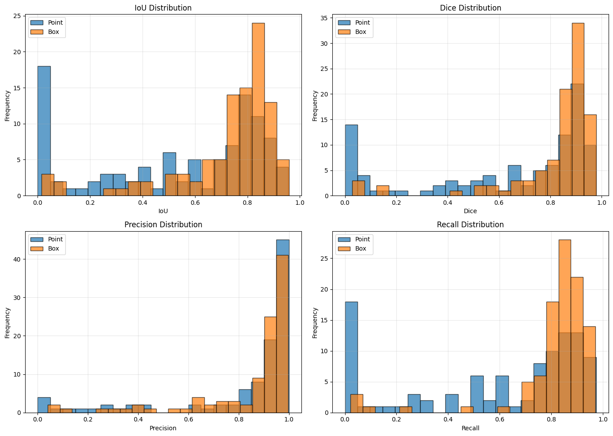

### Fine-tuning de SAM para segmentación de inundaciones

Luego del establecimiento del baseline zero-shot con SAM, se procedió al fine-tuning del modelo. Esta etapa tuvo como objetivo evaluar si la adaptación, incluso con un dataset relativamente pequeño (100 imágenes), podía mejorar el rendimiento obtenido.

Se construyó un dataset personalizado en PyTorch que:

- Redimensiona imágenes y máscaras a 1024×1024.
- Implementa data augmentation (flip horizontal/vertical, rotación ligera, variación de brillo/contraste).
- Extrae automáticamente prompts basados en la máscara real.
- Soporta de señale, point prompt con una coordenada aleatoria dentro del agua.

División de datos:

```python
=== DATA SPLIT ===
Train: 80 images
Val: 20 images

=== DATALOADERS CREADOS ===
Train batches: 40
Val batches: 10

Sample batch:
  Images shape: torch.Size([2, 3, 1024, 1024])
  Masks shape: torch.Size([2, 1, 1024, 1024])
  Prompts: 2 items
```

Se adoptó una estrategia eficiente entrenando solo el cabezal de segmentación:

| Módulo SAM     | Estado       |
| -------------- | ------------ |
| Image encoder  | ❄️ Congelado |
| Prompt encoder | ❄️ Congelado |
| Mask decoder   | ✅ Entrenable |

Esto reduce riesgo de overfitting y acelera entrenamiento:

- Parámetros totales: 93.7M
- Parámetros entrenables: 4.06M (≈4.3%)

```python
=== FINE-TUNING SETUP ===
Total parameters: 93,735,472
Trainable parameters: 4,058,340
Trainable %: 4.33%

Optimizer: Adam
Learning rate: 0.0001
Scheduler: StepLR (decay every 5 epochs by 0.5)
```

```python
=== STARTING TRAINING ===
Epochs: 10
Batch size: 2
Learning rate: 0.0001

Epoch 1/10
--------------------------------------------------
Train Loss: 0.4536 | Train IoU: 0.5152
Val Loss: 0.4255 | Val IoU: 0.6116
✅ Best model saved! (Val IoU: 0.6116)

Epoch 2/10
--------------------------------------------------
Train Loss: 0.3343 | Train IoU: 0.6362
Val Loss: 0.3314 | Val IoU: 0.6984
✅ Best model saved! (Val IoU: 0.6984)

Epoch 3/10
--------------------------------------------------
Train Loss: 0.3207 | Train IoU: 0.6622
Val Loss: 0.4353 | Val IoU: 0.5396

Epoch 4/10
--------------------------------------------------
Train Loss: 0.3284 | Train IoU: 0.6684
Val Loss: 0.4232 | Val IoU: 0.6481

Epoch 5/10
--------------------------------------------------
Train Loss: 0.2892 | Train IoU: 0.6932
Val Loss: 0.3636 | Val IoU: 0.6449

Epoch 6/10
--------------------------------------------------
Train Loss: 0.2819 | Train IoU: 0.6946
Val Loss: 0.3170 | Val IoU: 0.7110
✅ Best model saved! (Val IoU: 0.7110)

Epoch 7/10
--------------------------------------------------
Train Loss: 0.2804 | Train IoU: 0.6936
Val Loss: 0.3144 | Val IoU: 0.6994

Epoch 8/10
--------------------------------------------------
Train Loss: 0.2478 | Train IoU: 0.7255
Val Loss: 0.3415 | Val IoU: 0.6934

Epoch 9/10
--------------------------------------------------
Train Loss: 0.2495 | Train IoU: 0.7154
Val Loss: 0.2717 | Val IoU: 0.7575
✅ Best model saved! (Val IoU: 0.7575)

Epoch 10/10
--------------------------------------------------
Train Loss: 0.2464 | Train IoU: 0.7266
Val Loss: 0.3023 | Val IoU: 0.7237

=== TRAINING COMPLETED ===
Best Val IoU: 0.7575
```

Best Val IoU: 0.7575

Respecto al baseline zero-shot point prompt (~0.52 IoU), el fine-tuning implicó una mejora de aproximadamente de +0.24 IoU

La curva mostró:

- Reducción consistente de loss
- Incremento sostenido de IoU
- Ligera oscilación en validación típica por el tamaño del dataset
- No evidencias fuertes de overfitting

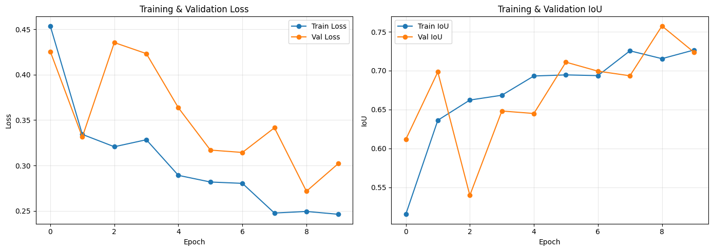

### Evaluación del modelo

Luego de completar el entrenamiento, se cargó el checkpoint del modelo fine-tuned y se realizó la evaluación sobre el conjunto de validación. El objetivo fue comparar su desempeño frente al modelo SAM pre-entrenado, utilizando métricas (IoU, Dice, precisión y recall).

En términos generales, el modelo ajustado mostró mejoras claras en todas las métricas evaluadas. Los mayores avances se observaron especialmente en IoU y Dice, indicando que el fine-tuning permitió que el modelo se adapte mejor a las características específicas del dataset trabajado. Esto se traduce en segmentos más fieles a las regiones reales en las imágenes.

```python
=== EVALUATING FINE-TUNED SAM ===
  Processed 20/20 images...

=== FINE-TUNED SAM ===
Mean IoU: 0.7180 ± 0.2132
Mean Dice: 0.8126 ± 0.1902
Mean Precision: 0.8893
Mean Recall: 0.7707

=== COMPARISON ===
Metric          Pretrained      Fine-tuned      Improvement    
------------------------------------------------------------
IOU             0.5291          0.7180          35.69          %
DICE            0.6220          0.8126          30.65          %
PRECISION       0.8193          0.8893          8.55           %
RECALL          0.5885          0.7707          30.96          %
```

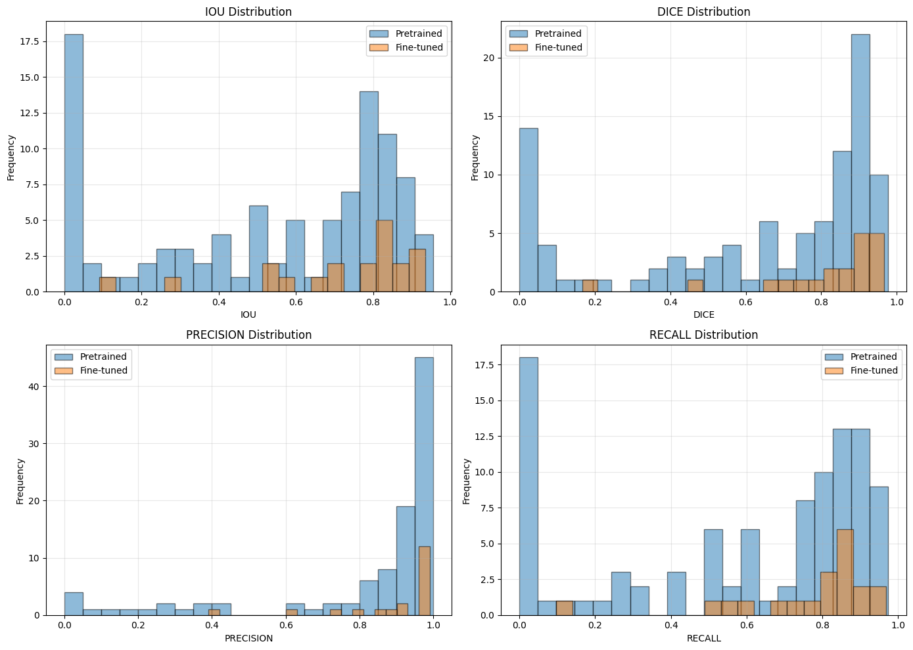

Al analizar los resultados caso por caso, se identificaron mejoras particularmente notorias en imágenes donde el modelo pre-entrenado tenía dificultades para identificar correctamente las regiones objetivo. El fine-tuned logró corregir segmentaciones incompletas y reducir errores en zonas más delgadas o menos contrastadas. Si bien hubo ejemplos donde la mejora fue mínima (principalmente en imágenes que ya eran fáciles para el modelo original), los beneficios en los casos complejos justifican el proceso de ajuste.

```python
=== IMAGE 0 ===
Pretrained: IoU=0.0018, Dice=0.0036
Fine-tuned: IoU=0.6744, Dice=0.8056
Improvement: IoU +0.6726, Dice +0.8019
```

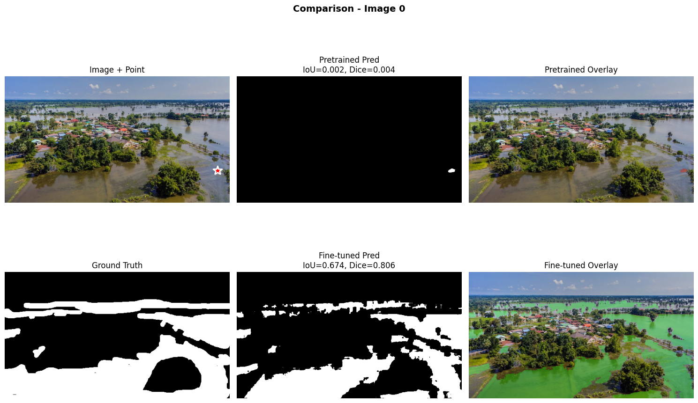

```python
=== IMAGE 5 ===
Pretrained: IoU=0.5862, Dice=0.7391
Fine-tuned: IoU=0.8350, Dice=0.9101
Improvement: IoU +0.2488, Dice +0.1709
```

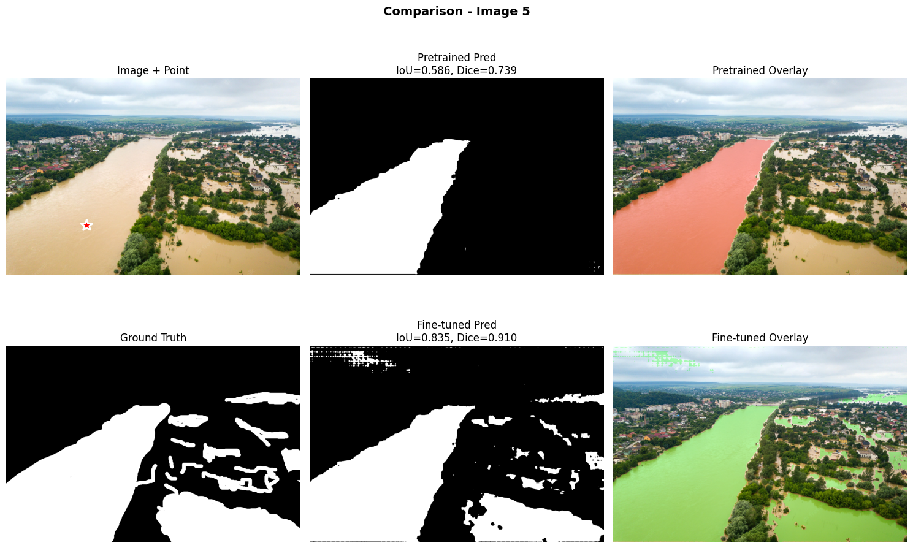

```python
=== IMAGE 10 ===
Pretrained: IoU=0.9338, Dice=0.9658
Fine-tuned: IoU=0.9348, Dice=0.9663
Improvement: IoU +0.0010, Dice +0.0005
```

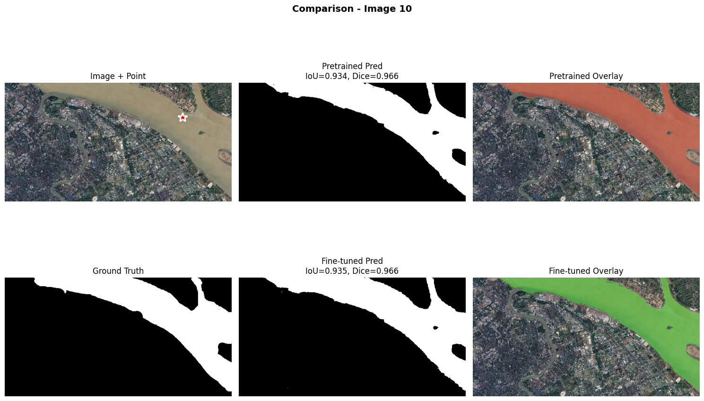

```python
=== IMAGE 15 ===
Pretrained: IoU=0.2934, Dice=0.4537
Fine-tuned: IoU=0.3018, Dice=0.4636
Improvement: IoU +0.0084, Dice +0.0100
```

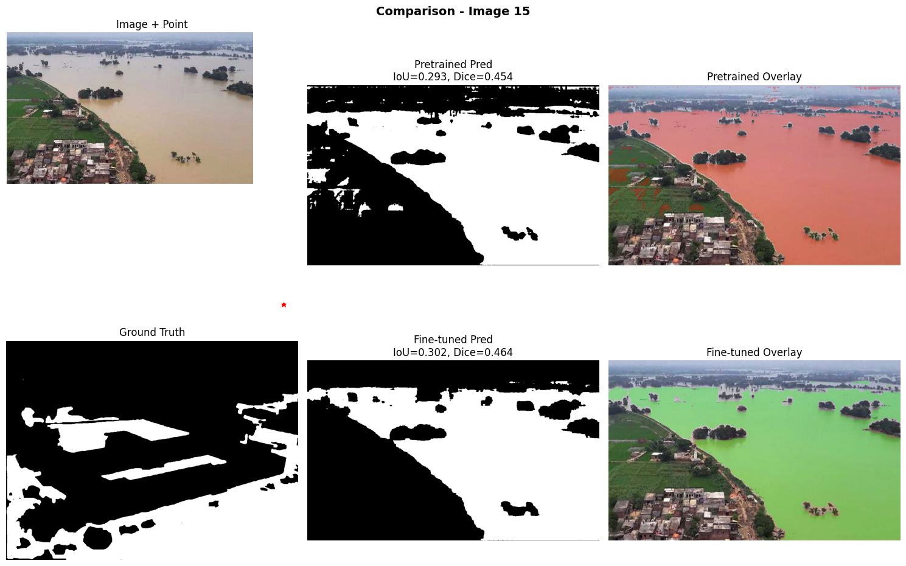


Finalmente, también se revisaron fallos. El modelo ajustado no solo redujo el número total de errores, sino que además las fallas restantes presentaron menor desviación respecto al ground truth. Esto confirma que el fine-tuning no solo mejora la precisión global sino también la estabilidad del modelo frente a distintos tipos de imágenes.


```python
=== ANALYZING PRETRAINED FAILURES ===
Failure cases: 7

Failure statistics:
  Mean IoU: 0.092
  Mean water region width: 1.00 pixels
```

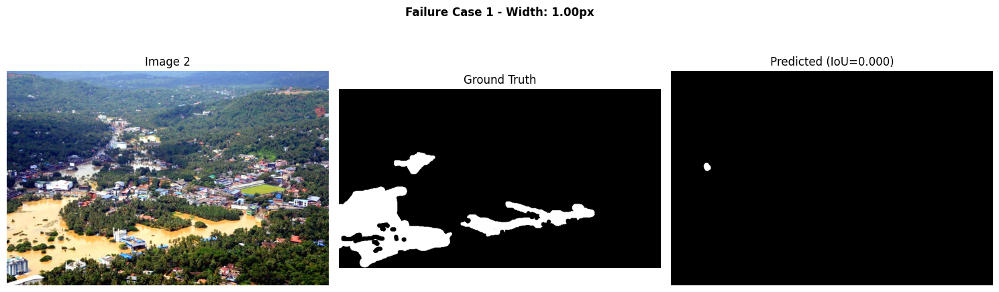

```python
=== ANALYZING FINE-TUNED FAILURES ===
Failure cases: 2

=== FAILURE REDUCTION ===
Pretrained failures: 7
Fine-tuned failures: 2
Reduction: 5 (71.4%)
```

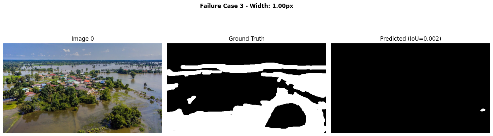

## Reflexión

Esta practica me permitió recorrer todo el flujo para adaptar y evaluar SAM en el dominio de segmentación de inundaciones, desde la preparación del dataset hasta la comparación entre inferencia zero-shot y fine-tuning. Se analizo el desempeño del modelo preentrenado, y el hecho de entender las ventajas y limitaciones de distintos tipos de prompts, y diseñar una estrategia de entrenamiento eficiente para un dataset reducido.

Uno de los principales aprendizajes fue comprobar que, si bien SAM ofrece resultados fuertes en modo zero-shot, la especialización resulta clave para maximizar la precisión en contextos específicos como imágenes satelitales de inundaciones. El fine-tuning logró mejoras significativas, redujo casos fallidos y generó predicciones más completas y consistentes.
