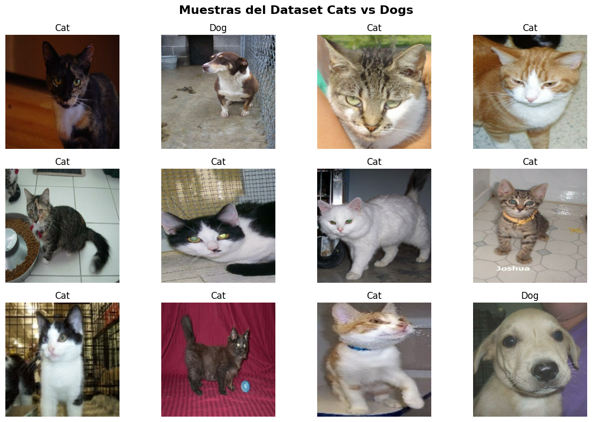
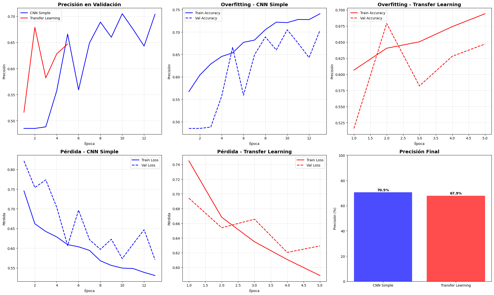
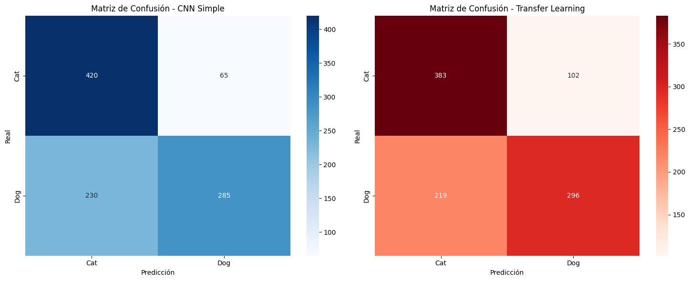

# Cat vs Dogs

## Contexto

Este trabajo aborda la clasificación binaria de imágenes (gatos vs. perros) con TensorFlow/Keras, poniendo el foco en comparar una red convolucional construida desde cero con un enfoque de Transfer Learning basado en ResNet50. 

El flujo completo incluyó la preparación del conjunto de datos con `tensorflow_datasets`, la normalización de imágenes al rango [0, 1] y el reescalado a 224×224 píxeles, la definición de arquitecturas, la configuración de entrenamiento con callbacks para regularización dinámica y, finalmente, la evaluación cuantitativa y cualitativa.

## Objetivos

El objetivo principal fue alcanzar un desempeño de referencia en test igual o superior al 70% de exactitud y, en paralelo, comparar una CNN desde cero frente a un modelo con aprendizaje por transferencia. 

Además, se buscó analizar métricas por clase para entender asimetrías en el rendimiento entre “Cat” y “Dog”, y explorar rápidamente arquitecturas livianas (p. ej., MobileNetV2 y EfficientNetB0) que pudieran ofrecer mejor relación precisión/parámetros.

## Actividades

- Preparación y preprocesamiento del dataset
- Implementación CNN simple y compilación
- Implementación Transfer Learning (ResNet50)
- Entrenamiento con callbacks (ambos modelos)
- Evaluación, gráficas y reportes
- Experimentos con arquitecturas livianas

## Desarrollo

La preparación del dataset se realizó dividiendo aproximadamente 80/20 para entrenamiento y test, y mapeando un preprocesamiento que normaliza y redimensiona las imágenes. Se limitaron 4,000 ejemplos para entrenamiento y 1,000 para test con el fin de acelerar el entrenamiento, manteniendo un balance razonable entre clases (aprox. 2,048 “Cat” y 1,952 “Dog”). Se utilizó codificación one-hot y un tamaño de lote de 32 imágenes por iteración.

```python
📊 INFORMACIÓN DEL DATASET:
   📈 Entrenamiento: 4000 imágenes
   🧪 Test: 1000 imágenes
   📐 Dimensiones: (224, 224, 3) (HxWxC)
   📋 Clases: 2 (Clasificación Binaria)
   🐱 Cats: 2051
   🐶 Dogs: 1949
   📦 Batch size: 32
```



La primera arquitectura fue una CNN desde cero con cuatro bloques convolucionales y de pooling, normalización por lotes y activaciones ReLU. Para favorecer la estabilidad y evitar un número excesivo de parámetros, la red reemplaza el `Flatten` por un `GlobalAveragePooling2D`, seguido de capas densas con `Dropout`. Esta configuración suma 423,490 parámetros y busca un buen equilibrio entre capacidad representacional y regularización para imágenes de 224×224.

```python
🏗️ PASO 3: CNN SIMPLE DESDE CERO
============================================================
🏗️ ARQUITECTURA CNN SIMPLE:
Model: "sequential"
┏━━━━━━━━━━━━━━━━━━━━━━━━━━━━━━━━━┳━━━━━━━━━━━━━━━━━━━━━━━━┳━━━━━━━━━━━━━━━┓
┃ Layer (type)                    ┃ Output Shape           ┃       Param # ┃
┡━━━━━━━━━━━━━━━━━━━━━━━━━━━━━━━━━╇━━━━━━━━━━━━━━━━━━━━━━━━╇━━━━━━━━━━━━━━━┩
│ conv2d (Conv2D)                 │ (None, 224, 224, 32)   │           896 │
├─────────────────────────────────┼────────────────────────┼───────────────┤
│ batch_normalization             │ (None, 224, 224, 32)   │           128 │
│ (BatchNormalization)            │                        │               │
├─────────────────────────────────┼────────────────────────┼───────────────┤
│ activation (Activation)         │ (None, 224, 224, 32)   │             0 │
├─────────────────────────────────┼────────────────────────┼───────────────┤
│ max_pooling2d (MaxPooling2D)    │ (None, 112, 112, 32)   │             0 │
├─────────────────────────────────┼────────────────────────┼───────────────┤
│ conv2d_1 (Conv2D)               │ (None, 112, 112, 64)   │        18,496 │
├─────────────────────────────────┼────────────────────────┼───────────────┤
│ batch_normalization_1           │ (None, 112, 112, 64)   │           256 │
│ (BatchNormalization)            │                        │               │
├─────────────────────────────────┼────────────────────────┼───────────────┤
│ activation_1 (Activation)       │ (None, 112, 112, 64)   │             0 │
├─────────────────────────────────┼────────────────────────┼───────────────┤
│ max_pooling2d_1 (MaxPooling2D)  │ (None, 56, 56, 64)     │             0 │
├─────────────────────────────────┼────────────────────────┼───────────────┤
│ conv2d_2 (Conv2D)               │ (None, 56, 56, 128)    │        73,856 │
├─────────────────────────────────┼────────────────────────┼───────────────┤
│ batch_normalization_2           │ (None, 56, 56, 128)    │           512 │
│ (BatchNormalization)            │                        │               │
├─────────────────────────────────┼────────────────────────┼───────────────┤
│ activation_2 (Activation)       │ (None, 56, 56, 128)    │             0 │
├─────────────────────────────────┼────────────────────────┼───────────────┤
│ max_pooling2d_2 (MaxPooling2D)  │ (None, 28, 28, 128)    │             0 │
├─────────────────────────────────┼────────────────────────┼───────────────┤
│ conv2d_3 (Conv2D)               │ (None, 28, 28, 256)    │       295,168 │
├─────────────────────────────────┼────────────────────────┼───────────────┤
│ batch_normalization_3           │ (None, 28, 28, 256)    │         1,024 │
│ (BatchNormalization)            │                        │               │
├─────────────────────────────────┼────────────────────────┼───────────────┤
│ activation_3 (Activation)       │ (None, 28, 28, 256)    │             0 │
├─────────────────────────────────┼────────────────────────┼───────────────┤
│ max_pooling2d_3 (MaxPooling2D)  │ (None, 14, 14, 256)    │             0 │
├─────────────────────────────────┼────────────────────────┼───────────────┤
│ global_average_pooling2d        │ (None, 256)            │             0 │
│ (GlobalAveragePooling2D)        │                        │               │
├─────────────────────────────────┼────────────────────────┼───────────────┤
│ dropout (Dropout)               │ (None, 256)            │             0 │
├─────────────────────────────────┼────────────────────────┼───────────────┤
│ dense (Dense)                   │ (None, 128)            │        32,896 │
├─────────────────────────────────┼────────────────────────┼───────────────┤
│ dropout_1 (Dropout)             │ (None, 128)            │             0 │
├─────────────────────────────────┼────────────────────────┼───────────────┤
│ dense_1 (Dense)                 │ (None, 2)              │           258 │
└─────────────────────────────────┴────────────────────────┴───────────────┘
 Total params: 423,490 (1.62 MB)
 Trainable params: 422,530 (1.61 MB)
 Non-trainable params: 960 (3.75 KB)
🔢 Parámetros totales: 423,490
```

El segundo enfoque recurrió a Transfer Learning con ResNet50 pre-entrenada en ImageNet con el feature extractor congelado. Sobre esa base se añadieron `GlobalAveragePooling2D` y un clasificador con capas densas, `BatchNormalization` y `Dropout`. El modelo tiene 24,146,434 parámetros, de los cuales 558,210 son entrenables en esta primera fase.

```python
🎯 PASO 4: TRANSFER LEARNING
============================================================
Downloading data from https://storage.googleapis.com/tensorflow/keras-applications/resnet/resnet50_weights_tf_dim_ordering_tf_kernels_notop.h5
94765736/94765736 ━━━━━━━━━━━━━━━━━━━━ 1s 0us/step
🎯 ARQUITECTURA TRANSFER LEARNING:
Model: "sequential_1"
┏━━━━━━━━━━━━━━━━━━━━━━━━━━━━━━━━━┳━━━━━━━━━━━━━━━━━━━━━━━━┳━━━━━━━━━━━━━━━┓
┃ Layer (type)                    ┃ Output Shape           ┃       Param # ┃
┡━━━━━━━━━━━━━━━━━━━━━━━━━━━━━━━━━╇━━━━━━━━━━━━━━━━━━━━━━━━╇━━━━━━━━━━━━━━━┩
│ resnet50 (Functional)           │ (None, 7, 7, 2048)     │    23,587,712 │
├─────────────────────────────────┼────────────────────────┼───────────────┤
│ global_average_pooling2d_1      │ (None, 2048)           │             0 │
│ (GlobalAveragePooling2D)        │                        │               │
├─────────────────────────────────┼────────────────────────┼───────────────┤
│ dense_2 (Dense)                 │ (None, 256)            │       524,544 │
├─────────────────────────────────┼────────────────────────┼───────────────┤
│ batch_normalization_4           │ (None, 256)            │         1,024 │
│ (BatchNormalization)            │                        │               │
├─────────────────────────────────┼────────────────────────┼───────────────┤
│ dropout_2 (Dropout)             │ (None, 256)            │             0 │
├─────────────────────────────────┼────────────────────────┼───────────────┤
│ dense_3 (Dense)                 │ (None, 128)            │        32,896 │
├─────────────────────────────────┼────────────────────────┼───────────────┤
│ dropout_3 (Dropout)             │ (None, 128)            │             0 │
├─────────────────────────────────┼────────────────────────┼───────────────┤
│ dense_4 (Dense)                 │ (None, 2)              │           258 │
└─────────────────────────────────┴────────────────────────┴───────────────┘
 Total params: 24,146,434 (92.11 MB)
 Trainable params: 558,210 (2.13 MB)
 Non-trainable params: 23,588,224 (89.98 MB)
🔢 Parámetros totales: 24,146,434
🔓 Parámetros entrenables: 558,210
```

El entrenamiento de ambos modelos uso `Adam` y callbacks de `EarlyStopping` (monitorizando `val_accuracy` con paciencia 3) y `ReduceLROnPlateau` (reducción de la tasa de aprendizaje al detectar estancamiento en `val_loss`). En las primeras épocas, la CNN simple se estabilizó alrededor de 0.72–0.73 de `val_accuracy`, mientras que el modelo con ResNet50, partiendo más bajo (~0.62), progresó hasta ~0.71 en validación. 

En test, la CNN desde cero alcanzó 73.30% de exactitud y el modelo con Transfer Learning obtuvo 70.80%, para una diferencia de -2.50 puntos porcentuales a favor del enfoque desde cero. 

```
🏋️ PASO 5: ENTRENAMIENTO
============================================================

3️⃣ Entrenando modelos...
🏗️ ENTRENANDO CNN SIMPLE...
Epoch 1/15
125/125 ━━━━━━━━━━━━━━━━━━━━ 25s 102ms/step - accuracy: 0.5499 - loss: 0.8372 - val_accuracy: 0.4850 - val_loss: 0.8216 - learning_rate: 0.0010
Epoch 5/15
125/125 ━━━━━━━━━━━━━━━━━━━━ 10s 77ms/step - accuracy: 0.6502 - loss: 0.6175 - val_accuracy: 0.6660 - val_loss: 0.6063 - learning_rate: 0.0010
Epoch 10/15
125/125 ━━━━━━━━━━━━━━━━━━━━ 10s 78ms/step - accuracy: 0.7195 - loss: 0.5535 - val_accuracy: 0.7050 - val_loss: 0.5735 - learning_rate: 2.0000e-04
Epoch 13/15
125/125 ━━━━━━━━━━━━━━━━━━━━ 10s 77ms/step - accuracy: 0.7356 - loss: 0.5373 - val_accuracy: 0.7040 - val_loss: 0.5707 - learning_rate: 1.0000e-04

🎯 ENTRENANDO TRANSFER LEARNING...
Epoch 1/15
125/125 ━━━━━━━━━━━━━━━━━━━━ 35s 172ms/step - accuracy: 0.5959 - loss: 0.7733 - val_accuracy: 0.5160 - val_loss: 0.6941 - learning_rate: 0.0010
Epoch 5/15
125/125 ━━━━━━━━━━━━━━━━━━━━ 13s 102ms/step - accuracy: 0.7017 - loss: 0.5833 - val_accuracy: 0.6470 - val_loss: 0.6293 - learning_rate: 0.0010
```

El análisis por clase mostró que la CNN simple presentó mejor recall para “Cat” (0.82) a costa de un menor recall para “Dog” (0.65), mientras que el Transfer Learning invirtió esa tendencia (recall “Dog” 0.82 y “Cat” 0.59). En términos de precisión, la CNN simple favoreció “Dog” (0.79) y el TL favoreció “Cat” (0.76). 

```python
4️⃣ Evaluando modelos...

📊 PASO 6: EVALUACIÓN Y COMPARACIÓN
============================================================
📊 COMPARACIÓN FINAL:
🏗️ CNN Simple: 0.7050 (70.50%)
🎯 Transfer Learning: 0.6790 (67.90%)
📈 Mejora: -2.60%
```



```python
📋 REPORTE DE CLASIFICACIÓN - CNN SIMPLE:
              precision    recall  f1-score   support

         Cat       0.65      0.87      0.74       485
         Dog       0.81      0.55      0.66       515

    accuracy                           0.70      1000
   macro avg       0.73      0.71      0.70      1000
weighted avg       0.73      0.70      0.70      1000


📋 REPORTE DE CLASIFICACIÓN - TRANSFER LEARNING:
              precision    recall  f1-score   support

         Cat       0.64      0.79      0.70       485
         Dog       0.74      0.57      0.65       515

    accuracy                           0.68      1000
   macro avg       0.69      0.68      0.68      1000
weighted avg       0.69      0.68      0.68      1000
```



Además, se ejecutó un experimento breve con arquitecturas livianas. En pocas épocas, MobileNetV2 obtuvo 98.70% de exactitud (≈2.62M de parámetros), superando claramente a EfficientNetB0 (48.90%, ≈4.41M) y a la propia ResNet50 en este régimen de entrenamiento corto (51.50%). Dado lo atípico del 98.70% en un escenario acelerado, este resultado debería validarse con múltiples semillas, mayor número de épocas y controles estrictos para descartar cualquier fuga de información o efectos de sobreajuste inadvertido.

```python
7️⃣ Ejecutando experimento adicional...

🔬 EXPERIMENTO: 3 ARQUITECTURAS LIVIANAS
============================================================
✅ EfficientNetB0 disponible - agregado al experimento
🚀 Probando 3 arquitecturas livianas (ejecución rápida):
   • MobileNetV2
   • ResNet50
   • EfficientNetB0

🚀 Entrenando MobileNetV2...
Downloading data from https://storage.googleapis.com/tensorflow/keras-applications/mobilenet_v2/mobilenet_v2_weights_tf_dim_ordering_tf_kernels_1.0_224_no_top.h5
9406464/9406464 ━━━━━━━━━━━━━━━━━━━━ 0s 0us/step
   ✅ MobileNetV2: 0.9840 (98.40%)

🚀 Entrenando ResNet50...
   ✅ ResNet50: 0.5670 (56.70%)

🚀 Entrenando EfficientNetB0...
Downloading data from https://storage.googleapis.com/keras-applications/efficientnetb0_notop.h5
16705208/16705208 ━━━━━━━━━━━━━━━━━━━━ 0s 0us/step
   ✅ EfficientNetB0: 0.5150 (51.50%)

📊 RESUMEN DE COMPARACIÓN:
--------------------------------------------------
🏆 MobileNetV2 : 0.9840 (98.40%) - 2,620,098 parámetros
🏆 ResNet50    : 0.5670 (56.70%) - 24,146,434 parámetros
🏆 EfficientNetB0: 0.5150 (51.50%) - 4,411,685 parámetros

🥇 MEJOR MODELO: MobileNetV2 con 98.40% de precisión

🔬 EXPERIMENTO 4: ANÁLISIS DE ERRORES
============================================================
32/32 ━━━━━━━━━━━━━━━━━━━━ 1s 20ms/step
📊 Predicciones incorrectas: 295 de 1000
📊 Precisión: 70.50%

🔍 TOP 10 CONFUSIONES MÁS COMUNES:
--------------------------------------------------
🔄 Dog          → Cat         : 230 casos
🔄 Cat          → Dog         : 65 casos
```

```python
📊 RESUMEN FINAL - CATS VS DOGS:
============================================================
🏗️ CNN Simple (Cats vs Dogs): 70.50%
🎯 Transfer Learning (Cats vs Dogs): 67.90%
📈 Mejora con Transfer Learning: -2.60%
🤔 CNN Simple funcionó mejor (dataset puede ser muy sintético)
```

## Reflexión

Este ejercicio refuerza que la calidad del preprocesamiento, la elección de arquitectura y la estrategia de entrenamiento inciden de forma decisiva en el desempeño final. El hecho de que la CNN desde cero superara a ResNet50 congelada sugiere que, para este dataset y bajo estas condiciones, la arquitectura diseñada resultó más adecuada que reutilizar representaciones genéricas sin ajuste fino.

Para mejorar, sería conveniente introducir una política de data augmentation más agresiva (volteos, rotaciones, jitter de color, recortes aleatorios) que incremente la diversidad del entrenamiento. En el modelo de Transfer Learning, el siguiente paso natural es habilitar fine-tuning parcial descongelando un subconjunto de capas finales de la base con un learning rate reducido. 

## Referencias

https://colab.research.google.com/drive/1qfOTqIPp7WUWTobZki3J1o2PLvgsX1ji?usp=sharing