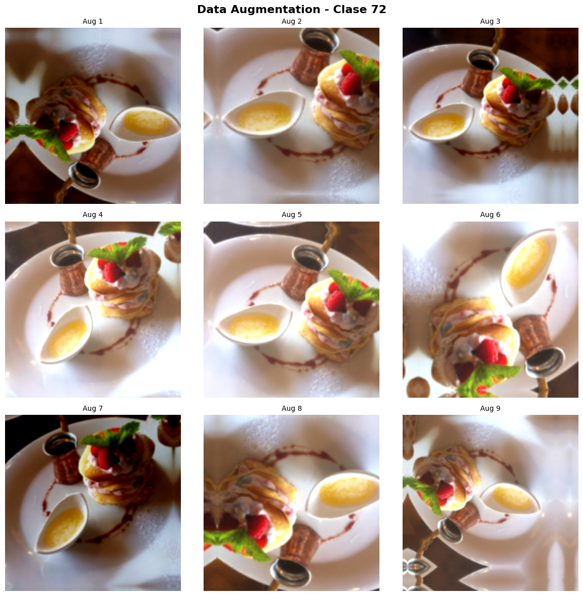
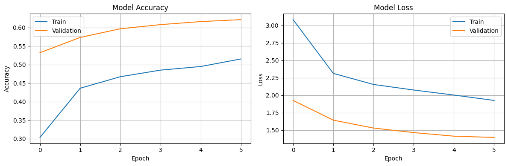
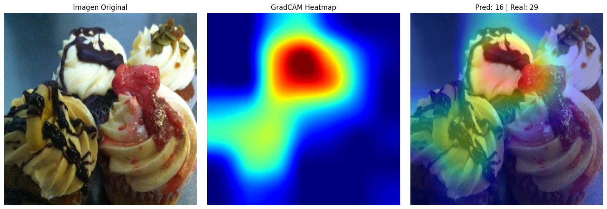
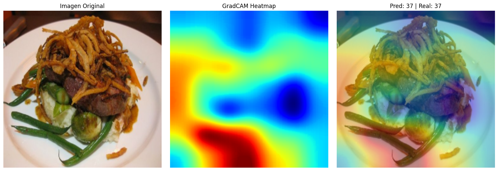
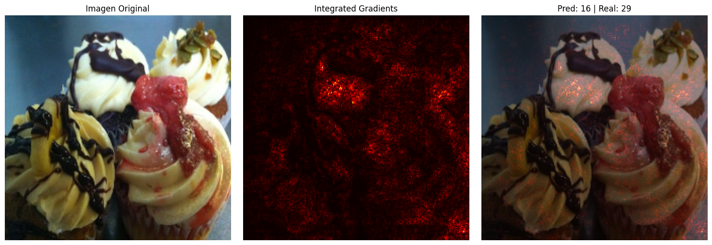
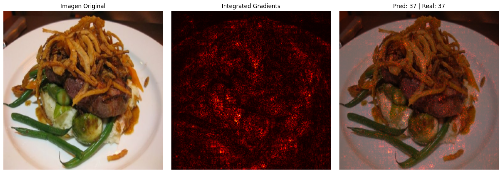
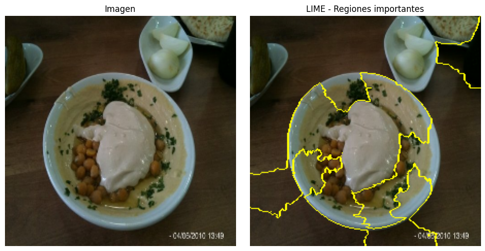
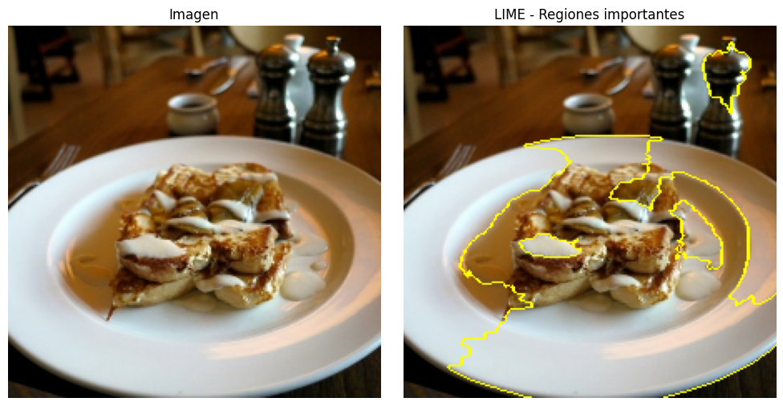

# Food-101

## Contexto

En esta actividad se trabajó con el dataset Food-101, que contiene imágenes de 101 diferentes clases de alimentos. El objetivo principal fue implementar técnicas para clasificación de imágenes, incluyendo data augmentation, transfer learning y métodos de explicabilidad de modelos.

## Objetivos

- Implementar un modelo de clasificación de imágenes utilizando transfer learning con EfficientNetB0
- Aplicar técnicas de data augmentation para mejorar la robustez del modelo
- Implementar y visualizar métodos de explicabilidad (GradCAM, Integrated Gradients y LIME) para entender las decisiones del modelo

## Actividades

- Configuración inicial y carga del dataset Food-101
- Implementación de pipelines de data augmentation
- Creación y entrenamiento del modelo con transfer learning
- Implementación de técnicas de explicabilidad
- Análisis y visualización de resultados

## Desarrollo

### Configuración Inicial y Preparación del Dataset

Para el manejo de imágenes, establecimos un tamaño estándar de 224x224 píxeles y un tamaño de batch de 32. El dataset Food-101 se cargó utilizando TensorFlow Datasets, que contiene un total de 101 clases diferentes de alimentos. Para optimizar el tiempo de desarrollo, trabajamos con un subset del dataset: 20,000 imágenes para entrenamiento y 5,000 para validación.

```python
Dataset food101 downloaded and prepared to /root/tensorflow_datasets/food101/2.0.0. Subsequent calls will reuse this data.
✅ Dataset descargado:
   Train: 75750 imágenes
   Val:   25250 imágenes
   Clases: 101

✅ Datasets preparados (resize a 224x224, sin normalizar):
   Train subset: 20000
   Val subset:   5000
   Rango de píxeles: [0, 255]
```

### Implementación de Data Augmentation

Se desarrollo dos pipelines diferentes para el procesamiento de datos:

El pipeline baseline se encargó de:

- Redimensionar las imágenes a 224x224
- Aplicar normalización específica para EfficientNet
- Mantener las imágenes en el rango [0, 255] antes de la normalización

El pipeline aumentado incluyó transformaciones más sofisticadas:

- Volteos horizontales y verticales aleatorios para aumentar la variabilidad
- Rotaciones de hasta 45 grados
- Zoom aleatorio de hasta 20%
- Traslaciones de hasta 10% en ambas direcciones
- Ajustes de contraste y brillo
- Normalización final para EfficientNet

Estas transformaciones se visualizaron para verificar su correcta implementación y asegurar que mantenían la integridad de las imágenes.



### Arquitectura del Modelo y Proceso de Entrenamiento

Se implemento un modelo basado en transfer learning utilizando EfficientNetB0. La arquitectura final consistió en:

- EfficientNetB0 pre-entrenado en ImageNet (con pesos congelados)
- Una capa de Global Average Pooling para reducir la dimensionalidad
- Una capa de Dropout con tasa de 0.2 para prevenir el overfitting
- Una capa densa final con 101 neuronas (una por clase) y activación softmax

```python
✅ Modelo creado
   Parámetros: 4,178,952
Model: "sequential"
┏━━━━━━━━━━━━━━━━━━━━━━━━━━━━━━━━━━━━━━━━━━━━━━━━━━━━━┳━━━━━━━━━━━━━━━━━━━━━━━━━━━━━━━━━━━━━━━━┳━━━━━━━━━━━━━━━━━━━
┃ Layer (type)                                        ┃ Output Shape                           ┃               Para
┡━━━━━━━━━━━━━━━━━━━━━━━━━━━━━━━━━━━━━━━━━━━━━━━━━━━━━╇━━━━━━━━━━━━━━━━━━━━━━━━━━━━━━━━━━━━━━━━╇━━━━━━━━━━━━━━━━━━━
│ efficientnetb0 (Functional)                         │ (None, 7, 7, 1280)                     │             4,049,
├─────────────────────────────────────────────────────┼────────────────────────────────────────┼───────────────────
│ global_average_pooling2d (GlobalAveragePooling2D)   │ (None, 1280)                           │                   
├─────────────────────────────────────────────────────┼────────────────────────────────────────┼───────────────────
│ dropout (Dropout)                                   │ (None, 1280)                           │                   
├─────────────────────────────────────────────────────┼────────────────────────────────────────┼───────────────────
│ dense (Dense)                                       │ (None, 101)                            │               129,
└─────────────────────────────────────────────────────┴────────────────────────────────────────┴───────────────────
 Total params: 4,178,952 (15.94 MB)
 Trainable params: 129,381 (505.39 KB)
 Non-trainable params: 4,049,571 (15.45 MB)
```

El modelo se compiló con:

- Optimizador: Adam
- Función de pérdida: Sparse Categorical Crossentropy
- Métrica: Accuracy

El entrenamiento se realizó durante 6 épocas utilizando el pipeline aumentado para el conjunto de entrenamiento y el pipeline baseline para validación. Los resultados mostraron una mejora progresiva en la precisión tanto en entrenamiento como en validación.

```python
🚀 ENTRENANDO MODELO
============================================================
Epoch 1/6
625/625 ━━━━━━━━━━━━━━━━━━━━ 363s 525ms/step - accuracy: 0.2016 - loss: 3.6530 - val_accuracy: 0.5322 - val_loss: 1.9245
Epoch 2/6
625/625 ━━━━━━━━━━━━━━━━━━━━ 317s 502ms/step - accuracy: 0.4258 - loss: 2.3797 - val_accuracy: 0.5734 - val_loss: 1.6416
Epoch 3/6
625/625 ━━━━━━━━━━━━━━━━━━━━ 313s 494ms/step - accuracy: 0.4660 - loss: 2.1685 - val_accuracy: 0.5968 - val_loss: 1.5287
Epoch 4/6
625/625 ━━━━━━━━━━━━━━━━━━━━ 313s 495ms/step - accuracy: 0.4853 - loss: 2.0869 - val_accuracy: 0.6080 - val_loss: 1.4635
Epoch 5/6
625/625 ━━━━━━━━━━━━━━━━━━━━ 312s 492ms/step - accuracy: 0.4930 - loss: 2.0113 - val_accuracy: 0.6162 - val_loss: 1.4122
Epoch 6/6
625/625 ━━━━━━━━━━━━━━━━━━━━ 310s 491ms/step - accuracy: 0.5135 - loss: 1.9408 - val_accuracy: 0.6214 - val_loss: 1.3941

✅ Entrenamiento completado
   📊 Mejor val_accuracy: 62.14%
```

```python
📊 RESULTADOS FINALES:
   Val Accuracy: 62.32%
   Val Loss: 1.3910
```



### 4. Técnicas de Explicabilidad

Se implemento tres técnicas diferentes de explicabilidad para entender mejor las decisiones del modelo:

1. GradCAM:

Se identifico automáticamente la última capa convolucional del modelo y generamos mapas de calor que resaltan las regiones más importantes para la predicción. Esta técnica nos permitió visualizar qué partes de la imagen el modelo consideraba más relevantes para su decisión.





2. Integrated Gradients:

Se implemento con 50 pasos de interpolación entre una imagen base (negra) y la imagen de entrada. Esta técnica nos proporcionó una vista más granular de la contribución de cada píxel a la predicción final.





3. LIME (Local Interpretable Model-agnostic Explanations):

Se configuro LIME para generar explicaciones locales de las predicciones, utilizando 1000 muestras por imagen y visualizando las 10 regiones más importantes que influyen en la clasificación.





## Reflexión

Durante el proceso de implementación, observé cómo el data augmentation contribuyó significativamente a la capacidad del modelo para generalizar mejor, especialmente en un dataset tan diverso como Food-101.

Los resultados del entrenamiento mostraron una evolución positiva en la precisión del modelo. GradCAM mostró que el modelo efectivamente se enfocaba en las características distintivas de cada plato, mientras que Integrated Gradients proporcionó una visión más detallada de cómo cada región de la imagen contribuía a la clasificación final.

Las técnicas de explicabilidad implementadas no solo ayudaron a entender mejor las decisiones del modelo, sino que también proporcionaron una base para la confianza en sus predicciones.

## Referencias

- https://colab.research.google.com/drive/1DYzDoEOcwinQ_m1kBIq3n23bkOs-kob_?usp=sharing