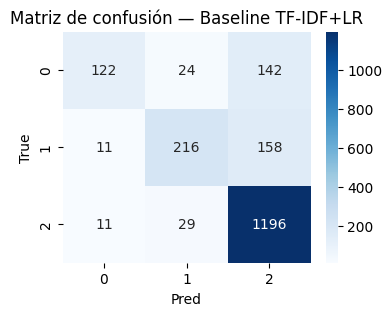

# Análisis y Clasificación Automática de Textos Ofensivos

## Contexto

Se explora el uso de modelos de lenguaje basados en Transformers para la detección y clasificación de textos ofensivos en redes sociales. A partir de un dataset de publicaciones reales, se realiza un análisis comparativo entre enfoques tradicionales de representación de texto y técnicas de fine-tuning aplicadas a modelos preentrenados como BERT o FinBERT.

## Objetivos

- Analizar la estructura y distribución de un dataset de textos etiquetados para identificar posibles sesgos y desbalances de clases.
- Implementar un modelo base de clasificación usando TF-IDF + Logistic Regression como línea de base.
- Entrenar y ajustar un modelo Transformer preentrenado (FinBERT y BERT-base) mediante fine-tuning para la clasificación multiclase de mensajes.
- Evaluar y comparar el rendimiento de ambos enfoques utilizando métricas.

## Actividades

- Parte 1: Setup y Exploración del Dataset
- Parte 2bis: EDA avanzada (TF‑IDF + proyección + Word2Vec)
- Parte 2: Baseline clásico (TF‑IDF + LogisticRegression)
- Parte 3: Fine-tuning con Hugging Face Transformers
- Parte 4: Visualizaciones y Comparación

## Desarrollo

Se utilizó el dataset “zeroshot/twitter-financial-news-sentiment” de Hugging Face, compuesto por 12.000 publicaciones de Twitter relacionadas con noticias financieras, distribuidas en tres clases: *Bearish (0)*, *Bullish (1)* y *Neutral (2)*. Los datos se dividieron en train (9543 registros) y validation (2388 registros).

```python
DatasetDict({
    train: Dataset({
        features: ['text', 'label'],
        num_rows: 9543
    })
    validation: Dataset({
        features: ['text', 'label'],
        num_rows: 2388
    })
})

2    6178
1    1923
0    1442
```


Se observó un fuerte desbalance de clases, predominando la categoría *Neutral* con más de 6.000 ejemplos, frente a unas 1.900 instancias *Bullish* y 1.400 *Bearish*. Esto justificó el uso de la métrica macro-F1 para una evaluación más justa entre clases.


```python
Top n-grams para clase 0:
co: 737
https: 735
https co: 735

Top n-grams para clase 1:
co: 852
https: 842
https co: 842

Top n-grams para clase 2:
co: 3559
https co: 3518
https: 3518
```


Además, el análisis de longitud de textos mostró una distribución moderadamente corta, lo que permitió aplicar truncamiento estándar en la tokenización sin pérdida significativa de contexto.

Durante la etapa de EDA, los n-grams más frecuentes en todas las clases incluyeron tokens como `co`, `https` y `https co`, lo que sugiere la alta presencia de enlaces en los tweets y cierto ruido textual. Esto reafirmó la necesidad de usar un modelo contextual como los Transformers, capaz de captar significado más allá de la frecuencia de palabras.

Como línea base se implementó un modelo TF-IDF + Logistic Regression, que alcanzó una precisión total del 80% y un macro-F1 de 0.70. Si bien el desempeño fue razonable, el modelo mostró dificultades para distinguir las clases minoritarias (*Bearish* y *Bullish*), reflejando un recall bajo (0.42 y 0.56) frente a un desempeño mucho mejor en *Neutral (0.97)*.

```python
              precision    recall  f1-score   support

           0       0.85      0.42      0.56       288
           1       0.80      0.56      0.66       385
           2       0.80      0.97      0.88      1236

    accuracy                           0.80      1909
   macro avg       0.82      0.65      0.70      1909
weighted avg       0.81      0.80      0.79      1909
```



Posteriormente, se realizó un fine-tuning del modelo Transformer “ProsusAI/finbert”, especializado en texto financiero.

Durante el entrenamiento, la pérdida de validación disminuyó significativamente en las primeras épocas y luego se estabilizó. Los resultados finales del modelo Transformer fueron:

- Accuracy: 0.8727
- F1-macro: 0.8266

```python
Texto: Esto es inaceptable y ofensivo.
Tokens: ['est', '##o', 'es', 'ina', '##ce', '##pta', '##ble', 'y', 'of', '##ens', '##ivo', '.']

Texto: Gran trabajo del equipo, ¡excelente!
Tokens: ['gran', 'tr', '##aba', '##jo', 'del', 'e', '##qui', '##po', ',', '¡', 'excel', '##ente', '!']

Epoch	Training Loss	Validation Loss	Accuracy	F1
1	0.477400	0.409127	0.862232	0.808454
2	0.260800	0.394032	0.869565	0.823505
3	0.144300	0.509117	0.872708	0.826560
4	0.097200	0.576328	0.868518	0.824941

{'eval_loss': 0.5091170072555542, 'eval_accuracy': 0.8727082242011525, 'eval_f1': 0.82656036096332, 'eval_runtime': 7.9514, 'eval_samples_per_second': 240.082, 'eval_steps_per_second': 15.092, 'epoch': 4.0}
```

Estos valores superaron claramente al baseline (Accuracy 0.80 / F1 0.70), mostrando una mejora en F1 y una mejor generalización entre clases.


```python
{'baseline': {'acc': 0.8035620743844945, 'f1': 0.7003047739488877}, 'transformer': {'acc': 0.8727082242011525, 'f1': 0.82656036096332}}
```

El modelo Transformer no solo logró mayor precisión global, sino también una representación más equilibrada de las clases, demostrando la ventaja de los modelos de lenguaje preentrenados frente a otros enfoques.

## Reflexión

Durante este trabajo se analizo un dataset textual, aplicando TF-IDF + Regresión Logística y técnicas de fine-tuning con modelos Transformers. Pude comprobar en la práctica cómo los modelos preentrenados, como FinBERT, son capaces de captar relaciones semánticas más profundas que los enfoques basados solo en frecuencia de palabras.

Entre los aspectos a mejorar, considero que sería útil ampliar el dataset o aplicar técnicas de balanceo para mejorar el desempeño en las clases minoritarias. También se podrían ajustar hiperparámetros (número de épocas, tasa de aprendizaje, tamaño del batch) y explorar variantes de modelos como RoBERTa o DeBERTa para evaluar si ofrecen mejoras adicionales.

## Referencias

- https://colab.research.google.com/drive/1Tr1cYrFQ9jVkeVwzwJHXvF2L2xRebIVC?usp=sharing
