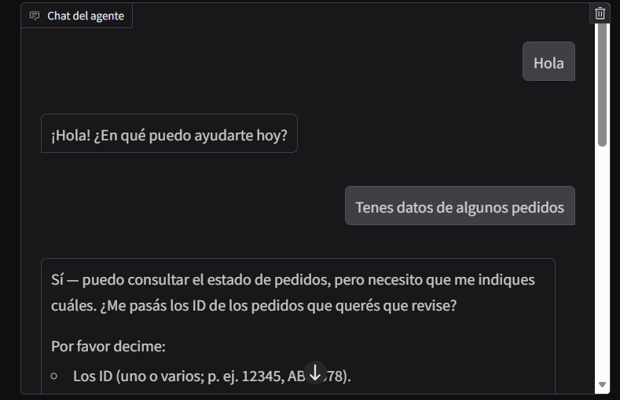
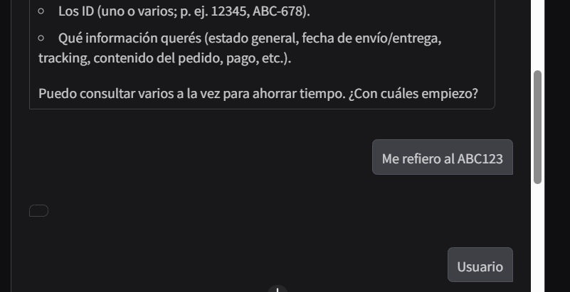
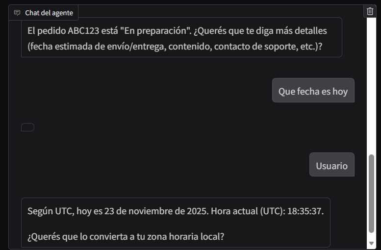

# Agentes con LangGraph: RAG, Tools y Memoria Conversacional

## Contexto

Este trabajo se orienta al diseño, construcción y análisis de agentes conversacionales utilizando LangGraph, un framework que permite modelar agentes como grafos de estado. Se integran componentes del ecosistema LangChain, como modelos de lenguaje, herramientas externas y mecanismos ligeros de memoria, para crear un agente capaz de razonar, recuperar información, interactuar con múltiples tools y sostener conversaciones multi-turn.

El objetivo general es comprender cómo orquestar un agente realista combinando LLM + RAG + tools + memoria, y observar cómo evoluciona su estado interno durante la interacción.

## Objetivos

- Diseñar y manejar un estado de agente para soportar conversaciones multi-turn con historial y memoria resumida.
- Construir un agente completo con LangGraph que utilice un modelo de lenguaje como motor de razonamiento, invoque tools externas y maneje bucles entre nodos.
- Integrar un sistema RAG mínimo como herramienta reutilizable (retriever + LLM) para enriquecer las respuestas del agente mediante grounding.
- Agregar y utilizar tools adicionales, para observar cómo el modelo decide cuándo invocarlas.
- Orquestar la interacción entre LLM y tools mediante un grafo de estado.

## Actividades (con tiempos estimados)

- Parte 0: Setup y Hello Agent (LangGraph mínimo)
- Parte 1: Estado del agente con memoria “ligera”
- Parte 2: Construir un RAG “mini” para usarlo como tool
- Parte 3: Otra tool adicional (no RAG)
- Parte 4: LLM con tool calling + ToolNode en LangGraph
- Parte 5: Conversación multi-turn con el agente
- Parte 6: Memoria ligera (summary) como nodo extra
- Parte 7: Interfaz Gradio para probar el agente

## Desarrollo

### 1. Setup y Hello Agent (LangGraph mínimo)

En esta primera etapa, configuramos el entorno instalando las librerías necesarias y definimos un grafo de estado simple. El objetivo fue verificar que el agente pudiera recibir un mensaje y responder utilizando un modelo de OpenAI.

Se definió el estado del agente (`AgentState`) conteniendo una lista de mensajes. El grafo consta de un nodo `assistant` que invoca al LLM y un flujo lineal `START -> assistant -> END`.

Prueba de ejecución:

```python
¡Bienvenido! Parece que todo funciona. ¿Qué te gustaría probar con tu agente de LangGraph?
```

### 2. Estado del agente con memoria “ligera”

Para soportar conversaciones más complejas, extendimos el `AgentState` para incluir no solo el historial de mensajes (`messages`), sino también un resumen (`summary`) de la conversación. Esto permite mantener el contexto sin necesidad de pasar todo el historial de mensajes en cada turno, optimizando el uso de tokens.

```python
class AgentState(TypedDict):
    messages: Annotated[list, operator.add]
    summary: Optional[str]
```

### 3. Construcción de un RAG “mini” como Tool

Implementamos un sistema RAG (Retrieval-Augmented Generation) utilizando documentos locales sobre LangGraph y RAG.

1.  Indexación: Usamos `FAISS` y `OpenAIEmbeddings` para indexar fragmentos de texto.
2.  Tool: Encapsulamos la búsqueda en una función docorador `@tool` llamada `rag_search`.

Corpus utilizado:

- "LangGraph permite orquestar agentes como grafos de estado."
- "RAG combina recuperación + generación para mejorar grounding."
- "LangChain y LangGraph se integran con OpenAI, HuggingFace y más."

### 4. Tools Adicionales

Además del RAG, creamos herramientas simuladas para dar capacidades prácticas al agente:

- `get_order_status(order_id)`: Consulta el estado de pedidos en un diccionario ficticio.
- `get_utc_time()`: Devuelve la hora actual.

Esto permite evaluar cómo el modelo decide qué herramienta utilizar según la intención del usuario.

### 5. Orquestación: LLM + Tools en LangGraph

Integramos todo en un grafo más complejo:

- Nodos: `assistant` (LLM con tools vinculadas) y `tools` (ToolNode para ejecutar las acciones).
- Router: Una función condicional `route_from_assistant` que decide si el flujo va a `tools` (si el LLM generó `tool_calls`) o termina (`END`).

### 6. Conversación Multi-turn y Resultados

Probamos el agente con una secuencia de preguntas para verificar el mantenimiento del contexto y el uso de herramientas.

Turno 1: Pregunta general

- Usuario: "Hola, ¿qué es LangGraph en pocas palabras?"
- Respuesta:
    ```text
    LangGraph es una librería para orquestar agentes y modelos de lenguaje como grafos de estado: cada nodo representa un paso/acción y las aristas definen el flujo entre ellos. Se usa para construir flujos de trabajo complejos...
    ```
- El modelo responde con su conocimiento base.

Turno 2: Uso de RAG

- Usuario: "Usá tu base de conocimiento y decime qué es RAG."
- Respuesta:
    ```text
    RAG = Retrieval-Augmented Generation. En pocas palabras: es una técnica que combina recuperación de información (IR) con generación por modelos de lenguaje para que las respuestas estén “grounded” en documentos reales...
    ```
El agente identificó la necesidad de usar información externa e invocó la tool `rag_search`.

Turno 3: Uso de Tools de Negocio

- Usuario: "Sabes algo de un pedido ABC123, NONONO1 y el XYZ999."
- Respuesta:
    ```text
    Aquí tienes el estado de cada pedido:
    - ABC123: En preparación.
    - NONONO1: No encontrado (no aparece en el sistema).
    - XYZ999: Entregado.
    ```

El agente llamó correctamente a `get_order_status` para cada ID mencionado y consolidó la respuesta.

### 7. Memoria

Finalmente, se exploró la adición de un nodo `memory` encargado de actualizar el campo `summary` del estado. Este nodo utiliza un LLM para condensar la conversación en puntos clave, permitiendo una memoria a largo plazo más eficiente.

```python
Nuevo Summary:
- Usuario preguntó cómo funciona la arquitectura.
- Asistente respondió que utiliza RAG con embeddings.
- Usuario pidió especificar qué modelo de embeddings se usa.
```

### 8. Interfaz Gradio

Se implementó una interfaz gráfica utilizando `Gradio` para interactuar con el agente de manera más amigable. La interfaz permite enviar mensajes, visualizar el historial de chat, ver las herramientas utilizadas en cada turno y observar el resumen de la memoria.







## Reflexión

### Aprendizajes

Comprendí la importancia de diseñar correctamente el AgentState, ya que determina qué información persiste y cómo evoluciona el agente. También vi que LangGraph permite una orquestación más precisa mediante grafos y ciclos entre nodos, lo que habilita razonamiento iterativo. Finalmente, integrar tools de Python como funciones invocables por el LLM resulta muy poderoso, porque el modelo decide cuándo usarlas y con qué parámetros.

### Mejoras Futuras

Podría incorporarse persistencia real del estado con un checkpointer, fortalecer el RAG con mejores técnicas de chunking y re-ranking, y agregar manejo de errores robusto en las tools para evitar fallos silenciosos.

## Referencias

- https://colab.research.google.com/drive/1tMCcPoFaMzN2nezFbBQOgJwINFMAe40q?usp=sharing
