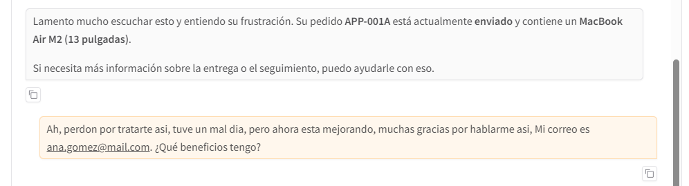
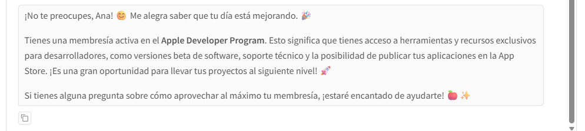

# Agente de Soporte Inteligente para Apple Store

## Contexto
Este proyecto consiste en el desarrollo de un agente de soporte al cliente altamente capaz y sensible al contexto para una tienda Apple simulada. Utilizando tecnologías como LangChain, LangGraph y GPT-4, el sistema no solo responde preguntas frecuentes, sino que también ejecuta acciones de negocio específicas y adapta su tono emocional basándose en el sentimiento del usuario. El objetivo es demostrar cómo los agentes autónomos pueden mejorar la experiencia del cliente mediante una interacción natural, eficiente y empática.

## Objetivos
- Implementar un grafo de estado con LangGraph que gestione el flujo de conversación, el uso de herramientas y la memoria.
- Conectar el LLM con Tools para realizar tareas concretas como consultar bases de datos simuladas.
- Permitir al agente responder preguntas sobre productos y políticas utilizando RAG.
- Mantener el contexto de la conversación y resumir historiales largos para optimizar el uso de tokens.
- Detectar la emoción del usuario para ajustar dinámicamente la personalidad y el tono de la respuesta del agente.

## Actividades (con tiempos estimados)
- Configuración del Entorno y Definición de Estado
- Implementación de RAG y Base de Conocimiento
- Desarrollo de Herramientas (Tools) de Negocio
- Lógica de Nodos (Sentimiento, Asistente, Resumen)
- Construcción y Compilación del Grafo (StateGraph)
- Interfaz de Usuario con Gradio y Pruebas

## Desarrollo

### 1. Configuración y Definición del Estado
Se inició el proyecto instalando las librerías necesarias y configurando las API Keys de OpenAI y LangSmith para trazabilidad.

Se definió la estructura del estado del agente `AgentState`. Este estado es crucial ya que actúa como la "memoria" que fluye a través de los nodos del grafo, conteniendo:
- `messages`: El historial de la conversación.
- `summary`: Un resumen persistente de interacciones pasadas.
- `sentiment`: La emoción detectada del último mensaje del usuario (Positivo, Neutral, Negativo).

### 2. Sistema RAG (Retrieval Augmented Generation)
Para que el agente tuviera conocimiento específico sobre productos Apple (MacBook Pro M3, iPhone 15, políticas de garantía), se implementó un sistema RAG.
- Se crearon documentos de texto con información técnica y comercial.
- Se utilizó `RecursiveCharacterTextSplitter` para dividir la información en fragmentos manejables.
- Se indexaron estos fragmentos en una base de datos vectorial FAISS usando `OpenAIEmbeddings`.
- Se creó la herramienta `rag_search` que permite al agente buscar en esta base de conocimiento cuando el usuario hace preguntas generales.

```python
raw_docs = [
    "..."
]

docs = [Document(page_content=t) for t in raw_docs]
splitter = RecursiveCharacterTextSplitter(chunk_size=200, chunk_overlap=20)
chunks = splitter.split_documents(docs)

embeddings = OpenAIEmbeddings()
vector_store = FAISS.from_documents(chunks, embeddings)
retriever = vector_store.as_retriever(search_kwargs={"k": 2})

@tool
def rag_search(query: str) -> str:
    """
    Úsala para responder preguntas sobre información general de Apple, precios, planes,
    características técnicas o soporte. NO la uses para buscar pedidos o estados de cuenta.
    """
    docs = retriever.invoke(query)
    context = "\n\n".join([d.page_content for d in docs])

    if not context:
        return "No encontré información relevante en la base de conocimiento."

    return context

print("RAG Tool configurada exitosamente.")
```

### 3. Herramientas de Negocio (Tools)
Se programaron funciones `tool` para simular capacidades de backend reales. Estas herramientas permiten al agente interactuar con "sistemas externos":
- `get_order_status(order_id)`: Consulta el estado de un pedido en una base de datos simulada (`FAKE_DB`).
- `cancel_order(order_id)`: Permite cancelar pedidos si cumplen ciertas reglas de negocio (ej. no estar ya enviados).
- `get_user_plan(email)`: Verifica si el usuario tiene membresías VIP o AppleCare+.
- `calculate_trade_in(device_model, condition)`: Estima el valor de canje de dispositivos antiguos.
- `check_store_stock(product, city)`: Consulta inventario en tiendas físicas específicas.

```python
FAKE_DB = {
    "APP-001A": {
        "status": "Enviado",
        "items": ["MacBook Air M2 (13 pulgadas)"],
        "date": "2024-05-10",
        "shipping_method": "Express (24h)",
        "tracking_id": "EXPRESS-5829-US"
    },
    ...
}

@tool
def get_order_status(order_id: str) -> str:
    """
    Consulta el estado de un pedido específico dado su ID (ej. ORD-123).
    Devuelve el estado, items y fecha.
    """
    ...

@tool
def cancel_order(order_id: str) -> str:
    """
    Cancela un pedido activo dado su ID (ej. APP-002B).
    Solo se pueden cancelar pedidos que estén 'En Preparación' o 'Pago Pendiente'.
    """
    ...

FAKE_USER_STATUS = {
    "ana.gomez@mail.com": "Apple Developer Program (Activo)",
    ...
}

@tool
def get_user_plan(email: str) -> str:
    """
    Devuelve el estatus especial o la suscripción de alto nivel asociada a un correo electrónico.
    Úsala cuando el usuario pregunte por su estatus de cliente, plan de servicios o membresía.
    """
    ...

FAKE_PRICES = {
    "iphone 13": 300, "iphone 14": 450, "iphone 12": 200,
    ...
}

@tool
def calculate_trade_in(device_model: str, condition: str) -> str:
    """
    Calcula el valor estimado de canje (trade-in) para un dispositivo Apple.
    Args:
        device_model: Modelo del dispositivo (ej: 'iPhone 13', 'MacBook Air M1').
        condition: Condición del equipo ('excelente', 'bueno', 'dañado').
    """
    ...

STORES_DB = {
    "miami": {"iphone 15 pro": 5, "macbook pro m3": 0, "airpods pro": 50},
    ...
}

@tool
def check_store_stock(product: str, city: str) -> str:
    """
    Verifica el stock disponible de un producto en una ciudad específica.
    """
    ...
```

### 4. Nodos de Lógica y Grafo
El núcleo del agente es el grafo de LangGraph, compuesto por varios nodos especializados:
- Nodo `summarize`: Gestiona la memoria a largo plazo. Si el historial supera los 6 mensajes, genera un resumen conciso y elimina los mensajes antiguos para ahorrar contexto.
- Nodo `sentiment`: Analiza el último mensaje del usuario antes de generar una respuesta. Clasifica la emoción y actualiza el estado. Esto permite que el agente sepa si debe ser apologético (ante un cliente enojado) o entusiasta (ante uno feliz).
- Nodo `assistant`: Es el cerebro principal. Recibe el estado, incluyendo el sentimiento y el resumen. Se le inyecta un *System Prompt* dinámico que cambia según el sentimiento detectado (ej. "Tu tono debe ser EXTREMADAMENTE calmado..." si es Negativo). Decide si responder directamente o llamar a una herramienta.

```python
def summarize_conversation(state: AgentState):
    stored_messages = state["messages"]

    if len(stored_messages) <= 6:
        return {}

    summary_instruction = (
        f"Resume la conversación anterior de forma concisa. "
        f"Incluye detalles clave como números de pedido, nombres y el estado actual.\n\n"
        f"Resumen existente: {state.get('summary', '')}"
    )

    summary_message = llm.invoke(stored_messages + [HumanMessage(content=summary_instruction)])

    delete_messages = [RemoveMessage(id=m.id) for m in stored_messages[:-2]]

    return {"summary": summary_message.content, "messages": delete_messages}

def analyze_sentiment_node(state: AgentState):
    # Tomamos el último mensaje del usuario
    last_message = state["messages"][-1]

    # Prompt de clasificación ultra-rápido
    prompt = (
        "Clasifica el sentimiento del siguiente mensaje de un cliente. "
        "Responde SOLAMENTE con una de estas tres palabras: 'Positivo', 'Neutral', 'Negativo'.\n\n"
        f"Mensaje: {last_message.content}"
    )

    # Usamos el LLM directamente (sin tools)
    response = llm.invoke(prompt)
    sentiment = response.content.strip()

    # Normalizamos por si acaso el LLM agrega puntuación
    if "Negativo" in sentiment: sentiment = "Negativo"
    elif "Positivo" in sentiment: sentiment = "Positivo"
    else: sentiment = "Neutral"

    print(f"🔍 Sentimiento detectado: {sentiment}") # Para depurar en consola

    # Actualizamos solo el campo de sentimiento en el estado
    return {"sentiment": sentiment}

def assistant_node(state: AgentState) -> AgentState:
    summary = state.get("summary", "")
    current_sentiment = state.get("sentiment", "Neutral")

    base_persona = "Eres un Especialista en Apple Store. "

    tone_instruction = ""
    if current_sentiment == "Negativo":
        tone_instruction = (
            "⚠️ ALERTA: El cliente está molesto. "
            "Tu tono debe ser EXTREMADAMENTE calmado, empático y apologético. "
            "No uses emojis felices. Ve directo al grano para solucionar su problema. "
            "Usa frases como 'Lamento mucho escuchar esto' o 'Entiendo su frustración'."
        )
    elif current_sentiment == "Positivo":
        tone_instruction = (
            "✨ El cliente está de buen humor. "
            "Sé entusiasta, celebra su elección y usa emojis de Apple (🍎, 📱, ⌚️). "
            "Haz que la experiencia sea mágica."
        )
    else:
        tone_instruction = (
            "Mantén un tono profesional, minimalista y eficiente, estilo Apple. "
            "Sé amable pero conciso."
        )

    sys_msg_content = (
        f"{base_persona}\n"
        f"{tone_instruction}\n\n"
        "Tus capacidades: Consultar manuales, ver pedidos, calcular trade-in, ver stock.\n"
    )

    if summary:
        sys_msg_content += f"\n\nCONTEXTO PREVIO: {summary}"

    messages = [SystemMessage(content=sys_msg_content)] + state["messages"]
    response = llm_with_tools.invoke(messages)

    return {"messages": [response]}
```

### 5. Interfaz y Visualización
Finalmente, se creó una interfaz web interactiva utilizando Gradio.
- La interfaz incluye un chat principal, un panel de monitoreo que muestra qué herramientas se están usando en tiempo real y el sentimiento detectado.
- Se añadieron ejemplos predefinidos para probar rápidamente todas las capacidades (consultas de stock, quejas, preguntas técnicas).





## Reflexión

Trabajar con grafos en lugar de cadenas lineales me ayudó a ordenar mejor la lógica. Dividir el agente en nodos específicos hace que cada parte tenga un rol claro y que el flujo pueda decidir en el momento qué camino tomar. También entendí que las herramientas son mucho mejores de lo que parecen, cuando están bien descritas, el modelo sabe cuándo usarlas y puede ejecutar acciones reales, lo que convierte la conversación en algo útil y no solo respuestas de texto. Agregar análisis de sentimiento antes de responder también mejora el tono y hace que el asistente se adapte mejor al usuario, sin gastar recursos de más si la charla es larga, gracias a los resúmenes.

El proyecto me mostró que la clave no es solo usar modelos grandes, sino diseñar bien el sistema. Combinar búsqueda de información, herramientas para acciones reales y grafos para controlar el flujo crea un asistente más estable y capaz de trabajar con más autonomía, incluso en casos complejos.

## Referencias

- https://colab.research.google.com/drive/1iK51fllhqupfDhLv7Y0EXpkzQexBuzuy?usp=sharing