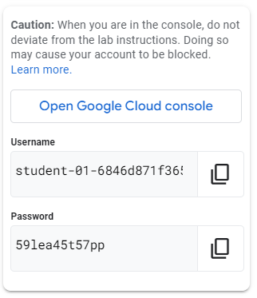
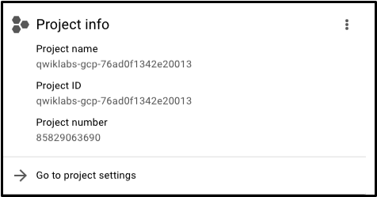
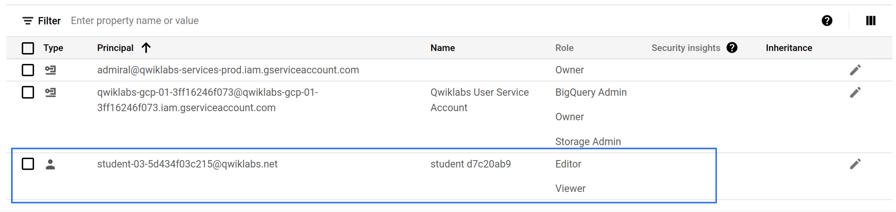
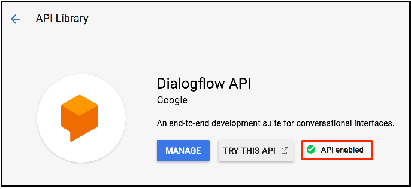

# Acceso y configuración básica en Google Cloud

Este lab ofrece una introducción práctica a Google Cloud Console, permitiendo explorar cómo funcionan los proyectos, los permisos y la activación de servicios para probar distintas herramientas en la nube.

## Inicio del lab

Al iniciar un lab, la plataforma crea automáticamente un entorno nuevo en la nube para la práctica. Esto incluye la creación de un proyecto temporal y la asignación de credenciales únicas que solo funcionan mientras el lab está activo. Estas credenciales permiten acceder a la consola y trabajar con los recursos asignados.

## Exploración de proyectos

Dentro de la consola se puede ver toda la información del proyecto activo, incluyendo el nombre, número y un ID que lo identifica en Google Cloud. Algunos labs proporcionan acceso a más de un proyecto para poder consultar recursos adicionales o realizar tareas de apoyo.

Entre estos proyectos se encuentra Qwiklabs Resources, que es de solo lectura y contiene archivos y datos de apoyo para diferentes labs. No se puede modificar ni eliminar nada en este proyecto, ya que es compartido para todos los estudiantes.

El proyecto asignado para la práctica es temporal y se elimina automáticamente al finalizar el lab, permitiendo experimentar sin riesgo de afectar entornos reales.

## Roles y permisos (IAM)

La gestión de permisos se realiza mediante Cloud Identity and Access Management (IAM). Los roles básicos incluyen:

- Viewer: permite ver recursos sin modificarlos.  
- Editor: permite crear, modificar o borrar recursos.  
- Owner: incluye los permisos de editor y permite administrar roles y facturación.

Durante el lab se puede practicar otorgando permisos a otros usuarios y verificando cómo se aplican los roles, lo que ayuda a entender cómo se controla el acceso a los distintos recursos en un proyecto de Google Cloud.

## Activación de servicios y APIs

La consola permite habilitar APIs y servicios según las necesidades del proyecto. Por ejemplo, la API de Dialogflow se puede activar para crear asistentes virtuales o sistemas de chat sin tener que manejar directamente la inteligencia artificial subyacente. 

Una vez habilitadas, las APIs permiten consultar documentación, probar funcionalidades y explorar la integración con los recursos del proyecto. En los labs, muchas APIs ya vienen habilitadas para facilitar el inicio de la práctica.

## Finalización del lab

Al finalizar el lab, las credenciales temporales se desactivan y el proyecto se elimina automáticamente.